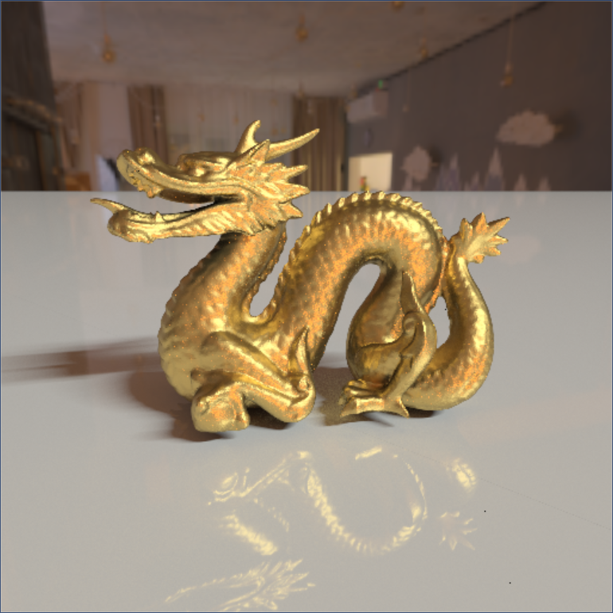
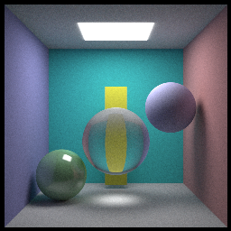
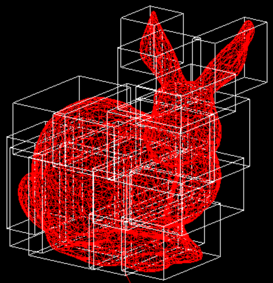
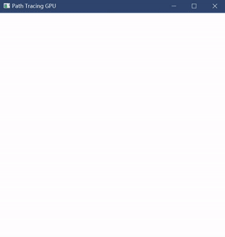
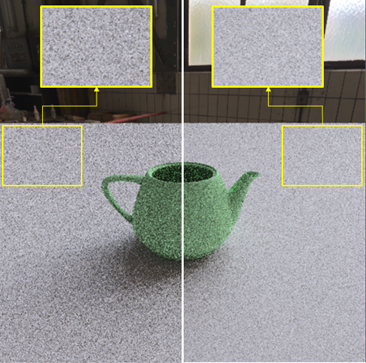
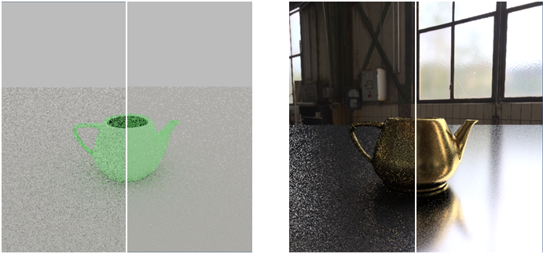
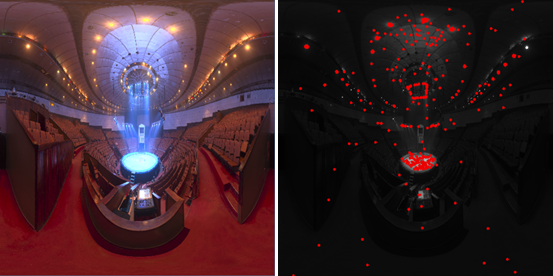
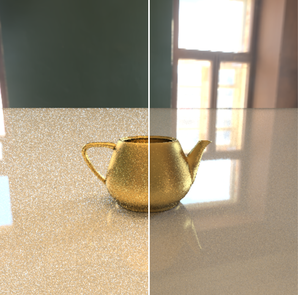

# EzRT
Easy Raytracing Tutorial (EzRT) is a lite code, simple tutorial for beginners to learn raytracing, with OpenGL and C++

<div align="center"></div>


# OverView

This tutorial contains 5 chapters, each chapter include tutorial blog (provide .md & .pdf files) and example code. 

## part 1. basic ray tracing

In this part we will implement a basic ray tracing program with  C++, then output each pixel as the result to png image.



## part 2. BVH Accelerate Struct

We just using a for loop to travel meshes. But BVH will support us to tracing on a big mesh with lots of triangles, and accelerate the program.

<div align="center"></div>

## part 3. OpenGL ray tracing

Using OpenGL's fragment shader to run accelerate program. Transfer BVH and triangles in texture buffer, then send to shader. Finally tracing each pixel progressively, then display the dynamic tracing process in screen.

<div align="center"></div>

## part 4. disney principle's BRDF

Learning micro facet theory, using Disney principle's BRDF to rendering various of physical material. 


## part 5. Importance Sampling & Low Discrepancy Sequence

Methods to denoise, accelerate fitting progress.

Low Discrepancy Sequence (Sobol) :

<div align="center"></div>

Importance Sampling, diffuse (left) and BRDF (right) :

<div align="center"></div>

Importance Sampling for HDR envmap :

<div align="center"></div>

Multi Importance Sampling with Heuristic power :

<div align="center"></div>


# Requirement

environment:

* Windows 10 x64
* vcpkg
* visual studio 2019


C++  lib:

* GLUT (freeglut) >= 3.0.0-7
* GLEW >= 2.1.0-5
* GLM  >= 0.9.9.5-3


Third part cpp lib:

* hdrloader


# Build

cd to source coce directory, then: 

```
cmake ./
```


# Other

* building on x64 
* set project 'main' as 启动项目
* running in  **Release** mode


# Bugs & TODO

* fix error in chapter 1, multiply cosine **$wi$**, not $wo$
* 摆烂了