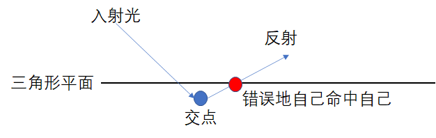
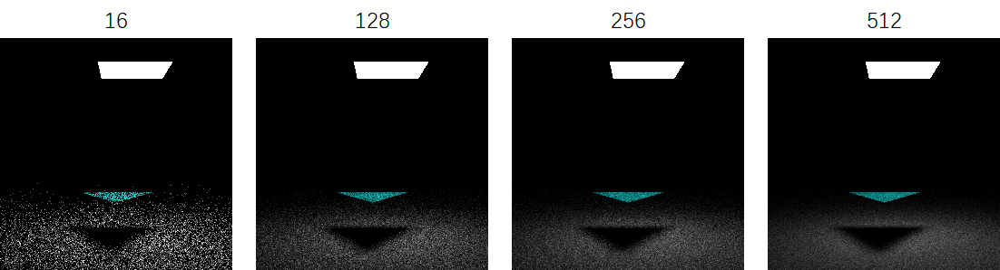

@[TOC](目录)

# 写在前面
这两天微信打算换个头像，于是打算弄个光追的小渲染器来渲染新头像。。。下面是结果：


多贴几张不同渲染滴图片：


<hr>


要实现光线追踪可不容易，最近我也在网上看了一些他人的博客和资料，基本上要么是笼统的理论介绍，贴几个高大上的数学公式，或者是 ppt 的截图，然后就是你复制我我复制你的内容，最后贴几张渲染的结果。我看完他们写的之后基本都是一脸懵 β 不知所措，我太菜了 

...

于是我打算自己写一篇博客。以【把大象装进冰箱】进行比喻：如果说网络上的资料是【打开门，送大象进去，关门】的话，那本篇博客就是讨论【怎么装】的。比如冰箱门把手在哪里，朝哪个方向拉才能打开冰箱，要用香蕉还是鞭子把大象赶进去，怎么关上冰箱的门...


批话不多说，直接开始正文的内容!


# 光线追踪简介
在传统的计算机图形学中，通常使用光栅化的方法来生成像素。因为光栅化之后我们只选取我们看到的图形，视野之外的几何信息被裁剪，导致场景的全局信息丢失。那么就会造成一些渲染上的 “不正确”，比如水面只能反射我们屏幕看到的像素：

<div align="center"></div>


此外，一些基于全局信息的渲染效果不能很好的运行，比如全局光照。在光栅管线下我们往往需要通过各种近似算法去模拟真实世界的光影现象，非常麻烦并且效果 “还凑合”

<hr>

光线追踪超越了传统的图形流水线，是一种 **现代** 的渲染。光线追踪是一种基于物理的渲染方法，通过模拟光在介质中的真实表现来输出足以逼近现实的图像。光线从光源出发，经过各种反射折射，进入摄像机：

<div align="center"></div>

因为从光源出发有 **无数条** 到达相机的路线，正向地从灯泡开始模拟光的传播变得不是很现实，于是曲线救国，转而从相机方向开始向场景投射射线，试图找出到达光源的可能路径：

<div align="center"></div>

本篇博客代码主要实现的是路径追踪技术。路径追踪技术是光线追踪的一个分支，通过向场景中投射光线，并且模拟光线的行径，在物体和光源之间找出一条条可行的路径，最后返回积累的颜色。

<hr>

和光栅化不同，光线追踪的第一步是向世界空间中投射光线，这一步叫做 RayCasting，投射的光线碰到哪个实体，我们对应位置的像素就代表该实体，同时要给对应位置的像素赋以一定的颜色：


假设我们发射的光线命中了一个点，我们就返回这个点的颜色作为最终像素的颜色。

<font color="orange"><b>那么怎样描述一点的颜色呢？我们引入渲染方程 ↓ </b></font>


# 渲染方程
故事要从 ~~元和二年~~  1986 年开始说起，科学家首次提出渲染方程，以描述一个点受到的光照的影响。**渲染一个像素的颜色就是求解渲染方程的过程**。大致意思是这样的：一个点的光照由 2 部分组成，分别是：

1. 该点自己发出的光
2. 来自任意方向上的光打到该点积累形成的光

注意这个任意方向，允许该点接收来自其 **法向半球** 范围内方向的入射光：


<div align="center"></div>

那么想要计算来自法向半球内任意方向的入射光的积累，我们必须计算一个 **半球积分！** 这里给出渲染方程的简化形式：

$$
L\left(p\right)=E\left(p\right)+\int_{} L\left(q\right) * cos(\theta) \  \mathrm{d} \omega_{i} 
$$

其中符号的解释如下：

$$
\begin{array}{l}
L(x) \rightarrow x \ 点的光强度 \\
E(x) \rightarrow x \ 点发出的光 \\
 q \rightarrow 从\ p \ 点出发,方向为 \ \omega_{i} \ 的光命中了 \ q \ 点的物体 \\
 \theta \rightarrow \omega_{i} \ 与 \ q \ 点法向量的夹角
\end{array}
$$


此外，$\int_{}$ 就是对法向半球入（出）射光线方向的积分。注意到渲染方程的 **递归** 形式，要想求解 p 点的光照我们必须先递归计算 q 点的光照值，如图：

<div align="center"></div>

递归式告诉我们：q 点也反射了光到 p 点，反射光的强度等于 q 点的光强度乘以反射到 p 点的百分比 cos(θ）

> 注：
> <br>
> 这里有个错误，我写的是 θ 是出射光 wi 和命中点 q 的法线的夹角，实际上渲染方程中，θ 是出射光 wi 和出发点 p 点的法线的夹角，也就是 Lambert's cosine law ，或者说 phong 光照模型中的 N dot L
> <br>
> 这个错误我在写完博客的半年之后才发现。。。不过因为我们用的是简化版的渲染方程，并非基于物理，即使你去掉这个 cosine，也能够得到相对不错的结果，真正正确的伪代码应该是：
> <div align="center"></div>
> 至于这里为啥使用错误的图，得到的图片仍然在一定程度上符合物理定律呢？我猜测是这样的：
>
> ~~民科警告⚠~~ 
>
> 对于 p 点的单位面积 dp，光能够发射到 q 点的比率，取决于 dp 在入射光方向上面的投影面积：
>
> <div align="center"></div>


<hr>

了解了渲染方程的成分，就可以进行渲染方程的求解了。在高等数学中，积分的计算需要找到被积函数的原函数，和积分变量。可是渲染方程是一个困难积分，无法精确地计算其原函数，于是需要找寻其他方法对困难积分进行计算。

<font color="orange"><b>那么怎样计算一个困难积分的？我们引入蒙特卡洛方法 ↓</b></font>

# 蒙特卡洛方法
我更愿意称之为丢豆子。考虑最直观的情况，欲求区间上一函数的积分，我们往 x 区间上面丢豆子，并且计算豆子命中的位置的 y 的值，最后把他们加起来作为积分的估计：

<div align="center"></div>


丢豆子的过程称之为【采样】，如果我们使用 **均匀分布** 的 x 进行丢豆子，就能得到上图等宽度的柱状图近似。

事实上在实际问题中，豆子的位置不会总是服从均匀分布。那么每一个豆子的贡献，除了豆子命中位置的 y 值，还取决于豆子 **命中该位置的概率**。蒙特卡洛方法允许我们使用 x 的任意的概率密度函数，来对积分进行估计。

假设采样 x 的概率密度函数为 $PDF(x)$，被积函数为 $f(x)$，那么 x 点采样的贡献就是：

$$
\frac{f(x)}{PDF(x)}
$$

所以积分计算就很简单了。首先按照产生一堆符合概率密度函数 PDF 分布的随机变量 x，然后对每一个 x 都计算 $\frac{f(x)}{PDF(x)}$ 最后求他们的 **均值** 即可。现在回过头来看刚刚的均匀分布的丢豆子，其中 $PDF(x) = \frac{1}{ b-a}$，那么我们估计 $x^2$ 的积分就可以这么计算：


可以看到仅 5 次采样就可以获得还不错的结果。我们和真实的积分值十分逼近了！采样的次数越多，差异就越少，所以蒙特卡洛方法可以做到对积分结果的 **无偏** 估计，这是好特性。

<font color="orange"><b>知晓了困难积分的近似求解方式，我们开始正式求解渲染方程 ↓</b></font>

# 渲染方程求解伪代码
渲染方程是对于被求解点 p 的法向半球的积分，那么我们的随机变量就是在法向半球内的射线的方向，假设我们取法向半球内 **均匀分布的射线** 方向，那么就有 $PDF(x) = \frac{1}{2\pi}$，因为半球面积就是 $2\pi$，如图：


于是有如下的伪代码：

```cpp
pathTracing(p)
{
	L = 0.0
	for(i in SAMPLE)
	{
		wi = random()	// 随机选择一个方向
		if(wi hit q)	// 射线 wi 击中 q 点
		{
			cosine = dot(nq, wi)	// q 点法向量 nq 和 wi 的夹角余弦值
			L += cosine * pathTracing(q) / PDF(wi)
		}
	}
	return L / SAMPLE	// 返回均值
}
```

其中 SAMPLE 就是我们的采样次数。那么问题就来了，这个递归的复杂度是指数，复杂度非常高带来的就是极大的计算资源的消耗，因为光线会有爆炸般的增长，以 SAMPLE=100 为例：

<div align="center"></div>

那么我们只有限制 SAMPLE=1 才能防止指数增长。而一次采样的估计肯定是不准确的，于是我们对每个像素，发射多条光线，然后平均他们的结果。每个像素的光线数目叫做 SPP，即（Sample Pre Pixel），下图演示了 SPP=3 的情况，我们找寻了 3 条到光源的路径，并且平均他们的贡献：

<div align="center"></div>


注意只有在第一次采样时发射若干条光线，其余的时候我们只随机选取一个方向发射光线并且递归计算。那么伪代码就改成：

```cpp
// 追踪一条光线
pathTracing(p)
{
	L = 0.0
	wi = random()	// 随机选择一个方向
	if(wi hit q)	// 射线 wi 击中 q 点
	{
		cosine = dot(nq, wi)	// q 点法向量 nq 和 wi 的夹角余弦值
		L += cosine * pathTracing(q) / PDF(wi)
	}

	return L
}

// 对一个像素投射 SPP 条光线
L = 0.0
for(i in SPP)
{
	wi = random()	// 随机选择一个方向
	if(wi hit q)	// 射线 wi 击中 q 点
	{
		L += pathTracing(q) / PDF(wi)
	}
}
L /= SPP
```

这一步也没啥特别的，就是向每一个像素投射光线，然后求解渲染方程，没了。。。

<font color="orange"><b>渲染方程的伪代码有了，我们通过 c++ 实现它 ↓</b></font>

# 编程前的准备
着手编写一个在 Windows 10 下运行的 x64 程序，程序以图片的形式输出场景的渲染结果。我们以 Vusial Studio 2019 作为 IDE，此外我们还需要额外的帮助库。

<h3>数学运算库</h3>

首先是数学运算库，我们需要一个能够表示 **三维向量**，并且对向量进行加减乘除点积叉乘等操作的帮助库。你可以自己写一个简易的 class，也可以使用现成的第三方库，这里我使用的是 glm，它的网站在 [这里](http://glm.g-truc.net/0.9.8/api/index.html)，你也可以从[它的 GitHub](https://github.com/g-truc/glm) 上面获取。此外，也可以通过 vcpkg 包管理工具来下载，只需要运行命令：

```bash
vcpkg install glm
```

如果在安装时遇到任何困难，可以参考我以前的博客：[传送门①](https://blog.csdn.net/weixin_44176696/article/details/109909977)，[传送门②](https://blog.csdn.net/weixin_44176696/article/details/110289659)

<h3>图像输出</h3>

你可以使用任何流行的图像处理的库来进行图像输出，他们可以是 Opencv，Qt，甚至是 OpenGL，但是这里我使用非常轻量级的 svpng。svpng 不是一个 c++ 的第三方库，它仅是一个 inc文件：

<div align="center"></div>

你只需要把它放在你的工程目录下，然后再 `#include "svpng.inc"` 即可调用它。svpng 就一个非常简单的功能，就可以帮我们保存 png 图像，调用 svpng 函数即可。函数的原型长这样：

```cpp
void svpng(FILE* fp, unsigned w, unsigned h, const unsigned char* img, int alpha)
```

其中 FILE 是文件指针，w 和 h 是图片的宽度和高度，img 是图像的像素值数组，alpha 是透明度，我们填 0 即可。通过如下的代码就可以将一个范围在 [0, 1] 之间的 double 浮点数 buffer 输出到图片上：

```cpp
// 输出 SRC 数组中的数据到图像
void imshow(double* SRC)
{
    
    unsigned char* image = new unsigned char[WIDTH * HEIGHT * 3];// 图像buffer
    unsigned char* p = image;
    double* S = SRC;    // 源数据

    FILE* fp;
    fopen_s(&fp, "image.png", "wb");

    for (int i = 0; i < HEIGHT; i++)
    {
        for (int j = 0; j < WIDTH; j++)
        {
            *p++ = (unsigned char)clamp((*S++) * 255, 0.0, 255.0);  // R 通道
            *p++ = (unsigned char)clamp((*S++) * 255, 0.0, 255.0);  // G 通道
            *p++ = (unsigned char)clamp((*S++) * 255, 0.0, 255.0);  // B 通道
        }
    }

    svpng(fp, WIDTH, HEIGHT, image, 0);
}
```


clamp 是截断函数，glm 库带的，如果报错那么您可以删掉它并且换成您自己的 clamp，只是时刻注意 SRC 是 [0, 1] 范围的 double，我们习惯这么表示颜色，同时方便计算，不容易被截断。此外，svpng 默认图像的 RGB 通道是相邻的，我们直接利用指针进行遍历即可。

随便在 SRC 中写点什么，比如输出 xy 的值作为 rg 通道。如果你看到如下的图片被生成，那么很成功！


如果找不到 svpng.inc 那么检查你的 vs 工程是否配置正确，将包含 svpng 的目录添加到 vs 的 include 目录：


<h3>多线程加速</h3>

光线追踪运算量巨大，单靠简单的单线程程序无法高效执行，但是因为 **每个光线的采样是相互独立的**，于是我们可以利用多线程加速。Visual Studio 有自带多线程加速的 openmp 库，**无需** 自己手动下载，只需要引入：


```cpp
#include <omp.h>    // openmp多线程加速
```

同时在项目设置中，允许 vs 使用多线程：


然后在需要并行执行的 for 循环之前加上：

```cpp
omp_set_num_threads(50); // 线程个数
#pragma omp parallel for

for()
{
	...
}
```

就可以享受多线程加速的福利了。此外，我墙裂建议你打开 O2 优化同时将运行模式调整到 Release，以获取最大运行速度：


<font color="orange"><b>一切就绪？我们准备进入光与粒的世界 ↓</b></font>

# 相机配置与光线生成
光线追踪的第一步是投射光线，我们模拟相机投影与成像的规则，指定一个 [-1, 1] 范围内的投影平面和一个视点，然后根据输出图片的像素位置，计算其对应投影平面上的坐标，最后用坐标减去视点坐标，得到 **视线的方向向量**，如图：

<div align="center"></div>

值得注意的是，图片的 xy 轴原点是在图片左上方，而实际投影我们需要一个在左下方的原点（即平面几何坐标系），所以 y 要做一次 flip。此外，在世界坐标系下，我们确定相机的位置和投影平面的位置，让相机看向 z 轴负方向：

<div align="center"></div>

相机配置就绪，我们尝试 **输出相机的射线投射方向**，其中 imshow 是上面编写的显示图片的函数：

```cpp
double* image = new double[WIDTH * HEIGHT * 3];
memset(image, 0.0, sizeof(double) * WIDTH * HEIGHT * 3);
double* p = image;
for (int i = 0; i < HEIGHT; i++)
{
    for (int j = 0; j < WIDTH; j++)
    {
        // 像素坐标转投影平面坐标
        double x = 2.0 * double(j) / double(WIDTH) - 1.0;
        double y = 2.0 * double(HEIGHT - i) / double(HEIGHT) - 1.0;

        vec3 coord = vec3(x, y, SCREEN_Z);          // 计算投影平面坐标
        vec3 direction = normalize(coord - EYE);    // 计算光线投射方向
        
        vec3 color = direction;

        *p = color.x; p++;  // R 通道
        *p = color.y; p++;  // G 通道
        *p = color.z; p++;  // B 通道
    }
}

imshow(image);
```
输出如下结果说明相机有在工作：


<font color="orange"><b>相机投射了光线，光线和场景物体相交，我们希望描述这一过程 ↓</b></font>

# 三角形与光线求交
在计算机图形学中通常使用三角形来描述任意形状的物体，因为三角形具有很好的几何特征，并且易于进行求交，裁剪等操作。在开始之前，我们先做一些规范化的定义：

<h3>结构定义</h3>

假设我们用起点（start）和方向（direction）来描述一个射线：

```cpp
// 光线
typedef struct Ray
{
    vec3 startPoint = vec3(0, 0, 0);    // 起点
    vec3 direction = vec3(0, 0, 0);     // 方向
}Ray;
```

在开始编写三角形类之前，我们先确定求交操作到底要返回那些信息：
1. 是否相交
2. 交点位置，用于作为我们下一次弹射的起点
3. 相交位置的表面属性：比如法向量，表面颜色，材质属性，发光度，粗糙度等

那么首先我们有表面属性的定义，使用结构体能很好的帮我们组织数据，同时易于拓展：

```cpp
// 物体表面材质定义
typedef struct Material
{
    bool isEmissive = false;        // 是否发光
    vec3 normal = vec3(0, 0, 0);    // 法向量
    vec3 color = vec3(0, 0, 0);     // 颜色
}Material;
```

然后是光线求交结果的定义：

```cpp
// 光线求交结果
typedef struct HitResult
{
    bool isHit = false;             // 是否命中
    double distance = 0.0f;         // 与交点的距离
    vec3 hitPoint = vec3(0, 0, 0);  // 光线命中点
    Material material;              // 命中点的表面材质
}HitResult;
```

然后是三角形的 class 的定义：

```cpp
class Shape
{
public:
    Shape(){}
    virtual HitResult intersect(Ray ray) { return HitResult(); }
};

// 三角形
class Triangle : public Shape
{
public:
    Triangle(){}
    Triangle(vec3 P1, vec3 P2, vec3 P3, vec3 C) 
    { 
        p1 = P1, p2 = P2, p3 = P3; 
        material.normal = normalize(cross(p2 - p1, p3 - p1)); material.color = C;
    }
    vec3 p1, p2, p3;    // 三顶点
    Material material;  // 材质

    // 与光线求交
    HitResult intersect(Ray ray) 
    { 
        HitResult res;
        // ...
        return res; 
    };
};
```

这里我墙裂建议使用 **虚函数+指针+继承** 的编程习惯，因为我们光线和任意图形求交，都有一致的返回结果，即 HitResult 结构体。我们使 c++ 的指针特性，可以通过一套代码，完成多种复杂图元的求交。此外，在添加一种新图元的时候，主代码不需要任何的改动！（虽然现在我们只有三角形。。。

<h3>求交计算</h3>

和三角形的求交分为两个步骤：首先判断光线和三角形所在平面是否有交点，然后再判断交点是否在三角形内部。思路很清晰，我们先来看光线与三角形所在平面相交的判断：


其中 t 表示了射线起点到交点的距离，**如果 t 小于 0 那么表示三角形在摄像机之后！** ，然后开始判断点是否在三角形中。我们连接顶点与 P 点，然后判断连线与边的叉乘方向是否与 **法向量** 一致。如果三个顶点的判断都通过，说明 P 在三角形中，否则不在：


注意此处法向量 N 是通过 $\vec{p_1p_2} \times \vec{p_1p_3}$ 得到的，上图的 N 垂直屏幕向外。于是有 Triangle 类的求交代码：


```cpp
// 与光线求交
HitResult intersect(Ray ray) 
{ 
    HitResult res;

    vec3 S = ray.startPoint;        // 射线起点
    vec3 d = ray.direction;         // 射线方向
    vec3 N = material.normal;       // 法向量
    if (dot(N, d) > 0.0f) N = -N;   // 获取正确的法向量

    // 如果视线和三角形平行
    if (fabs(dot(N, d)) < 0.00001f) return res;

    // 距离
    float t = (dot(N, p1) - dot(S, N)) / dot(d, N);
    if (t < 0.0005f) return res;    // 如果三角形在相机背面

    // 交点计算
    vec3 P = S + d * t;

    // 判断交点是否在三角形中
    vec3 c1 = cross(p2 - p1, P - p1);
    vec3 c2 = cross(p3 - p2, P - p2);
    vec3 c3 = cross(p1 - p3, P - p3);
    vec3 n = material.normal;   // 需要 "原生法向量" 来判断
    if (dot(c1, n) < 0 || dot(c2, n) < 0 || dot(c3, n) < 0) return res;

    // 装填返回结果
    res.isHit = true;
    res.distance = t;
    res.hitPoint = P;
    res.material = material;
    res.material.normal = N;    // 要返回正确的法向
    return res; 
};
```

代码比想象中的要复杂，因为我们考虑了更多的因数，比如视线和三角形平行。此外，法向量可能与我们视线的方向相同，那么三角形是背向我们的，.于是要改写法向 N 的方向：

<div align="center"></div>

此外，判断点是否在三角形中，我们要用 **改写之前** 的法向量来计算。因为原生法向量取决于顶点定义的顺序（p1, p2, p3），我们也是按照 p1, p2, p3 的顺序来进行叉乘的

> 注：
> 你可能注意到上面代码的那个 if (t < 0.0005f) 了
> 为啥是 0.0005 呢？是为了防止在三角形 T 上弹射的光线再次命中三角形 T （我打我自己
> 因为浮点精度不足，交点可能出现在原三角形的里侧，那么弹射时就会自己打到自己，如图：
> 


<font color="orange"><b>光线投射与求交都准备就绪，我们开始第一个光线追踪程序 ↓</b></font>

# Triangle, Again
我们在场景中添加一个三角形：

```cpp
const vec3 RED(1, 0.5, 0.5);

...

vector<Shape*> shapes;  // 几何物体的集合
shapes.push_back(new Triangle(vec3(-0.5, -0.5, 0), vec3(0.0, 0.5, 0), vec3(0.5, -0.5, 0), RED));
```

随后遍历场景，逐个求交并且返回 hit 的结果。我们编写一帮助函数来返回最近距离的交点及其属性：

```cpp
// 返回距离最近 hit 的结果
HitResult shoot(vector<Shape*>& shapes, Ray ray)
{
    HitResult res, r;
    res.distance = 1145141919.810f; // inf

    // 遍历所有图形，求最近交点
    for (auto& shape : shapes)
    {
        r = shape->intersect(ray);
        if (r.isHit && r.distance < res.distance) res = r;  // 记录距离最近的求交结果
    }

    return res;
}
```

然后我们逐像素的投射光线，并且输出光线第一个碰到的交点的颜色：

```cpp
double* image = new double[WIDTH * HEIGHT * 3];
memset(image, 0.0, sizeof(double) * WIDTH * HEIGHT * 3);
double* p = image;
for (int i = 0; i < HEIGHT; i++)
{
    for (int j = 0; j < WIDTH; j++)
    {
        // 像素坐标转投影平面坐标
        double x = 2.0 * double(j) / double(WIDTH) - 1.0;
        double y = 2.0 * double(HEIGHT - i) / double(HEIGHT) - 1.0;

        vec3 coord = vec3(x, y, SCREEN_Z);          // 计算投影平面坐标
        vec3 direction = normalize(coord - EYE);    // 计算光线投射方向

        // 生成光线
        Ray ray;
        ray.startPoint = coord;
        ray.direction = direction;

        // 找交点并输出交点的颜色
        HitResult res = shoot(shapes, ray);
        vec3 color = res.material.color;

        *p = color.x; p++;  // R 通道
        *p = color.y; p++;  // G 通道
        *p = color.z; p++;  // B 通道
    }
}

imshow(image);
```

程序输出了如下的图片：

这和 Learn OpenGL 中的 hello world 一致，只是我们以另一种方式来实现它！此外，最好尝试多种三角形的组合，比如遮挡关系或输出法向量，以便我们 debug，要 **确保求交程序的正确性**

<font color="orange"><b>第一个 hello world 程序运行良好，现在来准备进行光线追踪 ↓</b></font>

# 球面随机向量
现在还差最后一块拼图：随机数。在渲染方程的求解中，我们在法向半球上随机选取一个方向作为光线的弹射方向。首先获取一个 [0-1] 范围的随机浮点数：

```cpp
// 0-1 随机数生成
std::uniform_real_distribution<> dis(0.0, 1.0);
random_device rd;
mt19937 gen(rd());
double randf()
{
    return dis(gen);
}
```
然后我们随机生成 3 个坐标 xyz，如果坐标 **不在** 单位球内，我们拒绝，并且重新选取 xyz，从而产生 **均匀分布** 的球面随机向量：

```cpp
// 单位球内的随机向量
vec3 randomVec3()
{
    vec3 d;
    do
    {
        d = 2.0f * vec3(randf(), randf(), randf()) - vec3(1, 1, 1);
    } while (dot(d, d) > 1.0);
    return normalize(d);
}
```

在此之后我们还要根据碰撞点的表面，生成分布在法向半球的随机向量。一种可行的策略是使用仍然拒绝法，**一旦随机向量不在法向半球内，我们就拒绝它**，同时再产生一个新的随机向量，代码如下：

```cpp
// 法向半球随机向量
vec3 randomDirection(vec3 n)
{
    // 法向半球
    vec3 d;
    do
    {
        d = randomVec3();
    } while (dot(d, n) < 0.0f);
    return d;
}
```

值得注意的是，在 Peter Shirley 写的[《Ray Tracing in One Weekend Book Series》](https://github.com/RayTracing/raytracing.github.io)系列中，有一种更加简洁的求法向半球随机向量的方法，就是**以法向量的终点为球心**，产生单位球面上的随机向量，然后连接法向量起点和随机向量的终点就是最终的随机方向 d，如图：


写成代码也很简单：

```cpp
// 法向半球随机向量
vec3 randomDirection(vec3 n)
{
    return normalize(randomVec3() + n);
}
```

这种方法很奇怪，但是不得不承认它的效果更好，并且更快。下图是两种随机方法的比较：


个人猜测是因为方法 2 生成的向量在 **法向量** 的方向上具有更高的出现概率：

 
<font color="orange"><b>最后一块拼图已经被补齐了，正式开始光线追踪 ↓</b></font>

# 路径追踪，干就完了！
还记得刚刚我们的 hello world 是如何输出颜色的吗？我们直接输出了碰到的物体的颜色。接下来我们改变策略，对碰到的物体，我们要求其渲染方程下的颜色。我们定义一个函数，它接收整个场景的信息，和一条光线，然后根据路径追踪，返回该光线最终积累的颜色：

```cpp
// 路径追踪
vec3 pathTracing(vector<Shape*>& shapes, Ray ray)
{
    ...
    return xxx;
}
```

<h3>直接光照</h3>

我们考虑直接光照。如果射线碰到光源，我们返回光源的颜色，否则我们返回纯黑：

<div align="center"></div>


于是路径追踪的函数变得非常简单，仅 4 行代码：


```cpp
// 路径追踪
vec3 pathTracing(vector<Shape*>& shapes, Ray ray)
{
    HitResult res = shoot(shapes, ray);

    if (!res.isHit) return vec3(0); // 未命中

    // 如果发光则返回颜色
    if (res.material.isEmissive) return res.material.color;

    // 否则直接返回
    return vec3(0);
}
```
然后我们修改主函数。我们添加一些三角形：

```cpp
// 采样次数
const int SAMPLE = 128;
// 每次采样的亮度
const double BRIGHTNESS = (2.0f * 3.1415926f) * (1.0f / double(SAMPLE));

...

vector<Shape*> shapes;  // 几何物体的集合
// 三角形
shapes.push_back(new Triangle(vec3(-0.5, -0.5, -0.5), vec3(0.5, -0.5, -0.5), vec3(0, -0.5, 0.5), CYAN));
// 底部平面
shapes.push_back(new Triangle(vec3(10, -1, 10), vec3(-10, -1, -10), vec3(-10, -1, 10), WHITE));
shapes.push_back(new Triangle(vec3(10, -1, 10), vec3(10, -1, -10), vec3(-10, -1, -10), WHITE));
// 光源
Triangle l1 = Triangle(vec3(0.6, 0.99, 0.4), vec3(-0.2, 0.99, -0.4), vec3(-0.2, 0.99, 0.4), WHITE);
Triangle l2 = Triangle(vec3(0.6, 0.99, 0.4), vec3(0.6, 0.99, -0.4), vec3(-0.2, 0.99, -0.4), WHITE);
l1.material.isEmissive = true;
l2.material.isEmissive = true;
shapes.push_back(&l1);
shapes.push_back(&l2);
```

场景长这样：上方的是光源三角形组成的四边形，中间的淡蓝色三角形是不发光的实体，而底部则是一个很大的平面。


然后使用多线程进行采样，最后使其输出直接光照下的场景：

```cpp
double* image = new double[WIDTH * HEIGHT * 3];
memset(image, 0.0, sizeof(double) * WIDTH * HEIGHT * 3);

omp_set_num_threads(50); // 线程个数
#pragma omp parallel for
for (int k = 0; k < SAMPLE; k++)
{
    double* p = image;
    for (int i = 0; i < HEIGHT; i++)
    {
        for (int j = 0; j < WIDTH; j++)
        {
            // 像素坐标转投影平面坐标
            double x = 2.0 * double(j) / double(WIDTH) - 1.0;
            double y = 2.0 * double(HEIGHT - i) / double(HEIGHT) - 1.0;

            vec3 coord = vec3(x, y, SCREEN_Z);          // 计算投影平面坐标
            vec3 direction = normalize(coord - EYE);    // 计算光线投射方向

            // 生成光线
            Ray ray;
            ray.startPoint = coord;
            ray.direction = direction;

            // 与场景的交点
            HitResult res = shoot(shapes, ray);
            vec3 color = vec3(0, 0, 0);

            if (res.isHit)
            {
                // 命中光源直接返回光源颜色
                if (res.material.isEmissive)
                {
                    color = res.material.color;
                }
                // 命中实体则选择一个随机方向重新发射光线并且进行路径追踪
                else
                {
                    // 根据交点处法向量生成交点处反射的随机半球向量
                    Ray randomRay;
                    randomRay.startPoint = res.hitPoint;
                    randomRay.direction = randomDirection(res.material.normal);
                    
                    // 颜色积累
                    vec3 srcColor = res.material.color;
                    vec3 ptColor = pathTracing(shapes, reflectRay);
                    color = ptColor * srcColor;    // 和原颜色混合
                    color *= BRIGHTNESS;
                }
            }

            *p += color.x; p++;  // R 通道
            *p += color.y; p++;  // G 通道
            *p += color.z; p++;  // B 通道
        }
    }
}

imshow(image);
```

可以看到输出的图片具有非常真实的特性（尽管有很多噪点）：


可以看到在仅有直接光照的情况下，就能够实现非常多的特效，比如光照，软阴影，并且是基于物理的！而这些特效在传统光栅管线中都是代价及其昂贵的特效。此外，增大每个像素的采样次数（SPP，代码中的 SAMPLE 参数）能提升品质：


<h3>间接光照</h3>

直接光照仅考虑了渲染方程的自发光项。事实上除了来自光源的直接光照，还有来自其他物体反射的光：

<div align="center"></div>

因为渲染方程已经给了间接光照的计算公式，我们直接递归计算。但是值得注意的是递归的出口。我们可以简单的使用一个递归深度 depth 来控制，更加巧妙的方法是每次摇一个随机数 P，如果 P 小于某个阈值就结束。这个方法有一个很霸气的名字，叫做毛子轮盘：

<div align="center"></div>


但是我们仍然要通过深度保证不会出现死递归，此外每次返回时应该将颜色除以 P 以保证颜色的 **期望值** 始终不变。于是有：


```cpp
// 路径追踪
vec3 pathTracing(vector<Shape*>& shapes, Ray ray, int depth)
{
    if (depth > 8) return vec3(0);
    HitResult res = shoot(shapes, ray);

    if (!res.isHit) return vec3(0); // 未命中

    // 如果发光则返回颜色
    if (res.material.isEmissive) return res.material.color;

    // 有 P 的概率终止
    double r = randf();
    float P = 0.8;
    if (r > P) return vec3(0);

    // 否则继续
    Ray randomRay;
    randomRay.startPoint = res.hitPoint;
    randomRay.direction = randomDirection(res.material.normal);

    float cosine = dot(-ray.direction, res.material.normal);
    vec3 srcColor = res.material.color;
    vec3 ptColor = pathTracing(shapes, randomRay, depth+1) * cosine;
    vec3 color = ptColor * srcColor;    // 和原颜色混合

    return color / P;
}
```

我们重新布置一下场景，让三角形的背光面朝向镜头。现在间接光照能够被加入计算了：


注意和直接光照最大的区别就是背光面能够被间接地照亮，注意上图 **左右两个三角形的背面分别反射了红蓝两种颜色**。而仅有直接光照的渲染是无法照亮背光面的：


这里为了看的更清楚，顺手加了个伽马矫正。


<font color="orange"><b>到这里路径追踪的基本框架就已经完成了，下面是一些锦上添花的效果 ↓</b></font>

# 绘制球体
我们试图往场景中添加球体。球体的求交也比较简单。不多说了，上车：


这里给出 Sphere 类代码：

```cpp
// 球
class Sphere : public Shape
{
public:
    Sphere(){}
    Sphere(vec3 o, double r, vec3 c) { O = o; R = r; material.color = c; }
    vec3 O;             // 圆心
    double R;           // 半径
    Material material;  // 材质

    // 与光线求交
    HitResult intersect(Ray ray)
    {
        HitResult res;

        vec3 S = ray.startPoint;        // 射线起点
        vec3 d = ray.direction;         // 射线方向

        float OS = length(O - S);
        float SH = dot(O - S, d);
        float OH = sqrt(pow(OS, 2) - pow(SH, 2));

        if (OH > R) return res; // OH大于半径则不相交

        float PH = sqrt(pow(R, 2) - pow(OH, 2));

        float t1 = length(SH) - PH;
        float t2 = length(SH) + PH;
        float t = (t1 < 0) ? (t2) : (t1);   // 最近距离
        vec3 P = S + t * d;     // 交点

        // 防止自己交自己
        if (fabs(t1) < 0.0005f || fabs(t2) < 0.0005f) return res;

        // 装填返回结果
        res.isHit = true;
        res.distance = t;
        res.hitPoint = P;
        res.material = material;
        res.material.normal = normalize(P - O); // 要返回正确的法向
        return res;
    }
};
```

一样的上面的 0.0005f 也是为了防止自己交自己的情况出现。撒，这时候你就会发现为啥一开始我要不厌其烦地定义一个 Shape 类并且使用基类指针与虚函数。因为这允许你 **添加任何的图形而不用改动主代码**，比如我们加三个球：

```cpp
vector<Shape*> shapes;  // 几何物体的集合

// 球
shapes.push_back(new Sphere(vec3(-0.6, -0.8, 0.6), 0.2, WHITE));
shapes.push_back(new Sphere(vec3(-0.1, -0.7, 0.2), 0.3, WHITE));
shapes.push_back(new Sphere(vec3(0.5, -0.6, -0.5), 0.4, WHITE));
```

重新运行程序并且得到一个惊艳的结果：


好吧。。。我终于知道为啥几乎所有的光线追踪的博客都会拿球来做例子，因为确实求交简单，而且表现力非常强！

# 镜面反射
光打到材质上，有一部分发生漫反射，有一部分发生镜面反射，这取决于材质的属性。我们在材质中新定义一个属性叫做反射率 s。

```cpp
// 物体表面材质定义
typedef struct Material
{
    ...
    double specularRate = 0.0f;      // 反射光占比
}Material;
```

入射光有 s 的概率被反射，否则继续漫反射。那么我们的光追要用如下的流程：先摇一个随机数，如果其小于反射率，那么我们光线被反射，于是通过入射光和法向量的夹角计算反射光线，并且继续递归。否则我们正常地随机取一个方向投射光线。

于是修改路径追踪的函数，注意主代码中 ray casting 投射光线的时候也要做同样的修改：

```cpp
// 路径追踪
vec3 pathTracing(vector<Shape*>& shapes, Ray ray, int depth)
{
	前半部分和之前一样
	
    ...
    
    Ray randomRay;
    randomRay.startPoint = res.hitPoint;
    randomRay.direction = randomDirection(res.material.normal);
    
    vec3 color = vec3(0);
    float cosine = fabs(dot(-ray.direction, res.material.normal));

    // 根据反射率决定光线最终的方向
    r = randf();
    if (r < res.material.specularRate)  // 镜面反射
    {
        randomRay.direction = normalize(reflect(ray.direction, res.material.normal));
        color = pathTracing(shapes, randomRay, depth + 1) * cosine;
    }
    else    // 漫反射
    {
        vec3 srcColor = res.material.color;
        vec3 ptColor = pathTracing(shapes, randomRay, depth+1) * cosine;
        color = ptColor * srcColor;    // 和原颜色混合
    }

    return color / P;
}
```

在主代码中添加对应不同反射率的球，然后重新运行程序，可以看到反射非常漂亮，而且可以看到屏幕空间内不存在的内容：


我们也可修改反射率，下图从左到右分别是 0.3，0.6，0.9 的反射率：


注意到我们的球非常光滑，如果想模拟粗糙的反射，那么在生成反射光线方向的时候，加入随机向量的扰动即可。而扰动的程度取决于材质的粗糙度，这也是一个材质属性，我们加入它：

```cpp
// 物体表面材质定义
typedef struct Material
{
    ...
    double roughness = 1.0f;        // 粗糙程度
}Material;
```
然后我们反射的时候不再按照反射光线的方向，而是根据粗糙度，在随机向量和反射光线的方向做一个 **线性插值** 以决定最终反射的方向：

```cpp
if (r < res.material.specularRate)  // 镜面反射
{
    vec3 ref = normalize(reflect(ray.direction, res.material.normal));
    randomRay.direction = mix(ref, randomRay.direction, res.material.roughness);
    color = pathTracing(shapes, randomRay, depth + 1) * cosine;
}
```

注意主代码中 ray casting 投射光线的部分也要做同样的改动。下面分别是 0.9 反射率下，0.2，0.4，0.6 粗糙度下的效果，当然你也可以尝试自己自定义这些参数：


# 折射
光线通过介质发生折射，折射角取决于入射方向和物体表面法线。和反射类似，我们直接计算折射角即可。折射也有发生的概率，我们在材质结构体中添加一些字段：

```cpp
// 物体表面材质定义
typedef struct Material
{
    ...
    double refractRate = 0.0f;      // 折射光占比
    double refractAngle = 1.0f;     // 折射率
    double refractRoughness = 0.0f; // 折射粗糙度
}Material;
```

值得注意的是我们的概率计算：当随机数小于 reflectRate 的时候发生反射，随机数在 reflectRate 和 refractRate 之间发生折射，随机数大于 refractRate 的时候才是漫反射：

<div align="center"></div>


然后 path tracing 中对应的代码也要添加多一个 if elsl 选项，同时主函数中投射光线时第一次弹射也要做同样的修改。此外，和镜面反射一样，我们也加入了粗糙度来表示折射的扰动，但是扰动的方向是法向半球的 **负方向**，看代码：

```cpp
if (r < res.material.specularRate)  // 镜面反射
{
    ...
}
else if (res.material.specularRate <= r && r <= res.material.refractRate)    // 折射
{
    vec3 ref = normalize(refract(ray.direction, res.material.normal, float(res.material.refractAngle)));
    randomRay.direction = mix(ref, -randomRay.direction, res.material.refractRoughness);
    color = pathTracing(shapes, randomRay, depth + 1) * cosine;
}
else    // 漫反射
{
    ...
}
```

结果非常漂亮，我们可以获得很多免费的效果，比如地上的焦散光斑：


> 注：
> 这段代码严格意义上是错的，因为没有考虑射入球和射出球的两种不同的情况
> 上图使用 0.1 的折射角（refract 函数的 eta 参数）
> 因为我没有学过光学相关的课程，我也不知道这个参数该怎么取，事实上我是随便取的

通过改变粗糙度来调整折射光。这里使用 1.0 的折射角，表示光不发生折射，而是直接穿透。从左到右分别是 0.1，0.2，0.3 的粗糙度，我们可以得到毛玻璃的效果：


# 抗锯齿
你可能会发现场景中有很多锯齿：

在光线追踪渲染器中使用抗锯齿非常简单，我们可以在发射光线的时候，在光线的方向上加一个小的偏移量，以实现一个像素多个方向的采样，就好比光栅管线里面的 MSAA 一样：

```cpp
// MSAA
x += (randf() - 0.5f) / double(WIDTH);
y += (randf() - 0.5f) / double(HEIGHT);
```

效果：


# 完整代码

```cpp
#include <iostream>
#include <vector>
#include <random>
#include <stdlib.h>
#include <glm/glm.hpp>  // 数学库支持
#include "svpng.inc"    // png输出 ref: https://github.com/miloyip/svpng
#include <omp.h>    // openmp多线程加速

using namespace glm;
using namespace std;

// --------------------- end of include --------------------- //

// 采样次数
const int SAMPLE = 4096;

// 每次采样的亮度
const double BRIGHTNESS = (2.0f * 3.1415926f) * (1.0f / double(SAMPLE));

// 输出图像分辨率
const int WIDTH = 256;
const int HEIGHT = 256;

// 相机参数
const double SCREEN_Z = 1.1;        // 视平面 z 坐标
const vec3 EYE = vec3(0, 0, 4.0);   // 相机位置

// 颜色
const vec3 RED(1, 0.5, 0.5);
const vec3 GREEN(0.5, 1, 0.5);
const vec3 BLUE(0.5, 0.5, 1);
const vec3 YELLOW(1.0, 1.0, 0.1);
const vec3 CYAN(0.1, 1.0, 1.0);
const vec3 MAGENTA(1.0, 0.1, 1.0);
const vec3 GRAY(0.5, 0.5, 0.5);
const vec3 WHITE(1, 1, 1);

// --------------- end of global variable definition --------------- //

// 光线
typedef struct Ray
{
    vec3 startPoint = vec3(0, 0, 0);    // 起点
    vec3 direction = vec3(0, 0, 0);     // 方向
}Ray;

// 物体表面材质定义
typedef struct Material
{
    bool isEmissive = false;        // 是否发光
    vec3 normal = vec3(0, 0, 0);    // 法向量
    vec3 color = vec3(0, 0, 0);     // 颜色
    double specularRate = 0.0f;     // 反射光占比
    double roughness = 1.0f;        // 粗糙程度
    double refractRate = 0.0f;      // 折射光占比
    double refractAngle = 1.0f;     // 折射率
    double refractRoughness = 0.0f; // 折射粗糙度
}Material;

// 光线求交结果
typedef struct HitResult
{
    bool isHit = false;             // 是否命中
    double distance = 0.0f;         // 与交点的距离
    vec3 hitPoint = vec3(0, 0, 0);  // 光线命中点
    Material material;              // 命中点的表面材质
}HitResult;

class Shape
{
public:
    Shape(){}
    virtual HitResult intersect(Ray ray) { return HitResult(); }
};

// 三角形
class Triangle : public Shape
{
public:
    Triangle(){}
    Triangle(vec3 P1, vec3 P2, vec3 P3, vec3 C) 
    { 
        p1 = P1, p2 = P2, p3 = P3; 
        material.normal = normalize(cross(p2 - p1, p3 - p1)); material.color = C;
    }
    vec3 p1, p2, p3;    // 三顶点
    Material material;  // 材质

    // 与光线求交
    HitResult intersect(Ray ray) 
    { 
        HitResult res;

        vec3 S = ray.startPoint;        // 射线起点
        vec3 d = ray.direction;         // 射线方向
        vec3 N = material.normal;       // 法向量
        if (dot(N, d) > 0.0f) N = -N;   // 获取正确的法向量

        // 如果视线和三角形平行
        if (fabs(dot(N, d)) < 0.00001f) return res;

        // 距离
        float t = (dot(N, p1) - dot(S, N)) / dot(d, N);
        if (t < 0.0005f) return res;    // 如果三角形在相机背面

        // 交点计算
        vec3 P = S + d * t;

        // 判断交点是否在三角形中
        vec3 c1 = cross(p2 - p1, P - p1);
        vec3 c2 = cross(p3 - p2, P - p2);
        vec3 c3 = cross(p1 - p3, P - p3);
        vec3 n = material.normal;   // 需要 "原生法向量" 来判断
        if (dot(c1, n) < 0 || dot(c2, n) < 0 || dot(c3, n) < 0) return res;

        // 装填返回结果
        res.isHit = true;
        res.distance = t;
        res.hitPoint = P;
        res.material = material;
        res.material.normal = N;    // 要返回正确的法向
        return res; 
    };
};

// 球
class Sphere : public Shape
{
public:
    Sphere(){}
    Sphere(vec3 o, double r, vec3 c) { O = o; R = r; material.color = c; }
    vec3 O;             // 圆心
    double R;           // 半径
    Material material;  // 材质

    // 与光线求交
    HitResult intersect(Ray ray)
    {
        HitResult res;

        vec3 S = ray.startPoint;        // 射线起点
        vec3 d = ray.direction;         // 射线方向

        float OS = length(O - S);
        float SH = dot(O - S, d);
        float OH = sqrt(pow(OS, 2) - pow(SH, 2));

        if (OH > R) return res; // OH大于半径则不相交

        float PH = sqrt(pow(R, 2) - pow(OH, 2));

        float t1 = length(SH) - PH;
        float t2 = length(SH) + PH;
        float t = (t1 < 0) ? (t2) : (t1);   // 最近距离
        vec3 P = S + t * d;     // 交点

        // 防止自己交自己
        if (fabs(t1) < 0.0005f || fabs(t2) < 0.0005f) return res;

        // 装填返回结果
        res.isHit = true;
        res.distance = t;
        res.hitPoint = P;
        res.material = material;
        res.material.normal = normalize(P - O); // 要返回正确的法向
        return res;
    }
};

// ---------------------------- end of class definition ---------------------------- //

// 输出 SRC 数组中的数据到图像
void imshow(double* SRC)
{
    
    unsigned char* image = new unsigned char[WIDTH * HEIGHT * 3];// 图像buffer
    unsigned char* p = image;
    double* S = SRC;    // 源数据

    FILE* fp;
    fopen_s(&fp, "image.png", "wb");

    for (int i = 0; i < HEIGHT; i++)
    {
        for (int j = 0; j < WIDTH; j++)
        {
            *p++ = (unsigned char)clamp(pow(*S++, 1.0f / 2.2f) * 255, 0.0, 255.0);  // R 通道
            *p++ = (unsigned char)clamp(pow(*S++, 1.0f / 2.2f) * 255, 0.0, 255.0);  // G 通道
            *p++ = (unsigned char)clamp(pow(*S++, 1.0f / 2.2f) * 255, 0.0, 255.0);  // B 通道
        }
    }

    svpng(fp, WIDTH, HEIGHT, image, 0);
}

// 返回距离最近 hit 的结果
HitResult shoot(vector<Shape*>& shapes, Ray ray)
{
    HitResult res, r;
    res.distance = 1145141919.810f; // inf

    // 遍历所有图形，求最近交点
    for (auto& shape : shapes)
    {
        r = shape->intersect(ray);
        if (r.isHit && r.distance < res.distance) res = r;  // 记录距离最近的求交结果
    }

    return res;
}

// 0-1 随机数生成
std::uniform_real_distribution<> dis(0.0, 1.0);
random_device rd;
mt19937 gen(rd());
double randf()
{
    return dis(gen);
}

// 单位球内的随机向量
vec3 randomVec3()
{
    
    vec3 d;
    do
    {
        d = 2.0f * vec3(randf(), randf(), randf()) - vec3(1, 1, 1);
    } while (dot(d, d) > 1.0);
    return normalize(d);
    /*
    double r1 = randf(), r2 = randf();
    double z = sqrt(1.0f - r2);
    double phi = 2 * 3.1415926 * r1;
    float x = cos(phi) * sqrt(r2);
    float y = sin(phi) * sqrt(r2);
    return normalize(vec3(x, y, z));
    */
}

// 法向半球随机向量
vec3 randomDirection(vec3 n)
{
    /*
    // 法向半球
    vec3 d;
    do
    {
        d = randomVec3();
    } while (dot(d, n) < 0.0f);
    return d;
    */
    // 法向球
    return normalize(randomVec3() + n);
}

// 路径追踪
vec3 pathTracing(vector<Shape*>& shapes, Ray ray, int depth)
{
    if (depth > 8) return vec3(0);
    HitResult res = shoot(shapes, ray);

    if (!res.isHit) return vec3(0); // 未命中

    // 如果发光则返回颜色
    if (res.material.isEmissive) return res.material.color;
   
    // 有 P 的概率终止
    double r = randf();
    float P = 0.8;
    if (r > P) return vec3(0);
    
    // 否则继续
    Ray randomRay;
    randomRay.startPoint = res.hitPoint;
    randomRay.direction = randomDirection(res.material.normal);
    
    vec3 color = vec3(0);
    float cosine = fabs(dot(-ray.direction, res.material.normal));

    // 根据反射率决定光线最终的方向
    r = randf();
    if (r < res.material.specularRate)  // 镜面反射
    {
        vec3 ref = normalize(reflect(ray.direction, res.material.normal));
        randomRay.direction = mix(ref, randomRay.direction, res.material.roughness);
        color = pathTracing(shapes, randomRay, depth + 1) * cosine;
    }
    else if (res.material.specularRate <= r && r <= res.material.refractRate)    // 折射
    {
        vec3 ref = normalize(refract(ray.direction, res.material.normal, float(res.material.refractAngle)));
        randomRay.direction = mix(ref, -randomRay.direction, res.material.refractRoughness);
        color = pathTracing(shapes, randomRay, depth + 1) * cosine;
    }
    else    // 漫反射
    {
        vec3 srcColor = res.material.color;
        vec3 ptColor = pathTracing(shapes, randomRay, depth+1) * cosine;
        color = ptColor * srcColor;    // 和原颜色混合
    }

    return color / P;
}

// ---------------------------- end of functions ---------------------------- //

int main()
{
    vector<Shape*> shapes;  // 几何物体的集合

    Sphere s1 = Sphere(vec3(-0.65, -0.7, 0.0), 0.3, GREEN);
    Sphere s2 = Sphere(vec3(0.0, -0.3, 0.0), 0.4, WHITE);
    Sphere s3 = Sphere(vec3(0.65, 0.1, 0.0), 0.3, BLUE);
    s1.material.specularRate = 0.3;
    s1.material.roughness = 0.1;

    s2.material.specularRate = 0.3;
    s2.material.refractRate = 0.95;
    s2.material.refractAngle = 0.1;
    //s2.material.refractRoughness = 0.05;

    s3.material.specularRate = 0.3;

    shapes.push_back(&s1);
    shapes.push_back(&s2);
    shapes.push_back(&s3);

    shapes.push_back(new Triangle(vec3(-0.15, 0.4, -0.6), vec3(-0.15, -0.95, -0.6), vec3(0.15, 0.4, -0.6), YELLOW));
    shapes.push_back(new Triangle(vec3(0.15, 0.4, -0.6), vec3(-0.15, -0.95, -0.6), vec3(0.15, -0.95, -0.6), YELLOW));

    Triangle tt = Triangle(vec3(-0.2, -0.2, -0.95), vec3(0.2, -0.2, -0.95), vec3(-0.0, -0.9, 0.4), YELLOW);
    //tt.material.specularRate = 0.1;
    //tt.material.refractRate = 0.85;
    //tt.material.refractRoughness = 0.3;
    //shapes.push_back(&tt);
    
    // 发光物
    Triangle l1 = Triangle(vec3(0.4, 0.99, 0.4), vec3(-0.4, 0.99, -0.4), vec3(-0.4, 0.99, 0.4), WHITE);
    Triangle l2 = Triangle(vec3(0.4, 0.99, 0.4), vec3(0.4, 0.99, -0.4), vec3(-0.4, 0.99, -0.4), WHITE);
    l1.material.isEmissive = true;
    l2.material.isEmissive = true;
    shapes.push_back(&l1);
    shapes.push_back(&l2);

    // 背景盒子
    // bottom
    shapes.push_back(new Triangle(vec3(1, -1, 1), vec3(-1, -1, -1), vec3(-1, -1, 1), WHITE));
    shapes.push_back(new Triangle(vec3(1, -1, 1), vec3(1, -1, -1), vec3(-1, -1, -1), WHITE));
    // top
    shapes.push_back(new Triangle(vec3(1, 1, 1), vec3(-1, 1, 1), vec3(-1, 1, -1), WHITE));
    shapes.push_back(new Triangle(vec3(1, 1, 1), vec3(-1, 1, -1), vec3(1, 1, -1), WHITE));
    // back
    shapes.push_back(new Triangle(vec3(1, -1, -1), vec3(-1, 1, -1), vec3(-1, -1, -1), CYAN));
    shapes.push_back(new Triangle(vec3(1, -1, -1), vec3(1, 1, -1), vec3(-1, 1, -1), CYAN));
    // left
    shapes.push_back(new Triangle(vec3(-1, -1, -1), vec3(-1, 1, 1), vec3(-1, -1, 1), BLUE));
    shapes.push_back(new Triangle(vec3(-1, -1, -1), vec3(-1, 1, -1), vec3(-1, 1, 1), BLUE));
    // right
    shapes.push_back(new Triangle(vec3(1, 1, 1), vec3(1, -1, -1), vec3(1, -1, 1), RED));
    shapes.push_back(new Triangle(vec3(1, -1, -1), vec3(1, 1, 1), vec3(1, 1, -1), RED));
    
    
    double* image = new double[WIDTH * HEIGHT * 3];
    memset(image, 0.0, sizeof(double) * WIDTH * HEIGHT * 3);

    omp_set_num_threads(50); // 线程个数
    #pragma omp parallel for
    for (int k = 0; k < SAMPLE; k++)
    {
        double* p = image;
        for (int i = 0; i < HEIGHT; i++)
        {
            for (int j = 0; j < WIDTH; j++)
            {
                // 像素坐标转投影平面坐标
                double x = 2.0 * double(j) / double(WIDTH) - 1.0;
                double y = 2.0 * double(HEIGHT - i) / double(HEIGHT) - 1.0;

                // MSAA
                x += (randf() - 0.5f) / double(WIDTH);
                y += (randf() - 0.5f) / double(HEIGHT);

                vec3 coord = vec3(x, y, SCREEN_Z);          // 计算投影平面坐标
                vec3 direction = normalize(coord - EYE);    // 计算光线投射方向

                // 生成光线
                Ray ray;
                ray.startPoint = coord;
                ray.direction = direction;

                // 与场景的交点
                HitResult res = shoot(shapes, ray);
                vec3 color = vec3(0, 0, 0);

                if (res.isHit)
                {
                    // 命中光源直接返回光源颜色
                    if (res.material.isEmissive)
                    {
                        color = res.material.color;
                    }
                    // 命中实体则选择一个随机方向重新发射光线并且进行路径追踪
                    else
                    {
                        // 根据交点处法向量生成交点处反射的随机半球向量
                        Ray randomRay;
                        randomRay.startPoint = res.hitPoint;
                        randomRay.direction = randomDirection(res.material.normal);

                        // 根据反射率决定光线最终的方向
                        double r = randf();
                        if (r < res.material.specularRate)  // 镜面反射
                        {
                            vec3 ref = normalize(reflect(ray.direction, res.material.normal));
                            randomRay.direction = mix(ref, randomRay.direction, res.material.roughness);
                            color = pathTracing(shapes, randomRay, 0);
                        }
                        else if (res.material.specularRate <= r && r <= res.material.refractRate)    // 折射
                        {
                            vec3 ref = normalize(refract(ray.direction, res.material.normal, float(res.material.refractAngle)));
                            randomRay.direction = mix(ref, -randomRay.direction, res.material.refractRoughness);
                            color = pathTracing(shapes, randomRay, 0);
                        }
                        else    // 漫反射
                        {
                            vec3 srcColor = res.material.color;
                            vec3 ptColor = pathTracing(shapes, randomRay, 0);
                            color = ptColor * srcColor;    // 和原颜色混合
                        }
                        color *= BRIGHTNESS;
                    }
                }

                *p += color.x; p++;  // R 通道
                *p += color.y; p++;  // G 通道
                *p += color.z; p++;  // B 通道
            }
        }
    }
    
    imshow(image);

    return 0;
}
```

# 后记与总结
hhh 这是我第一次写这么长的文章，可能写的太多有点啰嗦了。主要是原理的部分过于拖沓。。。不过这样也有好处，毕竟能让自己更清楚的了解每个像素背后的一切。是通过精妙的算法和物理公式得到的，而不是魔理沙的月球魔法。。。

立个 flag 这是我今年写的最认真的文章了（事实上我一一共写了 3 版代码，博客放的是最终版）。通过编写这篇文章我们得到了一个简易的光线追踪离线渲染器，诚然它有很多不足，但是起码通过它我们能对光线追踪这一新的世界有一个管中窥豹的认识（翻译：摆烂了我不写了）

光追所面临的种种问题，老黄在 18 年 RTX 新显卡发布的时候就给出了非常棒的解决方案，涉及到非常多的优化方法及复杂的数学原理，能够让光追迈入实时渲染。这不，mc 的光追版已经出来了嘛（可惜我买不起显卡），新的方法不断出现，规范也在被逐渐完善，所以说，学习的路还很长啊。。。

