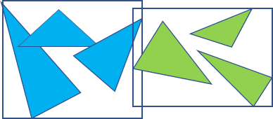

<div align="center"></div>

@[TOC](目录)

# 前言

利用 BVH 数据结构加速光线追踪遍历！

<div align="center"></div>


在上次的博客：[光线追踪渲染实战：蒙特卡洛路径追踪及其c++实现](https://blog.csdn.net/weixin_44176696/article/details/113418991) 里面，我们实现了最简单的光线追踪渲染 demo

但是注意到这个程序的效率并不高，因为我们大量的时间都用在了【光线和三角形求交】这个部分，事实上求交操作也是光线追踪技术性能的瓶颈。注意到下面的简单场景仅仅包含十几个图元（三角形和球体），但是渲染一张 256 x 256 的图片，采样 4096 spp，就消耗了数十分钟：

<div align="center"></div>

<br>

效率的低下是因为每次求交我们都枚举了场景中的所有图元，即：

```cpp
// 遍历所有图形，求最近交点
for (auto& shape : shapes)
{
    r = shape->intersect(ray);
    ...
}
```

如果说渲染一个小的场景，直接枚举就足够了。但是在现代计算机图形学中，场景的三角形数目一般都是按 K 或 M，即 $10^3$ 和 $10^6$ 来计算的。比如经典的 Sponza Atrium 就拥有 29 K 个多边形：

<div align="center"></div>


如果暴力遍历所有三角形，那么时间开销之大，以至于我们的程序慢到可以和银河系中间的大黑洞比一比谁先结束

于是 BVH 树的出现了，为了解决冗长的求交问题。事实上光线和大多数三角形都是不相交的，所以 BVH 树能够根据光线和场景的三维空间关系，每次剔除半数的三角形，减少冗余的求交，达到加速效果

# BVH 简介
BVH 全称 Bounding Volume Hierarchy，即层次包围盒。BVH 用 AABB 的盒子（碰撞箱）包围一组三角面片：

<div align="center"></div>


> 注：
> AABB 包围盒就是轴对称包围盒
> 即盒子的 6 个面平行于 xy, xz, yz 平面

光线要击中盒子中的三角形的 **必要条件** 是光线击中盒子，如果光线没有击中盒子，那么必定不会击中盒子里面的所有三角形。

基于这个规律，如果我们将三角形对半分，用两个盒子来分别容纳，就可以简单的用光线和盒子的求交，剔除半数的三角形，从而达到减少求交次数的目的：

<div align="center"></div>

对于左边和右边的盒子，可以递归地再次进行划分，形成树形结构：

<div align="center"></div>


光线与左边的盒子不相交，那么左半边的所有三角形，都不不用考虑了。这与平衡二叉树的搜索类似，一次排除半数元素，将查找的复杂度从 O(n) 变为 O(log(n))

所有的三角形都存储在叶子节点中，而中间节点仅存储 AABB 包围盒。在光线和 BVH 树的根节点求交的时候，有如下的步骤：

1. 光线和左盒子求交
2. 光线和右盒子求交
3. 如果光线命中左盒子，递归对左子树求交
4. 如果光线命中右盒子，递归对右子树求交

因为是以三角形为单位进行划分，每个三角形都属于一个盒子，那么盒子之间有可能交错。光线同时命中了左右盒子，就要对两个盒子都递归求交：

<div align="center"></div>


此外，这里左右盒子只是逻辑上的划分，不代表三维空间里的三角形位置。因为每次是将三角形（数组）对半分

# 构建 BVH 树
以经典的 Stanford Bunny 为例，它包含 4968 个三角形：

<div align="center"></div>


你可以在 [这里](https://graphics.stanford.edu/~mdfisher/Data/Meshes/bunny.obj) 找到这只兔子的 obj 格式的模型

假设我们已经成功读取了 obj 模型的所有顶点和面片索引。如果读取 obj 遇到困难，可以参考我之前的博客：[OpenGL学习（六）纹理与obj格式模型的读取](https://blog.csdn.net/weixin_44176696/article/details/110884072)

我们根据这些信息创建所有的三角形。首先是三角形的结构体定义：

```cpp
typedef struct Triangle { 
    vec3 p1, p2, p3;   // 三点
    vec3 center;       // 中心
    Triangle(vec3 a, vec3 b, vec3 c) {
        p1 = a, p2 = b, p3 = c;
        center = (p1 + p2 + p3) / vec3(3, 3, 3);
    }
} Triangle;
```

这里除了三个点以外还定义了中心，因为待会我们对三角形进行对半分，要根据其中心位置进行划分

划分的方式也很简单。按照某个轴进行排序，然后将数组对半分。排序的比较函数如下：

```cpp
// 按照三角形中心排序 -- 比较函数
bool cmpx(const Triangle& t1, const Triangle& t2) {
    return t1.center.x < t2.center.x;
}
bool cmpy(const Triangle& t1, const Triangle& t2) {
    return t1.center.y < t2.center.y;
}
bool cmpz(const Triangle& t1, const Triangle& t2) {
    return t1.center.z < t2.center.z;
}
```

紧接着需要根据 obj 文件的信息，创建三角形的数组：

```cpp
std::vector<Triangle> triangles;
```

最后我们需要一个 BVH 树的节点。它需要包含一些信息，比如包围盒 AABB，还有叶子节点信息：

这里保存一个 n 和 一个 index，其中 n 不为 0 时表示是叶子节点，n 是存储的三角形的个数，而 triangles 数组中 `[index, index + n -1]` 范围的三角形都属于该节点

最后是指向两个子树的指针，于是 BVHNode 结构体的定义如下：

```cpp
// BVH 树节点
struct BVHNode {
    BVHNode* left = NULL;       // 左右子树索引
    BVHNode* right = NULL;
    int n, index;               // 叶子节点信息               
    vec3 AA, BB;                // 碰撞盒
};
```


> 注：
> 这里规定 AA 是包围盒的数值小的坐标，BB 是数值大的坐标，比如：
> <div align="center"></div>
> 此外，在代码中 AABB 都是三维的坐标


然后可以开始建树：

1. 首先拿到一个三角形数组和左右下标 `l, r` 
2. 然后遍历 `[l, r]` 中所有三角形，计算 x，y，z 轴的最小最大值，从而获得本节点的 AABB 碰撞箱
3. 如果仅剩节点数目小于阈值 n，直接构建并且返回叶子节点，否则递归建树
4. 选取 AABB 碰撞箱 **最长** 的一个轴，对三角形按照对应轴的中心坐标进行 **排序** 
5. 根据数组中点 `mid` 将三角形序列分为左半边 `[l, mid]` 和右半边 `[mid+1, r]`，递归进行建树

代码如下：

```cpp
// 构建 BVH
BVHNode* buildBVH(std::vector<Triangle>& triangles, int l, int r, int n) {
    if (l > r) return 0;

    BVHNode* node = new BVHNode();
    node->AA = vec3(1145141919, 1145141919, 1145141919);
    node->BB = vec3(-1145141919, -1145141919, -1145141919);

    // 计算 AABB
    for (int i = l; i <= r; i++) {
        // 最小点 AA
        float minx = min(triangles[i].p1.x, min(triangles[i].p2.x, triangles[i].p3.x));
        float miny = min(triangles[i].p1.y, min(triangles[i].p2.y, triangles[i].p3.y));
        float minz = min(triangles[i].p1.z, min(triangles[i].p2.z, triangles[i].p3.z));
        node->AA.x = min(node->AA.x, minx);
        node->AA.y = min(node->AA.y, miny);
        node->AA.z = min(node->AA.z, minz);
        // 最大点 BB
        float maxx = max(triangles[i].p1.x, max(triangles[i].p2.x, triangles[i].p3.x));
        float maxy = max(triangles[i].p1.y, max(triangles[i].p2.y, triangles[i].p3.y));
        float maxz = max(triangles[i].p1.z, max(triangles[i].p2.z, triangles[i].p3.z));
        node->BB.x = max(node->BB.x, maxx);
        node->BB.y = max(node->BB.y, maxy);
        node->BB.z = max(node->BB.z, maxz);
    }

    // 不多于 n 个三角形 返回叶子节点
    if ((r - l + 1) <= n) {
        node->n = r - l + 1;
        node->index = l;
        return node;
    }

    // 否则递归建树
    float lenx = node->BB.x - node->AA.x;
    float leny = node->BB.y - node->AA.y;
    float lenz = node->BB.z - node->AA.z;
    // 按 x 划分
    if (lenx >= leny && lenx >= lenz)
        std::sort(triangles.begin() + l, triangles.begin() + r + 1, cmpx);
    // 按 y 划分
    if (leny >= lenx && leny >= lenz)
        std::sort(triangles.begin() + l, triangles.begin() + r + 1, cmpy);
    // 按 z 划分
    if (lenz >= lenx && lenz >= leny)
        std::sort(triangles.begin() + l, triangles.begin() + r + 1, cmpz);
    
    // 递归
    int mid = (l + r) / 2;
    node->left = buildBVH(triangles, l, mid, n);
    node->right = buildBVH(triangles, mid + 1, r, n);

    return node;
}
```

可视化的建树结果，首先是整个模型碰撞箱，然后进行二分，再二分，以此类推。下图以从上到下从左到右的顺序展示了二分建树的过程：

<div align="center"></div>

可以看到，层次越深，包围盒就越小，越多，越精确


# 光线和 AABB 盒子求交

要在 BVH 上求交，首先要解决的是光线和 BVH 盒子求交的问题。首先定义光线：

```cpp
// 光线
typedef struct Ray {
    vec3 startPoint = vec3(0, 0, 0);    // 起点
    vec3 direction = vec3(0, 0, 0);     // 方向
} Ray;
```

然后对于 AABB 盒子，因为是轴对齐的包围盒，只需要找出一组【穿入，穿出】点，即能说明光线击中盒子：

<div align="center"></div>


对于轴对齐包围盒，拥有三对平行的面，分别是 x，y，z 面，对于每一组面，都要计算【穿入，穿出】点：

<div align="center"></div>

如果光线起点距离穿入点的距离 **小于** 光线起点距离穿出点的距离，即 `t0 < t1` 则说明命中：

<div align="center"></div>

首先计算起点到各个面的距离，以二维为例，用 AA 的坐标除以光线方向 direction 可以得到二维向量 in，其中 in.x 是 x 面的穿入点，in.y 是 y 面的穿入点。同理 BB 的坐标除以 direction 得到 out 也是一样：

<div align="center"></div>

然后我们取 out 中最小的距离记作 t1，和 in 中最大的距离记作 t0，然后看是否 t1 > t0 如果满足等式，则说明命中：

<div align="center"></div>

这个结论推广到三维也是成立的，于是可以很快得出和 AABB 盒子求交的代码：

```cpp
// 和 aabb 盒子求交，没有交点则返回 -1
float hitAABB(Ray r, vec3 AA, vec3 BB) {
    // 1.0 / direction
    vec3 invdir = vec3(1.0 / r.direction.x, 1.0 / r.direction.y, 1.0 / r.direction.z);

    vec3 in = (BB - r.startPoint) * invdir;
    vec3 out = (AA - r.startPoint) * invdir;

    vec3 tmax = max(in, out);
    vec3 tmin = min(in, out);

    float t1 = min(tmax.x, min(tmax.y, tmax.z));
    float t0 = max(tmin.x, max(tmin.y, tmin.z));

    return (t1 >= t0) ? ((t0 > 0.0) ? (t0) : (t1)) : (-1);
}
```

> 注：
> 这里计算 invdir 是因为 glm 这个库不支持向量直接除运算符
> 而且预计算除法可以减小计算开销

# 光线在 BVH 上求交

首先定义一个求交的结果，因为我们不仅需要返回命中的三角形，还要返回起点到它的 **距离** ，这是因为遍历 BVH 时可能会产生两个交点：

<div align="center"></div>


但是最终我们需要选取最近的交点，可以通过距离来判断。于是有求交结果的定义：

```cpp
// 求交结果
struct HitResult {
    Triangle* triangle = NULL;
    float distance = INF;
};
```

紧接着是和三角形求交。首先判断光线和三角形所在平面是否相交，然后判断交点是否在平面内，原理如下：

<div align="center"></div>

<div align="center"></div>

于是和三角形求交的代码如下，如果没有交点，我们返回 INF 即一个大数：

```cpp
// 光线和三角形求交 
float hitTriangle(Triangle* triangle, Ray ray) {

    vec3 p1 = triangle->p1, p2 = triangle->p2, p3 = triangle->p3;
    vec3 S = ray.startPoint;        // 射线起点
    vec3 d = ray.direction;         // 射线方向
    vec3 N = normalize(cross(p2 - p1, p3 - p1));    // 法向量
    if (dot(N, d) > 0.0f) N = -N;   // 获取正确的法向量

    // 如果视线和三角形平行
    if (fabs(dot(N, d)) < 0.00001f) return INF;

    // 距离
    float t = (dot(N, p1) - dot(S, N)) / dot(d, N);
    if (t < 0.0005f) return INF;    // 如果三角形在光线背面

    // 交点计算
    vec3 P = S + d * t;

    // 判断交点是否在三角形中
    vec3 c1 = cross(p2 - p1, P - p1);
    vec3 c2 = cross(p3 - p2, P - p2);
    vec3 c3 = cross(p1 - p3, P - p3);
    if (dot(c1, N) > 0 && dot(c2, N) > 0 && dot(c3, N) > 0) return t;
    if (dot(c1, N) < 0 && dot(c2, N) < 0 && dot(c3, N) < 0) return t;

    return INF;
}
```

于是我们可以在 triangle 数组的某个下标范围 `[l, r]` 里面，暴力查找最近的三角形：

```cpp
// 暴力查数组
HitResult hitTriangleArray(Ray ray, std::vector<Triangle>& triangles, int l, int r) {
    HitResult res;
    for (int i = l; i <= r; i++) {
        float d = hitTriangle(&triangles[i], ray);
        if (d < INF && d < res.distance) {
            res.distance = d;
            res.triangle = &triangles[i];
        }
    }
    return res;
}
```

然后编写和 BVH 求交的代码。它返回击中的三角形的指针，如果未命中则返回空指针。光线求交操作也是递归操作，首先和左右子树的 AABB 盒子求交，如果击中盒子，就递归左右子树，否则停止。此外如果遇到叶子节点，应该和叶子节点包围的 **所有** 三角形求交：

```cpp
// 在 BVH 上遍历求交
HitResult hitBVH(Ray ray, std::vector<Triangle>& triangles, BVHNode* root) {
    if (root == NULL) return HitResult();

    // 是叶子 暴力查
    if (root->n > 0) {
        return hitTriangleArray(ray, triangles, root->n, root->n + root->index - 1);
    }

    // 和左右子树 AABB 求交
    float d1 = INF, d2 = INF;
    if (root->left) d1 = hitAABB(ray, root->left->AA, root->left->BB);
    if (root->right) d2 = hitAABB(ray, root->right->AA, root->right->BB);

    // 递归结果
    HitResult r1, r2;
    if (d1>0) r1 = hitBVH(ray, triangles, root->left);
    if (d2>0) r2 = hitBVH(ray, triangles, root->right);
    
    return r1.distance < r2.distance ? r1 : r2;
}
```

可以看到光线和三角形求交的结果，白色的三角形是击中的三角形：


<div align="center"></div>

下图以从上到下从左到右的顺序展示了递归遍历 BVH 树的过程，逐层缩小 AABB 碰撞盒，最后精确地定位到极小的区域：


这里只给出了 8 层递归，事实上树不止 8 层，继续遍历以获得更小的 AABB 盒子，以精确定位三角形


# SAH 优化（重要）
对于单个的，比较紧凑的网格，使用均分策略进行分割就能够得到不错的效果。但是并非所有场景都能得到好的效果，比如我们多加一个底面：

<div align="center"></div>

仅增加两个三角形会对效率带来很大的影响吗？答案是会的。观察增加底面后的新 BVH，这里仅展示第一层的 AABB 盒子：

<div align="center"></div>

第一层的两个碰撞盒几乎完全重叠了！这意味着大部分的光线会同时 hit 两个盒子，我们不得不对 **两个盒子都进行递归** 查找，那么效率自然降低了很多。

<div align="center"></div>


熟悉数据结构二叉查找树的童鞋很快就会发现，二叉查找树之所以快，是因为每次都能剔除半数（理想状态）的节点，但是盒子的 overlap 不能帮助我们剔除大量节点，效率自然低

于是引入 SAH 优化。SAH 全名 Surface Area Heuristic，即表面积启发算法。它是一种 “奇技淫巧”，但着实有效

SAH 算法首先定义了查找一颗 BVH 树的代价：

* 查找左盒子的 n1 个三角形需要花费 `T * n1` 的时间（其中 t 为常数
* 查找右盒子的 n2 个三角形需要花费 `T * n2` 的时间
* 假设光线有 p1 的概率击中左盒子，有 p2 的概率击中右盒子
* 最终的代价为 `cost = p1 * n1 + p2 * n2` （这里省略了常数 T

那么对于 n 个三角形的数组，一分为二总共有 n-1 种情况（回想中学数学的插隔板法），我们遍历所有的情况，找出使得代价 cost 最小的一种分割方案作为最终的分割

此外，对于 x，y，z 每个轴，我们都试一次，找出最佳的分割就行。那么怎么算光线击中两个盒子的概率呢？回想概率论的几何概型，不难发现光线击中盒子的概率，和盒子的 **表面积** 成正相关：

<div align="center"></div>

~~这里贴一下宇哥的馅饼故事。。。~~ 

至此点出 SAH 算法中 S 代表什么，即 surface，表面积！现在实现 SAH 优化就变得很简单了。每次只需要遍历所有的中点 i，将数组分割为 `[l, i], [i+1, r]` 两部分，然后算一下两部分的代价

还有一个小问题，这里需要计算 n 次左右盒子的 AABB 包围盒，如果每次我们遍历区间找最值建立包围盒，那么建树的效率会非常低下。这里有一个小技巧，使用 **前缀** 的思想，预先计算 `[l, i], [i+1, r]` 区间的最大，最小的 xyz 值，然后每次花费 O(1) 的时间查询就可以了。

那么根据 SAH 优化建立 BVH 树的代码如下：

```cpp
// SAH 优化构建 BVH
BVHNode* buildBVHwithSAH(std::vector<Triangle>& triangles, int l, int r, int n) {
    if (l > r) return 0;

    BVHNode* node = new BVHNode();
    node->AA = vec3(1145141919, 1145141919, 1145141919);
    node->BB = vec3(-1145141919, -1145141919, -1145141919);

    // 计算 AABB
    for (int i = l; i <= r; i++) {
        // 最小点 AA
        float minx = min(triangles[i].p1.x, min(triangles[i].p2.x, triangles[i].p3.x));
        float miny = min(triangles[i].p1.y, min(triangles[i].p2.y, triangles[i].p3.y));
        float minz = min(triangles[i].p1.z, min(triangles[i].p2.z, triangles[i].p3.z));
        node->AA.x = min(node->AA.x, minx);
        node->AA.y = min(node->AA.y, miny);
        node->AA.z = min(node->AA.z, minz);
        // 最大点 BB
        float maxx = max(triangles[i].p1.x, max(triangles[i].p2.x, triangles[i].p3.x));
        float maxy = max(triangles[i].p1.y, max(triangles[i].p2.y, triangles[i].p3.y));
        float maxz = max(triangles[i].p1.z, max(triangles[i].p2.z, triangles[i].p3.z));
        node->BB.x = max(node->BB.x, maxx);
        node->BB.y = max(node->BB.y, maxy);
        node->BB.z = max(node->BB.z, maxz);
    }

    // 不多于 n 个三角形 返回叶子节点
    if ((r - l + 1) <= n) {
        node->n = r - l + 1;
        node->index = l;
        return node;
    }

    // 否则递归建树
    float Cost = INF;
    int Axis = 0;
    int Split = (l + r) / 2;
    for (int axis = 0; axis < 3; axis++) {
        // 分别按 x，y，z 轴排序
        if (axis == 0) std::sort(&triangles[0] + l, &triangles[0] + r + 1, cmpx);
        if (axis == 1) std::sort(&triangles[0] + l, &triangles[0] + r + 1, cmpy);
        if (axis == 2) std::sort(&triangles[0] + l, &triangles[0] + r + 1, cmpz);

        // leftMax[i]: [l, i] 中最大的 xyz 值
        // leftMin[i]: [l, i] 中最小的 xyz 值
        std::vector<vec3> leftMax(r - l + 1, vec3(-INF, -INF, -INF));
        std::vector<vec3> leftMin(r - l + 1, vec3(INF, INF, INF));
        // 计算前缀 注意 i-l 以对齐到下标 0
        for (int i = l; i <= r; i++) {
            Triangle& t = triangles[i];
            int bias = (i == l) ? 0 : 1;  // 第一个元素特殊处理

            leftMax[i - l].x = max(leftMax[i - l - bias].x, max(t.p1.x, max(t.p2.x, t.p3.x)));
            leftMax[i - l].y = max(leftMax[i - l - bias].y, max(t.p1.y, max(t.p2.y, t.p3.y)));
            leftMax[i - l].z = max(leftMax[i - l - bias].z, max(t.p1.z, max(t.p2.z, t.p3.z)));

            leftMin[i - l].x = min(leftMin[i - l - bias].x, min(t.p1.x, min(t.p2.x, t.p3.x)));
            leftMin[i - l].y = min(leftMin[i - l - bias].y, min(t.p1.y, min(t.p2.y, t.p3.y)));
            leftMin[i - l].z = min(leftMin[i - l - bias].z, min(t.p1.z, min(t.p2.z, t.p3.z)));
        }

        // rightMax[i]: [i, r] 中最大的 xyz 值
        // rightMin[i]: [i, r] 中最小的 xyz 值
        std::vector<vec3> rightMax(r - l + 1, vec3(-INF, -INF, -INF));
        std::vector<vec3> rightMin(r - l + 1, vec3(INF, INF, INF));
        // 计算后缀 注意 i-l 以对齐到下标 0
        for (int i = r; i >= l; i--) {
            Triangle& t = triangles[i];
            int bias = (i == r) ? 0 : 1;  // 第一个元素特殊处理

            rightMax[i - l].x = max(rightMax[i - l + bias].x, max(t.p1.x, max(t.p2.x, t.p3.x)));
            rightMax[i - l].y = max(rightMax[i - l + bias].y, max(t.p1.y, max(t.p2.y, t.p3.y)));
            rightMax[i - l].z = max(rightMax[i - l + bias].z, max(t.p1.z, max(t.p2.z, t.p3.z)));

            rightMin[i - l].x = min(rightMin[i - l + bias].x, min(t.p1.x, min(t.p2.x, t.p3.x)));
            rightMin[i - l].y = min(rightMin[i - l + bias].y, min(t.p1.y, min(t.p2.y, t.p3.y)));
            rightMin[i - l].z = min(rightMin[i - l + bias].z, min(t.p1.z, min(t.p2.z, t.p3.z)));
        }

        // 遍历寻找分割
        float cost = INF;
        int split = l;
        for (int i = l; i <= r-1; i++) {
            float lenx, leny, lenz;
            // 左侧 [l, i]
            vec3 leftAA = leftMin[i - l];
            vec3 leftBB = leftMax[i - l];
            lenx = leftBB.x - leftAA.x;
            leny = leftBB.y - leftAA.y;
            lenz = leftBB.z - leftAA.z;
            float leftS = 2.0 * ((lenx * leny) + (lenx * lenz) + (leny * lenz));
            float leftCost = leftS * (i - l + 1);

            // 右侧 [i+1, r]
            vec3 rightAA = rightMin[i + 1 - l];
            vec3 rightBB = rightMax[i + 1 - l];
            lenx = rightBB.x - rightAA.x;
            leny = rightBB.y - rightAA.y;
            lenz = rightBB.z - rightAA.z;
            float rightS = 2.0 * ((lenx * leny) + (lenx * lenz) + (leny * lenz));
            float rightCost = rightS * (r - i);

            // 记录每个分割的最小答案
            float totalCost = leftCost + rightCost;
            if (totalCost < cost) {
                cost = totalCost;
                split = i;
            }
        }
        // 记录每个轴的最佳答案
        if (cost < Cost) {
            Cost = cost;
            Axis = axis;
            Split = split;
        }
    }
    
    // 按最佳轴分割
    if (Axis == 0) std::sort(&triangles[0] + l, &triangles[0] + r + 1, cmpx);
    if (Axis == 1) std::sort(&triangles[0] + l, &triangles[0] + r + 1, cmpy);
    if (Axis == 2) std::sort(&triangles[0] + l, &triangles[0] + r + 1, cmpz);

    // 递归
    node->left = buildBVHwithSAH(triangles, l, Split, n);
    node->right = buildBVHwithSAH(triangles, Split+1, r, n);

    return node;
}
```

我们再看看第一层包围盒的情况：

<div align="center"></div>

这里故意将底面的三角形倾斜了一定角度，方便观察 AABB 盒子。可以看到两个包围盒几乎没有交叠部分，效果非常好！

# 效率测试

hhh 说实话这是下一篇文章的内容了，在 GPU 上并行计算。我是过了一个月，回头编辑一下这篇文章，也对 BVH 和 SAH 优化做一个直观的对比。跑一个 4000+ 面的 Stanford Bunny 模型和一个底面，只有简单的 depth=6 的 diffuse

首先是暴力遍历，不使用 BVH ，暴力遍历 4000 多个三角形，帧数为 0.42，非常卡：

<div align="center"></div>

然后使用简单二分法建立的 BVH 进行遍历，这一步就有了巨大的提升。变成了 11 帧，有了质的飞跃：

<div align="center"></div>


最后是使用 SAH 优化建立的 BVH ，帧数是 20，可以看到效率几乎提升了一倍：

<div align="center"></div>


# 完整代码

在 cpu 上用 c++ 建树，可视化用 OpenGL

## c++

用到的库：

OpenGL：freeglut，GLEW
数学：glm

```cpp
#include <iostream>
#include <string>
#include <fstream>
#include <vector>
#include <sstream>
#include <iostream>
#include <algorithm>

#include <GL/glew.h>
#include <GL/freeglut.h>
#include <glm/glm.hpp>
#include <glm/gtc/matrix_transform.hpp>
#include <glm/gtc/type_ptr.hpp>

#define INF 114514.0

using namespace glm;

// ----------------------------------------------------------------------------- //

GLuint program;                 // 着色器程序对象
std::vector<vec3> vertices;     // 顶点坐标
std::vector<GLuint> indices;    // 顶点索引
std::vector<vec3> lines;        // 线段端点坐标
vec3 rotateControl(0, 0, 0);    // 旋转参数
vec3 scaleControl(1, 1, 1);     // 缩放参数

// BVH 树节点
struct BVHNode {
    BVHNode* left = NULL;       // 左右子树索引
    BVHNode* right = NULL;
    int n, index;               // 叶子节点信息               
    vec3 AA, BB;                // 碰撞盒
};

typedef struct Triangle {
    vec3 p1, p2, p3;   // 三点
    vec3 center;       // 中心
    Triangle(vec3 a, vec3 b, vec3 c) {
        p1 = a, p2 = b, p3 = c;
        center = (p1 + p2 + p3) / vec3(3, 3, 3);
    }
} Triangle;
std::vector<Triangle> triangles;

// 按照三角形中心排序 -- 比较函数
bool cmpx(const Triangle& t1, const Triangle& t2) {
    return t1.center.x < t2.center.x;
}
bool cmpy(const Triangle& t1, const Triangle& t2) {
    return t1.center.y < t2.center.y;
}
bool cmpz(const Triangle& t1, const Triangle& t2) {
    return t1.center.z < t2.center.z;
}

// 求交结果
struct HitResult {
    Triangle* triangle = NULL;
    float distance = INF;
};

// 光线
typedef struct Ray {
    vec3 startPoint = vec3(0, 0, 0);    // 起点
    vec3 direction = vec3(0, 0, 0);     // 方向
}Ray;

// ----------------------------------------------------------------------------- //

// 读取文件并且返回一个长字符串表示文件内容
std::string readShaderFile(std::string filepath) {
    std::string res, line;
    std::ifstream fin(filepath);
    if (!fin.is_open())
    {
        std::cout << "文件 " << filepath << " 打开失败" << std::endl;
        exit(-1);
    }
    while (std::getline(fin, line))
    {
        res += line + '\n';
    }
    fin.close();
    return res;
}

// 获取着色器对象
GLuint getShaderProgram(std::string fshader, std::string vshader) {
    // 读取shader源文件
    std::string vSource = readShaderFile(vshader);
    std::string fSource = readShaderFile(fshader);
    const char* vpointer = vSource.c_str();
    const char* fpointer = fSource.c_str();

    // 容错
    GLint success;
    GLchar infoLog[512];

    // 创建并编译顶点着色器
    GLuint vertexShader = glCreateShader(GL_VERTEX_SHADER);
    glShaderSource(vertexShader, 1, (const GLchar**)(&vpointer), NULL);
    glCompileShader(vertexShader);
    glGetShaderiv(vertexShader, GL_COMPILE_STATUS, &success);   // 错误检测
    if (!success)
    {
        glGetShaderInfoLog(vertexShader, 512, NULL, infoLog);
        std::cout << "顶点着色器编译错误\n" << infoLog << std::endl;
        exit(-1);
    }

    // 创建并且编译片段着色器
    GLuint fragmentShader = glCreateShader(GL_FRAGMENT_SHADER);
    glShaderSource(fragmentShader, 1, (const GLchar**)(&fpointer), NULL);
    glCompileShader(fragmentShader);
    glGetShaderiv(fragmentShader, GL_COMPILE_STATUS, &success);   // 错误检测
    if (!success)
    {
        glGetShaderInfoLog(fragmentShader, 512, NULL, infoLog);
        std::cout << "片段着色器编译错误\n" << infoLog << std::endl;
        exit(-1);
    }

    // 链接两个着色器到program对象
    GLuint shaderProgram = glCreateProgram();
    glAttachShader(shaderProgram, vertexShader);
    glAttachShader(shaderProgram, fragmentShader);
    glLinkProgram(shaderProgram);

    // 删除着色器对象
    glDeleteShader(vertexShader);
    glDeleteShader(fragmentShader);

    return shaderProgram;
}

// 读取 obj
void readObj(std::string filepath, std::vector<vec3>& vertices, std::vector<GLuint>& indices) {
    // 打开文件流
    std::ifstream fin(filepath);
    std::string line;
    if (!fin.is_open()) {
        std::cout << "文件 " << filepath << " 打开失败" << std::endl;
        exit(-1);
    }

    // 增量读取
    int offset = vertices.size();  

    // 按行读取
    while (std::getline(fin, line)) {
        std::istringstream sin(line);   // 以一行的数据作为 string stream 解析并且读取
        std::string type;
        GLfloat x, y, z;
        int v0, v1, v2;

        // 读取obj文件
        sin >> type;
        if (type == "v") {
            sin >> x >> y >> z;
            vertices.push_back(vec3(x, y, z));
        }
        if (type == "f") {
            sin >> v0 >> v1 >> v2;
            indices.push_back(v0 - 1 + offset);
            indices.push_back(v1 - 1 + offset);
            indices.push_back(v2 - 1 + offset);
        }
    }
}

void addLine(vec3 p1, vec3 p2) {
    lines.push_back(p1);
    lines.push_back(p2);
}

void addBox(BVHNode* root) {
    float x1 = root->AA.x, y1 = root->AA.y, z1 = root->AA.z;
    float x2 = root->BB.x, y2 = root->BB.y, z2 = root->BB.z;
    lines.push_back(vec3(x1, y1, z1)), lines.push_back(vec3(x2, y1, z1));
    lines.push_back(vec3(x1, y1, z1)), lines.push_back(vec3(x1, y1, z2));
    lines.push_back(vec3(x1, y1, z1)), lines.push_back(vec3(x1, y2, z1));
    lines.push_back(vec3(x2, y1, z1)), lines.push_back(vec3(x2, y1, z2));
    lines.push_back(vec3(x2, y1, z1)), lines.push_back(vec3(x2, y2, z1));
    lines.push_back(vec3(x1, y2, z1)), lines.push_back(vec3(x2, y2, z1));
    lines.push_back(vec3(x1, y1, z2)), lines.push_back(vec3(x1, y2, z2));
    lines.push_back(vec3(x1, y2, z1)), lines.push_back(vec3(x1, y2, z2));
    lines.push_back(vec3(x1, y2, z2)), lines.push_back(vec3(x2, y2, z2));
    lines.push_back(vec3(x1, y1, z2)), lines.push_back(vec3(x2, y1, z2));
    lines.push_back(vec3(x2, y2, z1)), lines.push_back(vec3(x2, y2, z2));
    lines.push_back(vec3(x2, y1, z2)), lines.push_back(vec3(x2, y2, z2));
}

void addTriangle(Triangle* tri) {
    if (tri) {
        lines.push_back(tri->p1 - vec3(0.0005, 0.0005, 0.0005));
        lines.push_back(tri->p2 - vec3(0.0005, 0.0005, 0.0005));
        lines.push_back(tri->p2 - vec3(0.0005, 0.0005, 0.0005));
        lines.push_back(tri->p3 - vec3(0.0005, 0.0005, 0.0005));
        lines.push_back(tri->p3 - vec3(0.0005, 0.0005, 0.0005));
        lines.push_back(tri->p1 - vec3(0.0005, 0.0005, 0.0005));
        lines.push_back(tri->p1 + vec3(0.0005, 0.0005, 0.0005));
        lines.push_back(tri->p2 + vec3(0.0005, 0.0005, 0.0005));
        lines.push_back(tri->p2 + vec3(0.0005, 0.0005, 0.0005));
        lines.push_back(tri->p3 + vec3(0.0005, 0.0005, 0.0005));
        lines.push_back(tri->p3 + vec3(0.0005, 0.0005, 0.0005));
        lines.push_back(tri->p1 + vec3(0.0005, 0.0005, 0.0005));
    }
}

// 光线和三角形求交 
float hitTriangle(Triangle* triangle, Ray ray) {

    vec3 p1 = triangle->p1, p2 = triangle->p2, p3 = triangle->p3;
    vec3 S = ray.startPoint;        // 射线起点
    vec3 d = ray.direction;         // 射线方向
    vec3 N = normalize(cross(p2 - p1, p3 - p1));    // 法向量
    if (dot(N, d) > 0.0f) N = -N;   // 获取正确的法向量

    // 如果视线和三角形平行
    if (fabs(dot(N, d)) < 0.00001f) return INF;

    // 距离
    float t = (dot(N, p1) - dot(S, N)) / dot(d, N);
    if (t < 0.0005f) return INF;    // 如果三角形在光线背面

    // 交点计算
    vec3 P = S + d * t;

    // 判断交点是否在三角形中
    vec3 c1 = cross(p2 - p1, P - p1);
    vec3 c2 = cross(p3 - p2, P - p2);
    vec3 c3 = cross(p1 - p3, P - p3);
    if (dot(c1, N) > 0 && dot(c2, N) > 0 && dot(c3, N) > 0) return t;
    if (dot(c1, N) < 0 && dot(c2, N) < 0 && dot(c3, N) < 0) return t;

    return INF;
}


// 构建 BVH
BVHNode* buildBVH(std::vector<Triangle>& triangles, int l, int r, int n) {
    if (l > r) return 0;

    BVHNode* node = new BVHNode();
    node->AA = vec3(1145141919, 1145141919, 1145141919);
    node->BB = vec3(-1145141919, -1145141919, -1145141919);

    // 计算 AABB
    for (int i = l; i <= r; i++) {
        // 最小点 AA
        float minx = min(triangles[i].p1.x, min(triangles[i].p2.x, triangles[i].p3.x));
        float miny = min(triangles[i].p1.y, min(triangles[i].p2.y, triangles[i].p3.y));
        float minz = min(triangles[i].p1.z, min(triangles[i].p2.z, triangles[i].p3.z));
        node->AA.x = min(node->AA.x, minx);
        node->AA.y = min(node->AA.y, miny);
        node->AA.z = min(node->AA.z, minz);
        // 最大点 BB
        float maxx = max(triangles[i].p1.x, max(triangles[i].p2.x, triangles[i].p3.x));
        float maxy = max(triangles[i].p1.y, max(triangles[i].p2.y, triangles[i].p3.y));
        float maxz = max(triangles[i].p1.z, max(triangles[i].p2.z, triangles[i].p3.z));
        node->BB.x = max(node->BB.x, maxx);
        node->BB.y = max(node->BB.y, maxy);
        node->BB.z = max(node->BB.z, maxz);
    }

    // 不多于 n 个三角形 返回叶子节点
    if ((r - l + 1) <= n) {
        node->n = r - l + 1;
        node->index = l;
        return node;
    }

    // 否则递归建树
    float lenx = node->BB.x - node->AA.x;
    float leny = node->BB.y - node->AA.y;
    float lenz = node->BB.z - node->AA.z;
    // 按 x 划分
    if (lenx >= leny && lenx >= lenz)
        std::sort(triangles.begin() + l, triangles.begin() + r + 1, cmpx);
    // 按 y 划分
    if (leny >= lenx && leny >= lenz)
        std::sort(triangles.begin() + l, triangles.begin() + r + 1, cmpy);
    // 按 z 划分
    if (lenz >= lenx && lenz >= leny)
        std::sort(triangles.begin() + l, triangles.begin() + r + 1, cmpz);
    
    // 递归
    int mid = (l + r) / 2;
    node->left = buildBVH(triangles, l, mid, n);
    node->right = buildBVH(triangles, mid + 1, r, n);

    return node;
}

// SAH 优化构建 BVH
BVHNode* buildBVHwithSAH(std::vector<Triangle>& triangles, int l, int r, int n) {
    if (l > r) return 0;

    BVHNode* node = new BVHNode();
    node->AA = vec3(1145141919, 1145141919, 1145141919);
    node->BB = vec3(-1145141919, -1145141919, -1145141919);

    // 计算 AABB
    for (int i = l; i <= r; i++) {
        // 最小点 AA
        float minx = min(triangles[i].p1.x, min(triangles[i].p2.x, triangles[i].p3.x));
        float miny = min(triangles[i].p1.y, min(triangles[i].p2.y, triangles[i].p3.y));
        float minz = min(triangles[i].p1.z, min(triangles[i].p2.z, triangles[i].p3.z));
        node->AA.x = min(node->AA.x, minx);
        node->AA.y = min(node->AA.y, miny);
        node->AA.z = min(node->AA.z, minz);
        // 最大点 BB
        float maxx = max(triangles[i].p1.x, max(triangles[i].p2.x, triangles[i].p3.x));
        float maxy = max(triangles[i].p1.y, max(triangles[i].p2.y, triangles[i].p3.y));
        float maxz = max(triangles[i].p1.z, max(triangles[i].p2.z, triangles[i].p3.z));
        node->BB.x = max(node->BB.x, maxx);
        node->BB.y = max(node->BB.y, maxy);
        node->BB.z = max(node->BB.z, maxz);
    }

    // 不多于 n 个三角形 返回叶子节点
    if ((r - l + 1) <= n) {
        node->n = r - l + 1;
        node->index = l;
        return node;
    }

    // 否则递归建树
    float Cost = INF;
    int Axis = 0;
    int Split = (l + r) / 2;
    for (int axis = 0; axis < 3; axis++) {
        // 分别按 x，y，z 轴排序
        if (axis == 0) std::sort(&triangles[0] + l, &triangles[0] + r + 1, cmpx);
        if (axis == 1) std::sort(&triangles[0] + l, &triangles[0] + r + 1, cmpy);
        if (axis == 2) std::sort(&triangles[0] + l, &triangles[0] + r + 1, cmpz);

        // leftMax[i]: [l, i] 中最大的 xyz 值
        // leftMin[i]: [l, i] 中最小的 xyz 值
        std::vector<vec3> leftMax(r - l + 1, vec3(-INF, -INF, -INF));
        std::vector<vec3> leftMin(r - l + 1, vec3(INF, INF, INF));
        // 计算前缀 注意 i-l 以对齐到下标 0
        for (int i = l; i <= r; i++) {
            Triangle& t = triangles[i];
            int bias = (i == l) ? 0 : 1;  // 第一个元素特殊处理

            leftMax[i - l].x = max(leftMax[i - l - bias].x, max(t.p1.x, max(t.p2.x, t.p3.x)));
            leftMax[i - l].y = max(leftMax[i - l - bias].y, max(t.p1.y, max(t.p2.y, t.p3.y)));
            leftMax[i - l].z = max(leftMax[i - l - bias].z, max(t.p1.z, max(t.p2.z, t.p3.z)));

            leftMin[i - l].x = min(leftMin[i - l - bias].x, min(t.p1.x, min(t.p2.x, t.p3.x)));
            leftMin[i - l].y = min(leftMin[i - l - bias].y, min(t.p1.y, min(t.p2.y, t.p3.y)));
            leftMin[i - l].z = min(leftMin[i - l - bias].z, min(t.p1.z, min(t.p2.z, t.p3.z)));
        }

        // rightMax[i]: [i, r] 中最大的 xyz 值
        // rightMin[i]: [i, r] 中最小的 xyz 值
        std::vector<vec3> rightMax(r - l + 1, vec3(-INF, -INF, -INF));
        std::vector<vec3> rightMin(r - l + 1, vec3(INF, INF, INF));
        // 计算后缀 注意 i-l 以对齐到下标 0
        for (int i = r; i >= l; i--) {
            Triangle& t = triangles[i];
            int bias = (i == r) ? 0 : 1;  // 第一个元素特殊处理

            rightMax[i - l].x = max(rightMax[i - l + bias].x, max(t.p1.x, max(t.p2.x, t.p3.x)));
            rightMax[i - l].y = max(rightMax[i - l + bias].y, max(t.p1.y, max(t.p2.y, t.p3.y)));
            rightMax[i - l].z = max(rightMax[i - l + bias].z, max(t.p1.z, max(t.p2.z, t.p3.z)));

            rightMin[i - l].x = min(rightMin[i - l + bias].x, min(t.p1.x, min(t.p2.x, t.p3.x)));
            rightMin[i - l].y = min(rightMin[i - l + bias].y, min(t.p1.y, min(t.p2.y, t.p3.y)));
            rightMin[i - l].z = min(rightMin[i - l + bias].z, min(t.p1.z, min(t.p2.z, t.p3.z)));
        }

        // 遍历寻找分割
        float cost = INF;
        int split = l;
        for (int i = l; i <= r-1; i++) {
            float lenx, leny, lenz;
            // 左侧 [l, i]
            vec3 leftAA = leftMin[i - l];
            vec3 leftBB = leftMax[i - l];
            lenx = leftBB.x - leftAA.x;
            leny = leftBB.y - leftAA.y;
            lenz = leftBB.z - leftAA.z;
            float leftS = 2.0 * ((lenx * leny) + (lenx * lenz) + (leny * lenz));
            float leftCost = leftS * (i - l + 1);

            // 右侧 [i+1, r]
            vec3 rightAA = rightMin[i + 1 - l];
            vec3 rightBB = rightMax[i + 1 - l];
            lenx = rightBB.x - rightAA.x;
            leny = rightBB.y - rightAA.y;
            lenz = rightBB.z - rightAA.z;
            float rightS = 2.0 * ((lenx * leny) + (lenx * lenz) + (leny * lenz));
            float rightCost = rightS * (r - i);

            // 记录每个分割的最小答案
            float totalCost = leftCost + rightCost;
            if (totalCost < cost) {
                cost = totalCost;
                split = i;
            }
        }
        // 记录每个轴的最佳答案
        if (cost < Cost) {
            Cost = cost;
            Axis = axis;
            Split = split;
        }
    }
    
    // 按最佳轴分割
    if (Axis == 0) std::sort(&triangles[0] + l, &triangles[0] + r + 1, cmpx);
    if (Axis == 1) std::sort(&triangles[0] + l, &triangles[0] + r + 1, cmpy);
    if (Axis == 2) std::sort(&triangles[0] + l, &triangles[0] + r + 1, cmpz);

    // 递归
    node->left = buildBVHwithSAH(triangles, l, Split, n);
    node->right = buildBVHwithSAH(triangles, Split+1, r, n);

    return node;
}

void dfsNlevel(BVHNode* root, int depth, int targetDepth) {
    if (root == NULL) return;
    if (targetDepth == depth) {
        addBox(root);
        return;
    }
    dfsNlevel(root->left, depth + 1, targetDepth);
    dfsNlevel(root->right, depth + 1, targetDepth);
}

// 暴力查数组
HitResult hitTriangleArray(Ray ray, std::vector<Triangle>& triangles, int l, int r) {
    HitResult res;
    for (int i = l; i <= r; i++) {
        float d = hitTriangle(&triangles[i], ray);
        if (d < INF && d < res.distance) {
            res.distance = d;
            res.triangle = &triangles[i];
        }
    }
    return res;
}

// 和 aabb 盒子求交，没有交点则返回 -1
float hitAABB(Ray r, vec3 AA, vec3 BB) {
    // 1.0 / direction
    vec3 invdir = vec3(1.0 / r.direction.x, 1.0 / r.direction.y, 1.0 / r.direction.z);

    vec3 in = (BB - r.startPoint) * invdir;
    vec3 out = (AA - r.startPoint) * invdir;

    vec3 tmax = max(in, out);
    vec3 tmin = min(in, out);

    float t1 = min(tmax.x, min(tmax.y, tmax.z));
    float t0 = max(tmin.x, max(tmin.y, tmin.z));

    return (t1 >= t0) ? ((t0 > 0.0) ? (t0) : (t1)) : (-1);
}

// 在 BVH 上遍历求交
HitResult hitBVH(Ray ray, std::vector<Triangle>& triangles, BVHNode* root) {
    if (root == NULL) return HitResult();

    // 是叶子 暴力查
    if (root->n > 0) {
        return hitTriangleArray(ray, triangles, root->n, root->n + root->index - 1);
    }

    // 和左右子树 AABB 求交
    float d1 = INF, d2 = INF;
    if (root->left) d1 = hitAABB(ray, root->left->AA, root->left->BB);
    if (root->right) d2 = hitAABB(ray, root->right->AA, root->right->BB);

    // 递归结果
    HitResult r1, r2;
    if (d1>0) r1 = hitBVH(ray, triangles, root->left);
    if (d2>0) r2 = hitBVH(ray, triangles, root->right);
    
    return r1.distance < r2.distance ? r1 : r2;
}

// ----------------------------------------------------------------------------- //

// 显示回调函数
void display() {

    // 构造模型变换矩阵
    mat4 unit(    // 单位矩阵
        vec4(1, 0, 0, 0),
        vec4(0, 1, 0, 0),
        vec4(0, 0, 1, 0),
        vec4(0, 0, 0, 1)
    );
    mat4 scaleMat = scale(unit, scaleControl);   // xyz缩放0.6倍
    mat4 rotateMat = unit;    // 旋转
    rotateMat = rotate(rotateMat, radians(rotateControl.x), vec3(1, 0, 0)); // 绕x轴转
    rotateMat = rotate(rotateMat, radians(rotateControl.y), vec3(0, 1, 0)); // 绕y轴转
    rotateMat = rotate(rotateMat, radians(rotateControl.z), vec3(0, 0, 1)); // 绕z轴转
    mat4 modelMat = rotateMat * scaleMat;   // 变换级联 -- 生成模型变换矩阵

    GLuint mlocation = glGetUniformLocation(program, "model");  // 名为model的uniform变量的位置索引
    glUniformMatrix4fv(mlocation, 1, GL_FALSE, value_ptr(modelMat));

    GLuint clocation = glGetUniformLocation(program, "color");

    // 绘制
    glClear(GL_COLOR_BUFFER_BIT | GL_DEPTH_BUFFER_BIT);       // 清空窗口颜色缓存
    glPolygonMode(GL_FRONT_AND_BACK, GL_LINE);
    glUniform3fv(clocation, 1, value_ptr(vec3(1, 0, 0)));
    glDrawElements(GL_TRIANGLES, indices.size(), GL_UNSIGNED_INT, 0);

    // 绘制 AABB 盒子  
    glUniform3fv(clocation, 1, value_ptr(vec3(1, 1, 1)));
    glDrawArrays(GL_LINES, vertices.size(), lines.size());
    glutSwapBuffers();  // 交换缓冲区
}

// 鼠标运动函数
double lastX = 0.0, lastY = 0.0;
void mouse(int x, int y)
{
    // 调整旋转
    rotateControl.y += -200 * (x - lastX) / 512;
    rotateControl.x += -200 * (y - lastY) / 512;
    lastX = x, lastY = y;
    glutPostRedisplay();    // 重绘
}

// 鼠标按下
void mouseDown(int button, int state, int x, int y) {
    if (button == GLUT_LEFT_BUTTON && state == GLUT_DOWN) {
        lastX = x, lastY = y;
    }
}

// 鼠标滚轮函数
void mouseWheel(int wheel, int direction, int x, int y) {
    scaleControl.x += 1 * direction * 0.1;
    scaleControl.y += 1 * direction * 0.1;
    scaleControl.z += 1 * direction * 0.1;
    glutPostRedisplay();    // 重绘
}

int main(int argc, char** argv) {

    glutInit(&argc, argv);              // glut初始化
    glutInitDisplayMode(GLUT_RGBA | GLUT_DEPTH);
    glutInitWindowSize(512, 512);// 窗口大小
    glutCreateWindow("BVH"); // 创建OpenGL上下文
    glewInit();

    // ------------------------------------------------------------------------------------------- //

    // 读 obj
    readObj("./models/Stanford Bunny.obj", vertices, indices);
    for (auto& v : vertices) {
        v.x *= 5.0, v.y *= 5.0, v.z *= 5.0;
        v.y -= 0.5;
    }
    readObj("./models/quad.obj", vertices, indices);
    // 构建 Triangle 数组
    for (int i = 0; i < indices.size(); i += 3) {
        triangles.push_back(Triangle(vertices[indices[i]], vertices[indices[i + 1]], vertices[indices[i + 2]]));
    }

    // 建立 BVH 树
    //BVHNode* root = buildBVH(triangles, 0, triangles.size() - 1, 8);
    BVHNode* root = buildBVHwithSAH(triangles, 0, triangles.size() - 1, 8);

    //addBox(root->left); 
    //addBox(root->right);

    dfsNlevel(root, 0, 5);   // 可视化第 n 层 bvh

    /**/
    Ray ray;
    ray.startPoint = vec3(0, 0, 1);
    ray.direction = normalize(vec3(0.1, -0.1, -0.7));
    
    // HitResult res = hitTriangleArray(ray, triangles, 0, triangles.size()-1); // 暴力验证
    HitResult res = hitBVH(ray, triangles, root);
    addTriangle(res.triangle);
    addLine(ray.startPoint, ray.startPoint + ray.direction * vec3(5,5,5));
    
    
    // ------------------------------------------------------------------------------------------- //

    // 生成vbo对象并且绑定vbo
    GLuint vbo;
    glGenBuffers(1, &vbo);
    glBindBuffer(GL_ARRAY_BUFFER, vbo);
    glBufferData(GL_ARRAY_BUFFER, sizeof(vec3) * (vertices.size() + lines.size()), NULL, GL_STATIC_DRAW);
    glBufferSubData(GL_ARRAY_BUFFER, 0, sizeof(vec3) * vertices.size(), vertices.data());
    glBufferSubData(GL_ARRAY_BUFFER, sizeof(vec3) * vertices.size(), sizeof(vec3) * lines.size(), lines.data());

    // 生成vao对象并且绑定vao
    GLuint vao;
    glGenVertexArrays(1, &vao);
    glBindVertexArray(vao);

    // 传索引到 ebo
    GLuint ebo;
    glGenBuffers(1, &ebo);
    glBindBuffer(GL_ELEMENT_ARRAY_BUFFER, ebo);
    glBufferData(GL_ELEMENT_ARRAY_BUFFER, indices.size() * sizeof(GLuint), indices.data(), GL_STATIC_DRAW);

    // 生成着色器程序对象
    std::string fshaderPath = "./shaders/fshader.fsh";
    std::string vshaderPath = "./shaders/vshader.vsh";
    program = getShaderProgram(fshaderPath, vshaderPath);
    glUseProgram(program);  // 使用着色器

    // 建立顶点变量vPosition在着色器中的索引 同时指定vPosition变量的数据解析格式
    glEnableVertexAttribArray(0);
    glVertexAttribPointer(0, 3, GL_FLOAT, GL_FALSE, 0, (GLvoid*)0);  // vao指定vPosition变量的数据解析格式

    glEnable(GL_DEPTH_TEST);  // 开启深度测试
    glClearColor(0.0, 0.0, 0.0, 1.0);   // 背景颜色 -- 黑

    glutDisplayFunc(display);   // 设置显示回调函数 -- 每帧执行
    glutMotionFunc(mouse);      // 鼠标拖动
    glutMouseFunc(mouseDown);   // 鼠标左键按下
    glutMouseWheelFunc(mouseWheel); // 滚轮缩放
    glutMainLoop();

    return 0;
}

```


## 着色器
fshader.fsh：

```clike
#version 330 core

out vec4 fColor;    // 片元输出像素的颜色

uniform vec3 color;

void main() {
    fColor.rgb = color;
}
```

vshader.vsh：

```clike
#version 330 core

layout (location = 0) in vec3 vPosition;  // cpu传入的顶点坐标

uniform mat4 model;

void main() {
    gl_Position = model * vec4(vPosition, 1.0);
}
```

# 总结
简单的 BVH 构建并不难，学过数据结构的童鞋应该很轻松。

<div align="center"></div>


不要以为 BVH 很简单！我们的代码只是简单的基于坐标进行二分，此外还有基于表面积均匀二分（BVH with SAH）能够构造更加高效的查找树，而英伟达的 [这篇论文](https://developer.nvidia.com/blog/thinking-parallel-part-iii-tree-construction-gpu/) 更是给出了在 GPU 上面并行建立 BVH 的算法，水很深，还需继续学习。。。

完成了 BVH 树的构建，意味着我们能够高效遍历数以千计的现代化的场景模型，而不是仅局限于数十个球和三角形，离现代光线追踪又进了一步

正如罗马不是一天建成，现代化光线追踪也涉及了非常多领域的应用和 trick ：
* 数学：蒙特卡洛采样，重要性采样
* 物理：能量守恒，PBR，其他各种物理定律
* 数据结构：BVH ，Oct tree，KD-tree 等场景管理结构
* 信号：降噪，时域滤波（temporary filter）
* 深度学习：超采样（超分辨率）
* 硬件：显卡的光追 uint，BVH travel uint

还有其他很多的技术（没有被提及）加起来，我们才能在现代计算机游戏中体验到交互式的实时光线追踪

当且仅当罗马不是一天建成的，我们的学习也不可能一蹴而就。但是至少今天我们补齐了一块拼图，离图形学中的耶路撒冷又进了一步，道阻且长，道阻且长啊！

~~预告一下：在下一次的博客中，我们将要把光线追踪放到 GPU 上面并行运行！今天就到这里吧，换！~~ 