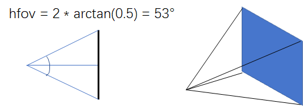
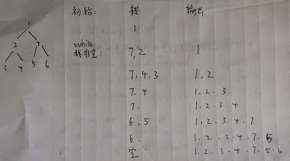
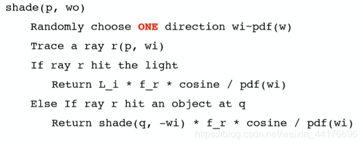

<div align="center"></div>

@[TOC](目录)

# 前言

在 GPU 上实现光线追踪！


<br>
<br>


在差不多半年之前，我在 [光线追踪渲染实战](https://blog.csdn.net/weixin_44176696/article/details/113418991)  中讨论并实现了简单的光线追踪，用 c++ 和多线程在 cpu 上最简单的计算，不过仅支持简单的三角形和球作为图元

时过境迁，摆弄这些精致的球体已不再新颖，为了高效遍历大量三角形，这篇 [光线追踪加速遍历结构](https://blog.csdn.net/weixin_44176696/article/details/118655688) 学习并且讨论了 BVH 这种加速遍历数据结构，同时给出了 c++ 的简单实现和可视化的代码

如果说前两篇博客是 mc 中的木镐，石镐的话，今天我们就敲把铁镐，顺便把 GPU 放在火上烤一烤：


<div align="center"></div>


唔，大概说一下思路把：用的是 OpenGL 的 fragment shader 逐像素计算光追，然后三角形和 BVH 结构还有材质等信息，编码一下塞到纹理里面传给 shader，然后嗯算就完事了

hhh 核心部分很简单，就是把原来的 c++ 代码移植一下，搞到 GLSL 里面运行。emmm 这不是经典的大象塞进冰箱嘛。事实上为此我花费很多时间来解决各种百家争鸣的 bug

好在困难的时期已经过去了，~~翻过这座山...~~  好了。。。不扯闲话了，做好准备，我们要再一次进入波与粒的世界！

# 0. 前置知识

> 注：
> 该部分不涉及任何原理，代码讲解
> 涉猎该部分列出的前置知识，才能比较顺利的阅读本篇博客，以至于看到代码的时候不至于一头雾水 hhh

<font size="4" color="red">环境</font>

visual studio 2019，数学库用 glm，然后 OpenGL 用 glew，窗口管理用 freeglut，图像读取用 SOIL2，关于怎么在 vs 上安装第三方库，可以使用 vcpkg 进行包管理，具体用法参考 [我之前的博客](https://blog.csdn.net/weixin_44176696/article/details/110289659)

<font size="4" color="red">OpenGL</font>

因为是基于 GLSL 的实现，那么首先对 OpenGL 得有一定的了解。常见的概念，比如绘制流程，着色器，坐标变换等。常见的操作，比如缓冲区对象，传送纹理，传递 uniform 一致变量等等。关于 OpenGL 的教程，最经典的莫过于 [Learn OpenGL](https://learnopengl-cn.readthedocs.io/zh/latest/) 了。当然也顺便推销下我自己的 [专栏](https://blog.csdn.net/weixin_44176696/category_10598859.html)，尽管它费拉不堪...

<font size="4" color="red">GLSL</font>

然后，片段着色器不是简单的输出重心插值后的顶点颜色。我们要在 fragment shader 中洋洋洒洒编写将近 114514e1919 行的代码来进行一个光的追，所以需要了解 GLSL 的语法规范，函数接口，uniform 变量，纹理，采样等操作

<font size="4" color="red">简单的几何学</font>

和三角形求交，和轴对齐包围盒 AABB 长方体盒子求交，三角形重心插值等数学几何原理。和三角形求交的原理，和 AABB 求交...

<font size="4" color="red">路径追踪</font>

一个点的颜色并不是由魔法确定的，而是通过渲染方程进行积分求解。每次积分逐像素递归求解光路直到碰到光源为止。原理和代码参考：[光线追踪渲染实战](https://blog.csdn.net/weixin_44176696/article/details/113418991) 

# 1. 布置画布
片段着色器会对每个像素进行一次计算，并且是在 GPU 上并行的，这正好满足我们的要求：并行与逐像素计算！我们用它来计算光线追踪的颜色！

利用片元着色器计算每个像素，首先我们绘制一个正方形铺满整个屏幕，作为我们的画布：

<div align="center"></div>


不需要任何的变换矩阵，直接将 6 个顶点固定到 NDC space，即 [-1, 1] 的范围，c++ 的代码很简单：

```cpp
std::vector<vec3> square = { 
	vec3(-1, -1, 0), vec3(1, -1, 0), vec3(-1, 1, 0), 
	vec3(1, 1, 0), vec3(-1, 1, 0), vec3(1, -1, 0) 
};

// 生成 vao vbo , 传送数据，绘制

...

```


顶点着色器直接传递顶点的 NDC 坐标作为像素的片元坐标，pix 变量的范围 [-1, 1]，在片段着色器中尝试输出像素的坐标 pix 作为颜色。当看到如下的图像，说明画布有在正常工作：

<div align="center"></div>


# 2. 三角形数据传送到 shader

> 注：
> 这部分的代码相当无聊，我们是在为 shader 准备数据
> 如果您比较关心路径追踪的 GLSL 实现，那么大可跳过该部分

和以往的光线追踪程序不同，计算发生在 GPU 端。向 shader 中传递数据有很多种方式，uniform 数组，uniform buffer 等等，但是这些方式都存在数目限制，无法传送大量的数据

回想我们是怎么将图片传送到 GPU 上的，没错，纹理！我们通过 c++ 将模型数据读取到内存，然后以纹理的形式将数据传送到显存，然后在 shader 中对纹理进行采样就可以读出原来的数据！

我们的数据通常是以 **数组** 形式进行传送，比如三角形数组，BVH 二叉树数组，材质数组等等。这些数组都是一维的，以方便我们用 **下标** 指针进行访问和采样

可是众所周知一般的图片纹理是二维的，通过一个 0 ~ 1 范围的 uv 坐标进行采样而不是下标。暂且不谈把一维数组折叠到二维纹理这种奇技淫巧，显卡电路中焊死的硬件双线性插值过滤器也会破坏数据的准确性

出于这些原因，OpenGL 提供了一种较为原始的传递方式，叫做 Buffer Texture，即使用纹理作为通用数据缓冲区。它允许我们直接将内存中的二进制数据搬运到显存中，然后通过一种特殊的采样器，也就是 samplerBuffer 来访问。

和一般的 sampler2D 不同，samplerBuffer 将纹理的内容（即显存中的原始数据）视为一维数组，可以通过 **下标直接索引** 数据，并且不会使用任何过滤器这刚好满足我们的需要！

关于 Buffer Texture 的用法，可以参照 [OpenGL Wiki](https://www.khronos.org/opengl/wiki/Buffer_Texture) ，或者下面的简单例子。假设我们有一个数组要传送：

```cpp
int n;	// 数组大小
float triangles[];
```

我们首先需要创建一个缓冲区对象，叫做 texture buffer object，简称 tbo，这可以类比为显存中开辟了一块空间：

```cpp
GLuint tbo;
glGenBuffers(1, &tbo);
glBindBuffer(GL_TEXTURE_BUFFER, tbo);
```

然后将数据塞进缓冲区中：

```cpp
glBufferData(GL_TEXTURE_BUFFER, n * sizeof(float), &your_data[0], GL_STATIC_DRAW);
```

随后创建一块纹理，注意这时的纹理类型应该为 GL_TEXTURE_BUFFER 这表示我们开辟的不是图像纹理而是数据缓冲区纹理：

```cpp
GLuint tex;
glGenTextures(1, &tex);
glBindTexture(GL_TEXTURE_BUFFER, tex);
```

然后用 glTexBuffer 将 tbo 中的数据关联到 texture buffer，这里我们使用 GL_RGB32F 的格式，这样一次访问可以取出一个 vec3 向量的数据。采样器的返回值有 RGB 三个通道，每个通道都是 32 位的浮点数：

```cpp
glTexBuffer(GL_TEXTURE_BUFFER, GL_RGB32F, tbo);
```

最后传送 0 号纹理到着色器：

```cpp
glActiveTexture(GL_TEXTURE0);
glUniform1i(glGetUniformLocation(program, "triangles"), 0);
```

然后在着色器端使用 texelFetch 和一个整数下标 index 进行 samplerBuffer 类型的纹理的查询：

```clike
uniform samplerBuffer triangles;

...

int index = xxx
vec3 data = texelFetch(triangles, index).xyz;
```


注意这里的数据格式 GL_RGB32F 指的是一个下标（一次采样）能读取到多少数据，即一格数据的单位。一个下标将会索引三个 32 位的浮点数，并且返回一个  vec4，但是仅有 rgb 分量有效。他们和内存数据的映射关系如下：

<div align="center"></div>

至此，我们已经掌握了在 GPU 上一次存取 12 字节（RGB32）内存数据的方法，但是我们的结构体不一定都是 12 字节对齐的

> 注：
> 也可以使用 GL_R32F 来每次读取一个 32 位浮点数，这样能够更加灵活的组织数据
> 但是显然一次读取一个 vec3 效率更高

以三角形和其材质为例，在 CPU 上 c++ 代码中他们的定义是这样的：

```cpp
// 物体表面材质定义
struct Material {
    vec3 emissive = vec3(0, 0, 0);  // 作为光源时的发光颜色
    vec3 baseColor = vec3(1, 1, 1);
    float subsurface = 0.0;
    float metallic = 0.0;
    float specular = 0.0;
    float specularTint = 0.0;
    float roughness = 0.0;
    float anisotropic = 0.0;
    float sheen = 0.0;
    float sheenTint = 0.0;
    float clearcoat = 0.0;
    float clearcoatGloss = 0.0;
    float IOR = 1.0;
    float transmission = 0.0;
};

// 三角形定义
struct Triangle {
    vec3 p1, p2, p3;    // 顶点坐标
    vec3 n1, n2, n3;    // 顶点法线
    Material material;  // 材质
};
```

> 注：
> 这里卖个关子...
> 算了，这里材质用的是 Disney 定义的 PBR 材质参数，下一章节中我们将实现 Disney principel's BRDF，简单的说就是规范化的基于物理的渲染

编码三角形数据，我们创建结构体 Triangle_encoded，他们的数据类型都是 vec3 组成的，满足 12 字节对齐：

```cpp
struct Triangle_encoded {
    vec3 p1, p2, p3;    // 顶点坐标
    vec3 n1, n2, n3;    // 顶点法线
    vec3 emissive;      // 自发光参数
    vec3 baseColor;     // 颜色
    vec3 param1;        // (subsurface, metallic, specular)
    vec3 param2;        // (specularTint, roughness, anisotropic)
    vec3 param3;        // (sheen, sheenTint, clearcoat)
    vec3 param4;        // (clearcoatGloss, IOR, transmission)
};
```

然后准备编码数据，这部分的 c++ 代码相当无聊，就是把数据倒腾来倒腾去：

```
// 读取三角形
std::vector<Triangle> triangles;
readObj()
int nTriangles = triangles.size();

...

// 编码 三角形, 材质
std::vector<Triangle_encoded> triangles_encoded(nTriangles);
for (int i = 0; i < nTriangles; i++) {
    Triangle& t = triangles[i];
    Material& m = t.material;
    // 顶点位置
    triangles_encoded[i].p1 = t.p1;
    triangles_encoded[i].p2 = t.p2;
    triangles_encoded[i].p3 = t.p3;
    // 顶点法线
    triangles_encoded[i].n1 = t.n1;
    triangles_encoded[i].n2 = t.n2;
    triangles_encoded[i].n3 = t.n3;
    // 材质
    triangles_encoded[i].emissive = m.emissive;
    triangles_encoded[i].baseColor = m.baseColor;
    triangles_encoded[i].param1 = vec3(m.subsurface, m.metallic, m.specular);
    triangles_encoded[i].param2 = vec3(m.specularTint, m.roughness, m.anisotropic);
    triangles_encoded[i].param3 = vec3(m.sheen, m.sheenTint, m.clearcoat);
    triangles_encoded[i].param4 = vec3(m.clearcoatGloss, m.IOR, m.transmission);
}
```

然后利用 texture buffer 传送到 shader 中，这里创建 texture buffer object，然后将数据导入 tbo，然后创建纹理，将 tbo 和纹理绑定：

```cpp
GLuint trianglesTextureBuffer;
GLuint tbo0;
glGenBuffers(1, &tbo0);
glBindBuffer(GL_TEXTURE_BUFFER, tbo0);
glBufferData(GL_TEXTURE_BUFFER, triangles_encoded.size() * sizeof(Triangle_encoded), &triangles_encoded[0], GL_STATIC_DRAW);
glGenTextures(1, &trianglesTextureBuffer);
glBindTexture(GL_TEXTURE_BUFFER, trianglesTextureBuffer);
glTexBuffer(GL_TEXTURE_BUFFER, GL_RGB32F, tbo0);
```

然后在 shader 中通过 texelFetch 解码数据，并且还原为原本的结构体，这部分的代码也相当无聊，同样是倒腾数据。只是注意访问纹理是以 vec3 为单位，编码后的三角形包含 12 个 vec3 向量，所以要通过下标计算每个下标对应的偏移，GLSL 代码如下：

```clike
#define SIZE_TRIANGLE   12

uniform samplerBuffer triangles;

...

// 获取第 i 下标的三角形
Triangle getTriangle(int i) {
    int offset = i * SIZE_TRIANGLE;
    Triangle t;

    // 顶点坐标
    t.p1 = texelFetch(triangles, offset + 0).xyz;
    t.p2 = texelFetch(triangles, offset + 1).xyz;
    t.p3 = texelFetch(triangles, offset + 2).xyz;
    // 法线
    t.n1 = texelFetch(triangles, offset + 3).xyz;
    t.n2 = texelFetch(triangles, offset + 4).xyz;
    t.n3 = texelFetch(triangles, offset + 5).xyz;

    return t;
}

// 获取第 i 下标的三角形的材质
Material getMaterial(int i) {
    Material m;

    int offset = i * SIZE_TRIANGLE;
    vec3 param1 = texelFetch(triangles, offset + 8).xyz;
    vec3 param2 = texelFetch(triangles, offset + 9).xyz;
    vec3 param3 = texelFetch(triangles, offset + 10).xyz;
    vec3 param4 = texelFetch(triangles, offset + 11).xyz;
    
    m.emissive = texelFetch(triangles, offset + 6).xyz;
    m.baseColor = texelFetch(triangles, offset + 7).xyz;
    m.subsurface = param1.x;
    m.metallic = param1.y;
    m.specular = param1.z;
    m.specularTint = param2.x;
    m.roughness = param2.y;
    m.anisotropic = param2.z;
    m.sheen = param3.x;
    m.sheenTint = param3.y;
    m.clearcoat = param3.z;
    m.clearcoatGloss = param4.x;
    m.IOR = param4.y;
    m.transmission = param4.z;

    return m;
}
```

然后尝试传输一个三角形和它的材质，在 shader 中输出它的颜色，顶点信息，或者任何属性以验证。如果成功读取颜色（或者其他数据，比如坐标）说明数据传输无误

# 3. 在 shader 中进行三角形求交

首先是光线的定义：

```clike
// 光线
struct Ray {
    vec3 startPoint;
    vec3 direction;
};
```

然后我们还需要一个求交结果，它包含一些必要的信息，比如交点位置，距离和表面材质：

```clike
// 光线求交结果
struct HitResult {
    bool isHit;             // 是否命中
    bool isInside;          // 是否从内部命中
    float distance;         // 与交点的距离
    vec3 hitPoint;          // 光线命中点
    vec3 normal;            // 命中点法线
    vec3 viewDir;           // 击中该点的光线的方向
    Material material;      // 命中点的表面材质
};
```

三角形求交的部分也不难，首先是求解光线和三角形所在平面的距离 t，有了距离顺势求出交点 P，思路如下：

<div align="center"></div>

求出交点之后，判断交点是否在三角形内。这里通过叉乘的方向和法相是否同向来判断。如果三次叉乘都和 N 同向，说明 P 在三角形中：

<div align="center"></div>

代码也很简单，唯一值得注意的是如果视线方向 d 和三角形的法向 N 的方向相同，要翻转一下 N 以保证不管从正面还是背面击中三角形，我们都能获得正确的法向量。代码如下：

```clike
#define INF             114514.0

// 光线和三角形求交 
HitResult hitTriangle(Triangle triangle, Ray ray) {
    HitResult res;
    res.distance = INF;
    res.isHit = false;
    res.isInside = false;

    vec3 p1 = triangle.p1;
    vec3 p2 = triangle.p2;
    vec3 p3 = triangle.p3;

    vec3 S = ray.startPoint;    // 射线起点
    vec3 d = ray.direction;     // 射线方向
    vec3 N = normalize(cross(p2-p1, p3-p1));    // 法向量

    // 从三角形背后（模型内部）击中
    if (dot(N, d) > 0.0f) {
        N = -N;   
        res.isInside = true;
    }

    // 如果视线和三角形平行
    if (abs(dot(N, d)) < 0.00001f) return res;

    // 距离
    float t = (dot(N, p1) - dot(S, N)) / dot(d, N);
    if (t < 0.0005f) return res;    // 如果三角形在光线背面

    // 交点计算
    vec3 P = S + d * t;

    // 判断交点是否在三角形中
    vec3 c1 = cross(p2 - p1, P - p1);
    vec3 c2 = cross(p3 - p2, P - p2);
    vec3 c3 = cross(p1 - p3, P - p3);
    bool r1 = (dot(c1, N) > 0 && dot(c2, N) > 0 && dot(c3, N) > 0);
    bool r2 = (dot(c1, N) < 0 && dot(c2, N) < 0 && dot(c3, N) < 0);

    // 命中，封装返回结果
    if (r1 || r2) {
        res.isHit = true;
        res.hitPoint = P;
        res.distance = t;
        res.normal = N;
        res.viewDir = d;
        // 根据交点位置插值顶点法线
        float alpha = (-(P.x-p2.x)*(p3.y-p2.y) + (P.y-p2.y)*(p3.x-p2.x)) / (-(p1.x-p2.x-0.00005)*(p3.y-p2.y+0.00005) + (p1.y-p2.y+0.00005)*(p3.x-p2.x+0.00005));
        float beta  = (-(P.x-p3.x)*(p1.y-p3.y) + (P.y-p3.y)*(p1.x-p3.x)) / (-(p2.x-p3.x-0.00005)*(p1.y-p3.y+0.00005) + (p2.y-p3.y+0.00005)*(p1.x-p3.x+0.00005));
        float gama  = 1.0 - alpha - beta;
        vec3 Nsmooth = alpha * triangle.n1 + beta * triangle.n2 + gama * triangle.n3;
        Nsmooth = normalize(Nsmooth);
        res.normal = (res.isInside) ? (-Nsmooth) : (Nsmooth);
    }

    return res;
}
```

然后我们编写一个函数，暴力遍历三角形数组进行求交，返回最近的交点：

```clike
#define INF             114514.0

// 暴力遍历数组下标范围 [l, r] 求最近交点
HitResult hitArray(Ray ray, int l, int r) {
    HitResult res;
    res.isHit = false;
    res.distance = INF;
    for(int i=l; i<=r; i++) {
        Triangle triangle = getTriangle(i);
        HitResult r = hitTriangle(triangle, ray);
        if(r.isHit && r.distance<res.distance) {
            res = r;
            res.material = getMaterial(i);
        }
    }
    return res;
}
```

然后我们配置一下相机，相机位于 vec3(0, 0, 4)，看向 z 轴负方向，根据画布像素的 NDC 坐标来投射射线。这里投影平面长宽均为 2.0，而 zNear 为 2.0，这保证了 50° 左右的视场角：

<div align="center"></div>

代码如下：

```clike
Ray ray;
ray.startPoint = vec3(0, 0, 4);
vec3 dir = vec3(pix.xy, 2) - ray.startPoint;
ray.direction = normalize(dir);
```

然后用刚刚写的 hitArray 遍历数组，求交点的同时返回表面的颜色：

```clike
uniform int nTriangles;

...

HitResult res = hitArray(ray, 0, nTriangles-1);
if(res.isHit) fragColor = vec4(res.material.color, 1);
```


三角形... 已经看的足够多次了...

<div align="center"></div>

读取一个 Stanford Bunny 的 obj 模型再试一下：

<div align="center"></div>

ohhhh 虽然是暴力遍历 4000 多个三角形，但是因为 GPU 强大的并行能力，我们能够维持 4 ~ 5 的 FPS


# 4. 线性化 BVH 树

我们成功遍历三角形，但是我们需要更加高效的遍历，BVH 树是一个不错的选择。但是在 GLSL 中 **没有指针** 这一概念，我们需要将使用 **指针** 的树形结构改为使用 **数组下标** 作为指针的线性化二叉树。相信学过数据结构的童鞋都对此不陌生...

<div align="center"></div>


这是原来的 BVH 节点结构体，内容分为三部分，分别是左右孩子，AABB 碰撞盒，叶子节点信息，其中 AA 为极小点，BB 为极大点。因为不能用指针，只能用数组下标，我们将结构体改为：

```cpp
// BVH 树节点
struct BVHNode {
    int left, right;    // 左右子树索引
    int n, index;       // 叶子节点信息               
    vec3 AA, BB;        // 碰撞盒
};
```

这里还引入了一个小变化：一个叶子节点可以保存多个三角形，n 表示该叶子节点的三角形数目，index 表示该节点第一个三角形，在 triangles 数组中的索引：

<div align="center"></div>

线性化二叉树也很简单，只需要每次创建节点的时候，将 `new Node()` 改为 `push_back()` 即插入数组，而下标的索引方式是照常的。

这里我们允许一个叶子包含 n 个三角形，每次创建节点直接 push_back，然后通过下标进行索引。使用最简单的二分法创建，每次将三角形数组对半分！创建 BVH 的代码如下：

> 注：
> 这里仅给出普通的二分建树代码
> SAH 优化版本的代码在下文 “完整代码” 部分可以找到

```cpp
// 构建 BVH
int buildBVH(std::vector<Triangle>& triangles, std::vector<BVHNode>& nodes, int l, int r, int n) {
    if (l > r) return 0;

    // 注：
    // 此处不可通过指针，引用等方式操作，必须用 nodes[id] 来操作
    // 因为 std::vector<> 扩容时会拷贝到更大的内存，那么地址就改变了
    // 而指针，引用均指向原来的内存，所以会发生错误
    nodes.push_back(BVHNode());
    int id = nodes.size() - 1;   // 注意： 先保存索引
    
    nodes[id] 的属性初始化 ...

    // 计算 AABB
    for (int i = l; i <= r; i++) {
        ...		// 遍历三角形 计算 AABB
    }

    // 不多于 n 个三角形 返回叶子节点
    if ((r - l + 1) <= n) {
        nodes[id].n = r - l + 1;
        nodes[id].index = l;
        return id;
    }

    // 否则递归建树
    // 按 x,y,z 划分数组
    std::sort(...)

    // 递归
    int mid = (l + r) / 2;
    int left = buildBVH(triangles, nodes, l, mid, n);
    int right = buildBVH(triangles, nodes, mid + 1, r, n);

    nodes[id].left = left;
    nodes[id].right = right;

    return id;
}
```

至此我们拥有一个线性化的二叉树，接下来准备将它送入 GPU


# 5. BVH 数据传送到 shader

> 注：
> 该部分的代码也相当无聊，尽情跳过

和三角形数据类似，编码，然后传送：

```cpp
struct BVHNode_encoded {
    vec3 childs;        // (left, right, 保留)
    vec3 leafInfo;      // (n, index, 保留)
    vec3 AA, BB;        
};
```

编码的过程太无聊了，不复制代码了。这里贴一下在 shader 中解码 BVHNode 的代码：

```clike
#define SIZE_BVHNODE    4

uniform samplerBuffer nodes;

// 获取第 i 下标的 BVHNode 对象
BVHNode getBVHNode(int i) {
    BVHNode node;

    // 左右子树
    int offset = i * SIZE_BVHNODE;
    ivec3 childs = ivec3(texelFetch(nodes, offset + 0).xyz);
    ivec3 leafInfo = ivec3(texelFetch(nodes, offset + 1).xyz);
    node.left = int(childs.x);
    node.right = int(childs.y);
    node.n = int(leafInfo.x);
    node.index = int(leafInfo.y);

    // 包围盒
    node.AA = texelFetch(nodes, offset + 2).xyz;
    node.BB = texelFetch(nodes, offset + 3).xyz;

    return node;
}
```

读取一个兔子，然后遍历所有节点，对于每个叶子节点，遍历它包含的所有三角形，看看兔子是否完整，以验证 BVH 是否传输正确：

> 注：
> 这一步还是暴力遍历，没有二分遍历 bvh，只是为了验证数据是否正确

```clike
投射光线 

...

for(int i=0; i<nNodes; i++) {
    BVHNode node = getBVHNode(i);
    if(node.n>0) {
        int L = node.index;
        int R = node.index + node.n - 1;
        HitResult res = hitArray(ray, L, R);
        if(res.isHit) fragColor = vec4(res.material.color, 1);
    }
}  
```

如果返回和 hitArray 一样的结果，说明我们 BVH 数据传输的没问题：


<div align="center"></div>


此外，在遍历之前，建议输出一下 1 号节点的左指针，不出意外应该是 2，将 `node.left / 3` 作为像素颜色输出，如果出现灰色说明正确，务必确保 **整数下标** 的传输无误！

# 6. 和 AABB 盒子求交
对于轴对齐包围盒，光线穿入穿出 xoy，xoz，yoz 平面，会有三组穿入点穿出点。如果找到一组穿入点穿出点，使得光线起点距离穿入点的距离 **小于** 光线起点距离穿出点的距离，即 `t0 < t1` 则说明命中

我们取 out 中最小的距离记作 t1，和 in 中最大的距离记作 t0，然后看是否 t1 > t0 如果满足等式，则说明命中：

<div align="center"></div>

对应的 GLSL 代码如下：

```clike
// 和 aabb 盒子求交，没有交点则返回 -1
float hitAABB(Ray r, vec3 AA, vec3 BB) {
    vec3 invdir = 1.0 / r.direction;

    vec3 f = (BB - r.startPoint) * invdir;
    vec3 n = (AA - r.startPoint) * invdir;

    vec3 tmax = max(f, n);
    vec3 tmin = min(f, n);

    float t1 = min(tmax.x, min(tmax.y, tmax.z));
    float t0 = max(tmin.x, max(tmin.y, tmin.z));

    return (t1 >= t0) ? ((t0 > 0.0) ? (t0) : (t1)) : (-1);
}
```

> 注：
> n 即近交点 near，也就是 in
> f 即远交点 far，也就是  out
> 因为 in 和 out 在 GLSL 中是关键字不能用作变量名

接下来测试一下。对于 BVH 的根节点（1 号节点）我们分别和其左右子树求交，如果左子树命中则返回红色，右子树命中则返回绿色，两个都命中则返回黄色：

```clike

...

BVHNode node = getBVHNode(1);
BVHNode left = getBVHNode(node.left);
BVHNode right = getBVHNode(node.right);

float r1 = hitAABB(ray, left.AA, left.BB);  
float r2 = hitAABB(ray, right.AA, right.BB);  

vec3 color;
if(r1>0) color = vec3(1, 0, 0);
if(r2>0) color = vec3(0, 1, 0);
if(r1>0 && r2>0) color = vec3(1, 1, 0);

...

```

结果如下：

<div align="center"></div>

出现上述结果说明 BVH 的构建，传送和求交都没有问题

# 7. 非递归遍历 BVH 树

在 GPU 上面没有栈的概念，也不能执行递归程序，我们需要人为编写二叉树遍历的代码。对于 BVH 树，在和 **根** 节点求交 **之后** ，我们总是查找它的左右子树，这相当于二叉树的 **先序遍历** ，实现起来相对容易

维护一个栈来保存节点。首先将树根入栈，然后 `while(!stack.empty())` 进行循环：
1. 从栈中弹出节点 root
2. 如果右树非空，将 root 的右子树压入栈中
3. 如果左树非空，将 root 的左子树压入栈中

很简单，不过注意 **先访问的节点后入栈** ，因为栈的存取顺序是相反的，这样保证下一次取栈顶元素，一定是先被访问的节点。这里摆烂了五毛特效糊一张非递归遍历时栈状态图：

<div align="center"></div>

如果不知道代码有没有 bug，可以上 leetcode 的第 144 题检验一下，这里是 [传送门](https://leetcode-cn.com/problems/binary-tree-preorder-traversal/) 

至此我们掌握了非递归遍历二叉树的方法，在 GLSL 中没有 STL 的 stack，所以我们用数组和一个 sp 指针模拟栈。下面是遍历 BVH 查询 **最近的** 三角形的 GLSL 代码：

```clike
// 遍历 BVH 求交
HitResult hitBVH(Ray ray) {
    HitResult res;
    res.isHit = false;
    res.distance = INF;

    // 栈
    int stack[256];
    int sp = 0;

    stack[sp++] = 1;
    while(sp>0) {
        int top = stack[--sp];
        BVHNode node = getBVHNode(top);
        
        // 是叶子节点，遍历三角形，求最近交点
        if(node.n>0) {
            int L = node.index;
            int R = node.index + node.n - 1;
            HitResult r = hitArray(ray, L, R);
            if(r.isHit && r.distance<res.distance) res = r;
            continue;
        }
        
        // 和左右盒子 AABB 求交
        float d1 = INF; // 左盒子距离
        float d2 = INF; // 右盒子距离
        if(node.left>0) {
            BVHNode leftNode = getBVHNode(node.left);
            d1 = hitAABB(ray, leftNode.AA, leftNode.BB);
        }
        if(node.right>0) {
            BVHNode rightNode = getBVHNode(node.right);
            d2 = hitAABB(ray, rightNode.AA, rightNode.BB);
        }

        // 在最近的盒子中搜索
        if(d1>0 && d2>0) {
            if(d1<d2) { // d1<d2, 左边先
                stack[sp++] = node.right;
                stack[sp++] = node.left;
            } else {    // d2<d1, 右边先
                stack[sp++] = node.left;
                stack[sp++] = node.right;
            }
        } else if(d1>0) {   // 仅命中左边
            stack[sp++] = node.left;
        } else if(d2>0) {   // 仅命中右边
            stack[sp++] = node.right;
        }
    }

    return res;
}
```

这里通过交点的距离判断，优先查找近的盒子，能够大大加速。将原来的暴力查找的 `hitArray` 换成新的 `hitBVH` 函数，然后再一次看看效果：

<div align="center"></div>

帧数稳定在 100 左右，相比之前的暴力遍历的 5 帧，效率高了 20 倍不止


# 8. 开始光线追踪
## 8.1. 原理回顾

再一次回顾渲染方程：


因为光路可逆，沿着 wi 方向 **射入**  p 点的光的能量，等于从 q 点出发，沿着 wi 方向 **射出** 的光的能量：

$$
L_i(p, w_i)=L_o(q, w_i)
$$

故形成递归式：

$$
L_o(p, w_o)=L_e(p, w_o)+\int_{\Omega^+}L_o(q, w_i) \ f_r(p, w_i, w_o) \ (n\cdot w_i) {\rm d} w_i
$$

于是伪代码为：


<div align="center"></div>

> 注：
> 因为在 p 点法向半球随机一个 wi，此时 wi 的方向是射出，和定义的射入相反，故取负号

每次递归的返回结果都乘以了 `f_r * cosine / pdf`，但是对于 shader 中没有递归，我们用循环代替。维护一个变量 history 来记录每次递归，返回结果的累乘。

和上述的伪代码的参数入口不太一致，我们给定一个点 p 的表面信息，即 HitResult 结构体，一个入射光线方向 viewDir 和一个最大弹射次数，然后通过 pathTracing 函数求解 p 点的颜色：

```clike
投射光线

...

// primary hit
HitResult firstHit = hitBVH(ray);
vec3 color;

if(!firstHit.isHit) {
    color = vec3(0);
} else {
    vec3 Le = firstHit.material.emissive;
    int maxBounce = 2;
    vec3 Li = pathTracing(firstHit, maxBounce);
    color = Le + Li;
}

fragColor = vec4(color, 1.0);
```

我们只是写完了 main 函数，pathTracing 还没开工。但是我们要做一些铺垫工作

## 8.2. 帮助函数

编写三个帮助函数，分别是：
1.  0 ~ 1 均匀分布的随机数的函数
2. 生成半球均匀分布的随机向量的函数
3. 任意向量投影到 **法向半球** 的函数

首先是 0 ~ 1 均匀分布的随机数，该部分代码引自 [Casual Shadertoy Path Tracing Part 1](https://blog.demofox.org/2020/05/25/casual-shadertoy-path-tracing-1-basic-camera-diffuse-emissive/)，并且需要一个 uniform uint 变量 frameCounter （帧计数器）做随机种子，同时还需要 width，height 和当前屏幕像素的 NDC 坐标 pix 变量：

```clike
uniform uint frameCounter;

uint seed = uint(
    uint((pix.x * 0.5 + 0.5) * width)  * uint(1973) + 
    uint((pix.y * 0.5 + 0.5) * height) * uint(9277) + 
    uint(frameCounter) * uint(26699)) | uint(1);

uint wang_hash(inout uint seed) {
    seed = uint(seed ^ uint(61)) ^ uint(seed >> uint(16));
    seed *= uint(9);
    seed = seed ^ (seed >> 4);
    seed *= uint(0x27d4eb2d);
    seed = seed ^ (seed >> 15);
    return seed;
}
 
float rand() {
    return float(wang_hash(seed)) / 4294967296.0;
}
```

其次是半球均匀分布，这部分的代码引自 [PBRT 13.6 ](https://www.pbr-book.org/3ed-2018/Monte_Carlo_Integration/2D_Sampling_with_Multidimensional_Transformations#Cosine-WeightedHemisphereSampling)，其中 $\xi_1, \xi_2$ 是 0 ~ 1 均匀分布的随机数：

<div align="center"></div>

代码如下：

```clike
// 半球均匀采样
vec3 SampleHemisphere() {
    float z = rand();
    float r = max(0, sqrt(1.0 - z*z));
    float phi = 2.0 * PI * rand();
    return vec3(r * cos(phi), r * sin(phi), z);
}
```

此外，这里半球的 “上方向” 是 z 轴，需要做一次投影来对应到法向半球的法线 N 方向。该部分的代码引自 [GPU Path Tracing in Unity – Part 2](http://blog.three-eyed-games.com/2018/05/12/gpu-path-tracing-in-unity-part-2/)，GLSL 实现和文中有出入：

```clike
// 将向量 v 投影到 N 的法向半球
vec3 toNormalHemisphere(vec3 v, vec3 N) {
    vec3 helper = vec3(1, 0, 0);
    if(abs(N.x)>0.999) helper = vec3(0, 0, 1);
    vec3 tangent = normalize(cross(N, helper));
    vec3 bitangent = normalize(cross(N, tangent));
    return v.x * tangent + v.y * bitangent + v.z * N;
}
```
## 8.3. pathTracing 的实现

紧接着是 pathTracing 的实现。这里我们仅实现漫反射

半球面积为  $2\pi$ ，这里我们取漫反射的概率密度函数 pdf 为 $1/2\pi$，此外关于 `f_r` 这里我们取表面颜色除以 $\pi$， 先卖个关子，这里姑且看作一个常数

> 注：
> 这里  f_r 实际上是 BRDF，即双向反射分布函数
> 函数 BRDF(p, wi, wo) 的值，描述了光从 wi 射入 p 点，散射后有多少光能从 wo 射出
> 一个结论是漫反射的 BRDF 就是颜色值除以 pi
> 这里先记住，我后续的博客会有详细推导

具体的 pathTracing 代码如下：

```clike
// 路径追踪
vec3 pathTracing(HitResult hit, int maxBounce) {

    vec3 Lo = vec3(0);      // 最终的颜色
    vec3 history = vec3(1); // 递归积累的颜色

    for(int bounce=0; bounce<maxBounce; bounce++) {
        // 随机出射方向 wi
        vec3 wi = toNormalHemisphere(SampleHemisphere(), hit.normal);

        // 漫反射: 随机发射光线
        Ray randomRay;
        randomRay.startPoint = hit.hitPoint;
        randomRay.direction = wi;
        HitResult newHit = hitBVH(randomRay);

        float pdf = 1.0 / (2.0 * PI);                                   // 半球均匀采样概率密度
        float cosine_o = max(0, dot(-hit.viewDir, hit.normal));         // 入射光和法线夹角余弦
        float cosine_i = max(0, dot(randomRay.direction, hit.normal));  // 出射光和法线夹角余弦
        vec3 f_r = hit.material.baseColor / PI;                         // 漫反射 BRDF

        // 未命中
        if(!newHit.isHit) {
            break;
        }
        
        // 命中光源积累颜色
        vec3 Le = newHit.material.emissive;
        Lo += history * Le * f_r * cosine_i / pdf;
        
        // 递归(步进)
        hit = newHit;
        history *= f_r * cosine_i / pdf;  // 累积颜色
    }
    
    return Lo;
}
```


运行代码：

<div align="center"></div>

结果非常嘈杂，这是因为我们要将每一帧的结果 **累加** 作为积分的值，而不是单独的取每一个离散的采样，为此需要混合多个帧的绘制结果

## 8.4. 多帧混合与后处理

为了获得前一帧的结果，我们需要维护一块纹理 lastFrame 来保存上一帧的图像，同时为了对输出进行后处理（比如伽马矫正，色调映射），我们需要实现一个简单管线：

<div align="center"></div>

其中 pass1 进行光线追踪，和上一帧混合，输出。pass2 帧缓冲仅有一个颜色附件，关联到 lastFrame 上，直接输出颜色就可以更新 lastFrame 的值，而 pass3 则是后处理和最终输出。

关于管线和帧缓存，熟悉 defer render，或者 Minecraft shader 的童鞋应该不陌生，也可以参考我的博客：[OpenGL学习（十一）：延迟渲染管线](https://blog.csdn.net/weixin_44176696/article/details/112987749)，这里只是把第一个 geometry pass 改为了 raytracing pass

> 注：
> 再卖个关子，后面（的博客）我们还要和 geometry pass 打交道

这里封装一个 RenderPass 类，其中 colorAttachments 是要传入下一 pass 的纹理 id，这些纹理将作为帧缓冲的颜色附件。然后每个 pass 直接调用 draw 就行，其中 texPassArray 是 **上一个 pass** 的 colorAttachments，具体的 c++ 代码实现可以参考下文的【完整】代码部分：

```cpp
class RenderPass {
public:
    std::vector<GLuint> colorAttachments;
    // 其他属性 ...
    
    void bindData(bool finalPass = false) {
        
    }
    void draw(std::vector<GLuint> texPassArray = {}) {
        
    }
};
```

在我们实现完管线之后，在 pass1 的片元着色器的代码中增加多帧混合：

```clike
uniform sampler2D lastFrame;

...

// 和上一帧混合
vec3 lastColor = texture2D(lastFrame, pix.xy*0.5+0.5).rgb;
color = mix(lastColor, color, 1.0/float(frameCounter+1));
```


再来一次，动图压缩了，噪点有点多：


好耶！至此我们在 GPU 上实现了光追，并且拟合的过程还是可视化的


# 9. HDR 环境贴图

锦上添花。

HDR 图是全景图，与一般的皂片不同，HDR 图片能够表示的亮度范围更加广。一般的图片和 HDR 图片在亮度改变时的对比如下：

<div align="center"></div>

<br>

> 注：
> 图片引自 [How to Create Your Own HDR Environment Maps](http://blog.gregzaal.com/2016/03/16/make-your-own-hdri/)
> 这是一篇讲摄影的博客，某种意义上摄影也是一个（对现实世界进行）采样（或者积分）的过程。摄像机感光芯片的光门打开，电容开始积累光子（充电）然后读电容的值就可以获得像素颜色
> （纯云，不保证对，我不会摄影，也没钱买相机 Orz

一般的图片亮度拉满也就 255，但是 HDR 亮度是整个浮点数范围，能够较好的表示现实中的光照，所以用来做环境贴图

首先可以在 [ploy heaven](https://polyhaven.com/hdris) 上面下载到 HDR 贴图：

<div align="center"></div>

然后我们需要读取 HDR 图片，SOIL 显然是读不了的（其实有伪 HDR，是通过 RGBE 或者 RGBdivA，RGBdivA2 来实现的，不过似乎有一个 A 通道始终为 128 的 BUG 所以用不了。。。

这里我们选择一个轻量级的库：HDR Image Loader，它无需安装，只需要 include 一下就可用。它的代码在 [这里](https://www.flipcode.com/archives/HDR_Image_Reader.shtml)

顺利 include 之后，读取 HDR 图的代码如下：

```cpp
#include "lib/hdrloader.h"

...

// hdr 全景图
HDRLoaderResult hdrRes;
bool r = HDRLoader::load("./skybox/sunset.hdr", hdrRes);
GLuint hdrMap = 创建一张纹理（）
glTexImage2D(GL_TEXTURE_2D, 0, GL_RGB32F, hdrRes.width, hdrRes.height, 0, GL_RGB, GL_FLOAT, hdrRes.cols);
```

然后在 shader 中，我们直接输出一下：

<div align="center"></div>

有两个问题：
1. 图像有点暗，那是因为没有伽马矫正
2. 图像是反的，待会采样的时候 flip 一下 y 就行了
3. 图像很扭曲：待会我们用 spherical coord 采样就正常了

然后我们给定一个向量 v，将其转为采样 HDR图的 **纹理坐标** uv，此部分的代码参考 [stack overflow](https://stackoverflow.com/questions/48494389/how-does-this-code-sample-from-a-spherical-map/48534536)，这里和原文不同的是我翻转了 y 坐标：

```clike
// 将三维向量 v 转为 HDR map 的纹理坐标 uv
vec2 SampleSphericalMap(vec3 v) {
    vec2 uv = vec2(atan(v.z, v.x), asin(v.y));
    uv /= vec2(2.0 * PI, PI);
    uv += 0.5;
    uv.y = 1.0 - uv.y;
    return uv;
}
```

至此我们可以采样 HDR 图了：

```clike
// 获取 HDR 环境颜色
vec3 sampleHdr(vec3 v) {
    vec2 uv = SampleSphericalMap(normalize(v));
    vec3 color = texture2D(hdrMap, uv).rgb;
    //color = min(color, vec3(10));
    return color;
}
```

> 注：
> 上述代码有一句 min 将 HDR 亮度 clamp 到了 10 以内，严格意义上这是不对的，我也注释掉了
> 但是如果不这么做，会出现很多 firefly，图片会很 noisy，如图：
> <div align="center"></div>
> 这是因为 HDR 存在亮度太高，面积又小的点，这使得很多次采样时，会偶发性地积累一次很大的能量
> <br>
> 至于解决方案，可以利用重要性采样，统计图像的亮度分布，然后以这个分布去采样 hdr 图，下面是我写的一个以亮度为概率采样 envmap 的例子，后续的博客会详细讲解这部分的内容...（咕
>
> <div align="center"></div>


然后将 main 函数中，primary ray 的 miss 的处理中，`color = vec3(0)` 换为：

```clike
color = sampleHdr(ray.direction);
```

此外，pathTracing 中，ray miss 的时候也要处理：

```clike
// 未命中
if(!newHit.isHit) {
    vec3 skyColor = sampleHdr(randomRay.direction);
    Lo += history * skyColor * f_r * cosine_i / pdf;
    break;
}
```

下图的 HDR 最大值被 clamp 到 10 以内，可以看到效果还是不错的：

<div align="center"></div>

如果不 clamp，可以投下更为鲜明的阴影，但是缺点是有 firefly，后续可能会想办法用重要性采样解决（逃

# 10. 完整代码
## 10.1. c++ 代码

```cpp
#include <iostream>
#include <iomanip>
#include <string>
#include <fstream>
#include <vector>
#include <sstream>
#include <iostream>
#include <algorithm>
#include <ctime>

#include <GL/glew.h>
#include <GL/freeglut.h>
#include <glm/glm.hpp>
#include <glm/gtc/matrix_transform.hpp>
#include <glm/gtc/type_ptr.hpp>
#include <SOIL2/SOIL2.h>


#include "lib/hdrloader.h"

#define INF 114514.0

using namespace glm;

// ----------------------------------------------------------------------------- //

// 物体表面材质定义
struct Material {
    vec3 emissive = vec3(0, 0, 0);  // 作为光源时的发光颜色
    vec3 baseColor = vec3(1, 1, 1);
    float subsurface = 0.0;
    float metallic = 0.0;
    float specular = 0.0;
    float specularTint = 0.0;
    float roughness = 0.0;
    float anisotropic = 0.0;
    float sheen = 0.0;
    float sheenTint = 0.0;
    float clearcoat = 0.0;
    float clearcoatGloss = 0.0;
    float IOR = 1.0;
    float transmission = 0.0;
};

// 三角形定义
struct Triangle {
    vec3 p1, p2, p3;    // 顶点坐标
    vec3 n1, n2, n3;    // 顶点法线
    Material material;  // 材质
};

// BVH 树节点
struct BVHNode {
    int left, right;    // 左右子树索引
    int n, index;       // 叶子节点信息               
    vec3 AA, BB;        // 碰撞盒
};

// ----------------------------------------------------------------------------- //

struct Triangle_encoded {
    vec3 p1, p2, p3;    // 顶点坐标
    vec3 n1, n2, n3;    // 顶点法线
    vec3 emissive;      // 自发光参数
    vec3 baseColor;     // 颜色
    vec3 param1;        // (subsurface, metallic, specular)
    vec3 param2;        // (specularTint, roughness, anisotropic)
    vec3 param3;        // (sheen, sheenTint, clearcoat)
    vec3 param4;        // (clearcoatGloss, IOR, transmission)
};

struct BVHNode_encoded {
    vec3 childs;        // (left, right, 保留)
    vec3 leafInfo;      // (n, index, 保留)
    vec3 AA, BB;        
};

// ----------------------------------------------------------------------------- //

class RenderPass {
public:
    GLuint FBO = 0;
    GLuint vao, vbo;
    std::vector<GLuint> colorAttachments;
    GLuint program;
    int width = 512;
    int height = 512;
    void bindData(bool finalPass = false) {
        if (!finalPass) glGenFramebuffers(1, &FBO);
        glBindFramebuffer(GL_FRAMEBUFFER, FBO);

        glGenBuffers(1, &vbo);
        glBindBuffer(GL_ARRAY_BUFFER, vbo);
        std::vector<vec3> square = { vec3(-1, -1, 0), vec3(1, -1, 0), vec3(-1, 1, 0), vec3(1, 1, 0), vec3(-1, 1, 0), vec3(1, -1, 0) };
        glBufferData(GL_ARRAY_BUFFER, sizeof(vec3) * square.size(), NULL, GL_STATIC_DRAW);
        glBufferSubData(GL_ARRAY_BUFFER, 0, sizeof(vec3) * square.size(), &square[0]);

        glGenVertexArrays(1, &vao);
        glBindVertexArray(vao);
        glEnableVertexAttribArray(0);   // layout (location = 0) 
        glVertexAttribPointer(0, 3, GL_FLOAT, GL_FALSE, 0, (GLvoid*)0);
        // 不是 finalPass 则生成帧缓冲的颜色附件
        if (!finalPass) {
            std::vector<GLuint> attachments;
            for (int i = 0; i < colorAttachments.size(); i++) {
                glBindTexture(GL_TEXTURE_2D, colorAttachments[i]);
                glFramebufferTexture2D(GL_FRAMEBUFFER, GL_COLOR_ATTACHMENT0 + i, GL_TEXTURE_2D, colorAttachments[i], 0);// 将颜色纹理绑定到 i 号颜色附件
                attachments.push_back(GL_COLOR_ATTACHMENT0 + i);
            }
            glDrawBuffers(attachments.size(), &attachments[0]);
        }
        
        glBindFramebuffer(GL_FRAMEBUFFER, 0);
    }
    void draw(std::vector<GLuint> texPassArray = {}) {
        glUseProgram(program);
        glBindFramebuffer(GL_FRAMEBUFFER, FBO);
        glBindVertexArray(vao);
        // 传上一帧的帧缓冲颜色附件
        for (int i = 0; i < texPassArray.size(); i++) {
            glActiveTexture(GL_TEXTURE0+i);
            glBindTexture(GL_TEXTURE_2D, texPassArray[i]);
            std::string uName = "texPass" + std::to_string(i);
            glUniform1i(glGetUniformLocation(program, uName.c_str()), i);
        }
        glViewport(0, 0, width, height);
        glClear(GL_COLOR_BUFFER_BIT | GL_DEPTH_BUFFER_BIT);
        glDrawArrays(GL_TRIANGLES, 0, 6);

        glBindVertexArray(0);
        glBindFramebuffer(GL_FRAMEBUFFER, 0);
        glUseProgram(0);
    }
};

// ----------------------------------------------------------------------------- //

GLuint trianglesTextureBuffer;
GLuint nodesTextureBuffer;
GLuint lastFrame;
GLuint hdrMap;

RenderPass pass1;
RenderPass pass2;
RenderPass pass3;

// 相机参数
float upAngle = 0.0;
float rotatAngle = 0.0;
float r = 4.0;

// ----------------------------------------------------------------------------- //

// 按照三角形中心排序 -- 比较函数
bool cmpx(const Triangle& t1, const Triangle& t2) {
    vec3 center1 = (t1.p1 + t1.p2 + t1.p3) / vec3(3, 3, 3);
    vec3 center2 = (t2.p1 + t2.p2 + t2.p3) / vec3(3, 3, 3);
    return center1.x < center2.x;
}
bool cmpy(const Triangle& t1, const Triangle& t2) {
    vec3 center1 = (t1.p1 + t1.p2 + t1.p3) / vec3(3, 3, 3);
    vec3 center2 = (t2.p1 + t2.p2 + t2.p3) / vec3(3, 3, 3);
    return center1.y < center2.y;
}
bool cmpz(const Triangle& t1, const Triangle& t2) {
    vec3 center1 = (t1.p1 + t1.p2 + t1.p3) / vec3(3, 3, 3);
    vec3 center2 = (t2.p1 + t2.p2 + t2.p3) / vec3(3, 3, 3);
    return center1.z < center2.z;
}

// ----------------------------------------------------------------------------- //

// 读取文件并且返回一个长字符串表示文件内容
std::string readShaderFile(std::string filepath) {
    std::string res, line;
    std::ifstream fin(filepath);
    if (!fin.is_open())
    {
        std::cout << "文件 " << filepath << " 打开失败" << std::endl;
        exit(-1);
    }
    while (std::getline(fin, line))
    {
        res += line + '\n';
    }
    fin.close();
    return res;
}

GLuint getTextureRGB32F(int width, int height) {
    GLuint tex;
    glGenTextures(1, &tex);
    glBindTexture(GL_TEXTURE_2D, tex);
    glTexImage2D(GL_TEXTURE_2D, 0, GL_RGBA32F, width, height, 0, GL_RGBA, GL_FLOAT, NULL);
    glTexParameteri(GL_TEXTURE_2D, GL_TEXTURE_MIN_FILTER, GL_NEAREST);
    glTexParameteri(GL_TEXTURE_2D, GL_TEXTURE_MAG_FILTER, GL_NEAREST);
    glTexParameteri(GL_TEXTURE_2D, GL_TEXTURE_WRAP_S, GL_CLAMP_TO_EDGE);
    glTexParameteri(GL_TEXTURE_2D, GL_TEXTURE_WRAP_T, GL_CLAMP_TO_EDGE);
    return tex;
}

// 获取着色器对象
GLuint getShaderProgram(std::string fshader, std::string vshader) {
    // 读取shader源文件
    std::string vSource = readShaderFile(vshader);
    std::string fSource = readShaderFile(fshader);
    const char* vpointer = vSource.c_str();
    const char* fpointer = fSource.c_str();

    // 容错
    GLint success;
    GLchar infoLog[512];

    // 创建并编译顶点着色器
    GLuint vertexShader = glCreateShader(GL_VERTEX_SHADER);
    glShaderSource(vertexShader, 1, (const GLchar**)(&vpointer), NULL);
    glCompileShader(vertexShader);
    glGetShaderiv(vertexShader, GL_COMPILE_STATUS, &success);   // 错误检测
    if (!success)
    {
        glGetShaderInfoLog(vertexShader, 512, NULL, infoLog);
        std::cout << "顶点着色器编译错误\n" << infoLog << std::endl;
        exit(-1);
    }

    // 创建并且编译片段着色器
    GLuint fragmentShader = glCreateShader(GL_FRAGMENT_SHADER);
    glShaderSource(fragmentShader, 1, (const GLchar**)(&fpointer), NULL);
    glCompileShader(fragmentShader);
    glGetShaderiv(fragmentShader, GL_COMPILE_STATUS, &success);   // 错误检测
    if (!success)
    {
        glGetShaderInfoLog(fragmentShader, 512, NULL, infoLog);
        std::cout << "片段着色器编译错误\n" << infoLog << std::endl;
        exit(-1);
    }

    // 链接两个着色器到program对象
    GLuint shaderProgram = glCreateProgram();
    glAttachShader(shaderProgram, vertexShader);
    glAttachShader(shaderProgram, fragmentShader);
    glLinkProgram(shaderProgram);

    // 删除着色器对象
    glDeleteShader(vertexShader);
    glDeleteShader(fragmentShader);

    return shaderProgram;
}

// ----------------------------------------------------------------------------- //

// 模型变换矩阵
mat4 getTransformMatrix(vec3 rotateCtrl, vec3 translateCtrl, vec3 scaleCtrl) {
    glm::mat4 unit(    // 单位矩阵
        glm::vec4(1, 0, 0, 0),
        glm::vec4(0, 1, 0, 0),
        glm::vec4(0, 0, 1, 0),
        glm::vec4(0, 0, 0, 1)
    );
    mat4 scale = glm::scale(unit, scaleCtrl);
    mat4 translate = glm::translate(unit, translateCtrl);
    mat4 rotate = unit;
    rotate = glm::rotate(rotate, glm::radians(rotateCtrl.x), glm::vec3(1, 0, 0));
    rotate = glm::rotate(rotate, glm::radians(rotateCtrl.y), glm::vec3(0, 1, 0));
    rotate = glm::rotate(rotate, glm::radians(rotateCtrl.z), glm::vec3(0, 0, 1));

    mat4 model = translate * rotate * scale;
    return model;
}

// 读取 obj
void readObj(std::string filepath, std::vector<Triangle>& triangles, Material material, mat4 trans, bool smoothNormal) {

    // 顶点位置，索引
    std::vector<vec3> vertices;
    std::vector<GLuint> indices;

    // 打开文件流
    std::ifstream fin(filepath);
    std::string line;
    if (!fin.is_open()) {
        std::cout << "文件 " << filepath << " 打开失败" << std::endl;
        exit(-1);
    }

    // 计算 AABB 盒，归一化模型大小
    float maxx = -11451419.19;
    float maxy = -11451419.19;
    float maxz = -11451419.19;
    float minx = 11451419.19;
    float miny = 11451419.19;
    float minz = 11451419.19;

    // 按行读取
    while (std::getline(fin, line)) {
        std::istringstream sin(line);   // 以一行的数据作为 string stream 解析并且读取
        std::string type;
        GLfloat x, y, z;
        int v0, v1, v2;
        int vn0, vn1, vn2;
        int vt0, vt1, vt2;
        char slash;

        // 统计斜杆数目，用不同格式读取
        int slashCnt = 0;
        for (int i = 0; i < line.length(); i++) {
            if (line[i] == '/') slashCnt++;
        }

        // 读取obj文件
        sin >> type;
        if (type == "v") {
            sin >> x >> y >> z;
            vertices.push_back(vec3(x, y, z));
            maxx = max(maxx, x); maxy = max(maxx, y); maxz = max(maxx, z);
            minx = min(minx, x); miny = min(minx, y); minz = min(minx, z);
        }
        if (type == "f") {
            if (slashCnt == 6) {
                sin >> v0 >> slash >> vt0 >> slash >> vn0;
                sin >> v1 >> slash >> vt1 >> slash >> vn1;
                sin >> v2 >> slash >> vt2 >> slash >> vn2;
            }
            else if (slashCnt == 3) {
                sin >> v0 >> slash >> vt0;
                sin >> v1 >> slash >> vt1;
                sin >> v2 >> slash >> vt2;
            }
            else {
                sin >> v0 >> v1 >> v2;
            }
            indices.push_back(v0 - 1);
            indices.push_back(v1 - 1);
            indices.push_back(v2 - 1);
        }
    }

    // 模型大小归一化
    float lenx = maxx - minx;
    float leny = maxy - miny;
    float lenz = maxz - minz;
    float maxaxis = max(lenx, max(leny, lenz));
    for (auto& v : vertices) {
        v.x /= maxaxis;
        v.y /= maxaxis;
        v.z /= maxaxis;
    }

    // 通过矩阵进行坐标变换
    for (auto& v : vertices) {
        vec4 vv = vec4(v.x, v.y, v.z, 1);
        vv = trans * vv;
        v = vec3(vv.x, vv.y, vv.z);
    }

    // 生成法线
    std::vector<vec3> normals(vertices.size(), vec3(0, 0, 0));
    for (int i = 0; i < indices.size(); i += 3) {
        vec3 p1 = vertices[indices[i]];
        vec3 p2 = vertices[indices[i + 1]];
        vec3 p3 = vertices[indices[i + 2]];
        vec3 n = normalize(cross(p2 - p1, p3 - p1));
        normals[indices[i]] += n;
        normals[indices[i + 1]] += n;
        normals[indices[i + 2]] += n;
    }

    // 构建 Triangle 对象数组
    int offset = triangles.size();  // 增量更新
    triangles.resize(offset + indices.size() / 3);
    for (int i = 0; i < indices.size(); i += 3) {
        Triangle& t = triangles[offset + i / 3];
        // 传顶点属性
        t.p1 = vertices[indices[i]];
        t.p2 = vertices[indices[i + 1]];
        t.p3 = vertices[indices[i + 2]];
        if (!smoothNormal) {
            vec3 n = normalize(cross(t.p2 - t.p1, t.p3 - t.p1));
            t.n1 = n; t.n2 = n; t.n3 = n;
        }
        else {
            t.n1 = normalize(normals[indices[i]]);
            t.n2 = normalize(normals[indices[i + 1]]);
            t.n3 = normalize(normals[indices[i + 2]]);
        }

        // 传材质
        t.material = material;
    }
}

// 构建 BVH
int buildBVH(std::vector<Triangle>& triangles, std::vector<BVHNode>& nodes, int l, int r, int n) {
    if (l > r) return 0;

    // 注：
    // 此处不可通过指针，引用等方式操作，必须用 nodes[id] 来操作
    // 因为 std::vector<> 扩容时会拷贝到更大的内存，那么地址就改变了
    // 而指针，引用均指向原来的内存，所以会发生错误
    nodes.push_back(BVHNode());
    int id = nodes.size() - 1;   // 注意： 先保存索引
    nodes[id].left = nodes[id].right = nodes[id].n = nodes[id].index = 0;
    nodes[id].AA = vec3(1145141919, 1145141919, 1145141919);
    nodes[id].BB = vec3(-1145141919, -1145141919, -1145141919);

    // 计算 AABB
    for (int i = l; i <= r; i++) {
        // 最小点 AA
        float minx = min(triangles[i].p1.x, min(triangles[i].p2.x, triangles[i].p3.x));
        float miny = min(triangles[i].p1.y, min(triangles[i].p2.y, triangles[i].p3.y));
        float minz = min(triangles[i].p1.z, min(triangles[i].p2.z, triangles[i].p3.z));
        nodes[id].AA.x = min(nodes[id].AA.x, minx);
        nodes[id].AA.y = min(nodes[id].AA.y, miny);
        nodes[id].AA.z = min(nodes[id].AA.z, minz);
        // 最大点 BB
        float maxx = max(triangles[i].p1.x, max(triangles[i].p2.x, triangles[i].p3.x));
        float maxy = max(triangles[i].p1.y, max(triangles[i].p2.y, triangles[i].p3.y));
        float maxz = max(triangles[i].p1.z, max(triangles[i].p2.z, triangles[i].p3.z));
        nodes[id].BB.x = max(nodes[id].BB.x, maxx);
        nodes[id].BB.y = max(nodes[id].BB.y, maxy);
        nodes[id].BB.z = max(nodes[id].BB.z, maxz);
    }

    // 不多于 n 个三角形 返回叶子节点
    if ((r - l + 1) <= n) {
        nodes[id].n = r - l + 1;
        nodes[id].index = l;
        return id;
    }

    // 否则递归建树
    float lenx = nodes[id].BB.x - nodes[id].AA.x;
    float leny = nodes[id].BB.y - nodes[id].AA.y;
    float lenz = nodes[id].BB.z - nodes[id].AA.z;
    // 按 x 划分
    if (lenx >= leny && lenx >= lenz)
        std::sort(triangles.begin() + l, triangles.begin() + r + 1, cmpx);
    // 按 y 划分
    if (leny >= lenx && leny >= lenz)
        std::sort(triangles.begin() + l, triangles.begin() + r + 1, cmpy);
    // 按 z 划分
    if (lenz >= lenx && lenz >= leny)
        std::sort(triangles.begin() + l, triangles.begin() + r + 1, cmpz);
    // 递归
    int mid = (l + r) / 2;
    int left = buildBVH(triangles, nodes, l, mid, n);
    int right = buildBVH(triangles, nodes, mid + 1, r, n);

    nodes[id].left = left;
    nodes[id].right = right;

    return id;
}

// SAH 优化构建 BVH
int buildBVHwithSAH(std::vector<Triangle>& triangles, std::vector<BVHNode>& nodes, int l, int r, int n) {
    if (l > r) return 0;

    nodes.push_back(BVHNode());
    int id = nodes.size() - 1;   
    nodes[id].left = nodes[id].right = nodes[id].n = nodes[id].index = 0;
    nodes[id].AA = vec3(1145141919, 1145141919, 1145141919);
    nodes[id].BB = vec3(-1145141919, -1145141919, -1145141919);

    // 计算 AABB
    for (int i = l; i <= r; i++) {
        // 最小点 AA
        float minx = min(triangles[i].p1.x, min(triangles[i].p2.x, triangles[i].p3.x));
        float miny = min(triangles[i].p1.y, min(triangles[i].p2.y, triangles[i].p3.y));
        float minz = min(triangles[i].p1.z, min(triangles[i].p2.z, triangles[i].p3.z));
        nodes[id].AA.x = min(nodes[id].AA.x, minx);
        nodes[id].AA.y = min(nodes[id].AA.y, miny);
        nodes[id].AA.z = min(nodes[id].AA.z, minz);
        // 最大点 BB
        float maxx = max(triangles[i].p1.x, max(triangles[i].p2.x, triangles[i].p3.x));
        float maxy = max(triangles[i].p1.y, max(triangles[i].p2.y, triangles[i].p3.y));
        float maxz = max(triangles[i].p1.z, max(triangles[i].p2.z, triangles[i].p3.z));
        nodes[id].BB.x = max(nodes[id].BB.x, maxx);
        nodes[id].BB.y = max(nodes[id].BB.y, maxy);
        nodes[id].BB.z = max(nodes[id].BB.z, maxz);
    }

    // 不多于 n 个三角形 返回叶子节点
    if ((r - l + 1) <= n) {
        nodes[id].n = r - l + 1;
        nodes[id].index = l;
        return id;
    }

    // 否则递归建树
    float Cost = INF;
    int Axis = 0;
    int Split = (l + r) / 2;
    for (int axis = 0; axis < 3; axis++) {
        // 分别按 x，y，z 轴排序
        if (axis == 0) std::sort(&triangles[0] + l, &triangles[0] + r + 1, cmpx);
        if (axis == 1) std::sort(&triangles[0] + l, &triangles[0] + r + 1, cmpy);
        if (axis == 2) std::sort(&triangles[0] + l, &triangles[0] + r + 1, cmpz);

        // leftMax[i]: [l, i] 中最大的 xyz 值
        // leftMin[i]: [l, i] 中最小的 xyz 值
        std::vector<vec3> leftMax(r - l + 1, vec3(-INF, -INF, -INF));
        std::vector<vec3> leftMin(r - l + 1, vec3(INF, INF, INF));
        // 计算前缀 注意 i-l 以对齐到下标 0
        for (int i = l; i <= r; i++) {
            Triangle& t = triangles[i];
            int bias = (i == l) ? 0 : 1;  // 第一个元素特殊处理

            leftMax[i - l].x = max(leftMax[i - l - bias].x, max(t.p1.x, max(t.p2.x, t.p3.x)));
            leftMax[i - l].y = max(leftMax[i - l - bias].y, max(t.p1.y, max(t.p2.y, t.p3.y)));
            leftMax[i - l].z = max(leftMax[i - l - bias].z, max(t.p1.z, max(t.p2.z, t.p3.z)));

            leftMin[i - l].x = min(leftMin[i - l - bias].x, min(t.p1.x, min(t.p2.x, t.p3.x)));
            leftMin[i - l].y = min(leftMin[i - l - bias].y, min(t.p1.y, min(t.p2.y, t.p3.y)));
            leftMin[i - l].z = min(leftMin[i - l - bias].z, min(t.p1.z, min(t.p2.z, t.p3.z)));
        }

        // rightMax[i]: [i, r] 中最大的 xyz 值
        // rightMin[i]: [i, r] 中最小的 xyz 值
        std::vector<vec3> rightMax(r - l + 1, vec3(-INF, -INF, -INF));
        std::vector<vec3> rightMin(r - l + 1, vec3(INF, INF, INF));
        // 计算后缀 注意 i-l 以对齐到下标 0
        for (int i = r; i >= l; i--) {
            Triangle& t = triangles[i];
            int bias = (i == r) ? 0 : 1;  // 第一个元素特殊处理

            rightMax[i - l].x = max(rightMax[i - l + bias].x, max(t.p1.x, max(t.p2.x, t.p3.x)));
            rightMax[i - l].y = max(rightMax[i - l + bias].y, max(t.p1.y, max(t.p2.y, t.p3.y)));
            rightMax[i - l].z = max(rightMax[i - l + bias].z, max(t.p1.z, max(t.p2.z, t.p3.z)));

            rightMin[i - l].x = min(rightMin[i - l + bias].x, min(t.p1.x, min(t.p2.x, t.p3.x)));
            rightMin[i - l].y = min(rightMin[i - l + bias].y, min(t.p1.y, min(t.p2.y, t.p3.y)));
            rightMin[i - l].z = min(rightMin[i - l + bias].z, min(t.p1.z, min(t.p2.z, t.p3.z)));
        }

        // 遍历寻找分割
        float cost = INF;
        int split = l;
        for (int i = l; i <= r - 1; i++) {
            float lenx, leny, lenz;
            // 左侧 [l, i]
            vec3 leftAA = leftMin[i - l];
            vec3 leftBB = leftMax[i - l];
            lenx = leftBB.x - leftAA.x;
            leny = leftBB.y - leftAA.y;
            lenz = leftBB.z - leftAA.z;
            float leftS = 2.0 * ((lenx * leny) + (lenx * lenz) + (leny * lenz));
            float leftCost = leftS * (i - l + 1);

            // 右侧 [i+1, r]
            vec3 rightAA = rightMin[i + 1 - l];
            vec3 rightBB = rightMax[i + 1 - l];
            lenx = rightBB.x - rightAA.x;
            leny = rightBB.y - rightAA.y;
            lenz = rightBB.z - rightAA.z;
            float rightS = 2.0 * ((lenx * leny) + (lenx * lenz) + (leny * lenz));
            float rightCost = rightS * (r - i);

            // 记录每个分割的最小答案
            float totalCost = leftCost + rightCost;
            if (totalCost < cost) {
                cost = totalCost;
                split = i;
            }
        }
        // 记录每个轴的最佳答案
        if (cost < Cost) {
            Cost = cost;
            Axis = axis;
            Split = split;
        }
    }

    // 按最佳轴分割
    if (Axis == 0) std::sort(&triangles[0] + l, &triangles[0] + r + 1, cmpx);
    if (Axis == 1) std::sort(&triangles[0] + l, &triangles[0] + r + 1, cmpy);
    if (Axis == 2) std::sort(&triangles[0] + l, &triangles[0] + r + 1, cmpz);

    // 递归
    int left  = buildBVHwithSAH(triangles, nodes, l, Split, n);
    int right = buildBVHwithSAH(triangles, nodes, Split + 1, r, n);

    nodes[id].left = left;
    nodes[id].right = right;

    return id;
}

// ----------------------------------------------------------------------------- //

// 绘制
clock_t t1, t2;
double dt, fps;
unsigned int frameCounter = 0;
void display() {
    
    // 帧计时
    t2 = clock();
    dt = (double)(t2 - t1) / CLOCKS_PER_SEC;
    fps = 1.0 / dt;
    std::cout << "\r";
    std::cout << std::fixed << std::setprecision(2) << "FPS : " << fps << "    迭代次数: " << frameCounter;
    t1 = t2;

    // 相机参数
    vec3 eye = vec3(-sin(radians(rotatAngle)) * cos(radians(upAngle)), sin(radians(upAngle)), cos(radians(rotatAngle)) * cos(radians(upAngle)));
    eye.x *= r; eye.y *= r; eye.z *= r;
    mat4 cameraRotate = lookAt(eye, vec3(0, 0, 0), vec3(0, 1, 0));  // 相机注视着原点
    cameraRotate = inverse(cameraRotate);   // lookat 的逆矩阵将光线方向进行转换

    // 传 uniform 给 pass1
    glUseProgram(pass1.program);
    glUniform3fv(glGetUniformLocation(pass1.program, "eye"), 1, value_ptr(eye));
    glUniformMatrix4fv(glGetUniformLocation(pass1.program, "cameraRotate"), 1, GL_FALSE, value_ptr(cameraRotate));
    glUniform1ui(glGetUniformLocation(pass1.program, "frameCounter"), frameCounter++);// 传计数器用作随机种子

    glActiveTexture(GL_TEXTURE0);
    glBindTexture(GL_TEXTURE_BUFFER, trianglesTextureBuffer);
    glUniform1i(glGetUniformLocation(pass1.program, "triangles"), 0);

    glActiveTexture(GL_TEXTURE1);
    glBindTexture(GL_TEXTURE_BUFFER, nodesTextureBuffer);
    glUniform1i(glGetUniformLocation(pass1.program, "nodes"), 1);

    glActiveTexture(GL_TEXTURE2);
    glBindTexture(GL_TEXTURE_2D, lastFrame);
    glUniform1i(glGetUniformLocation(pass1.program, "lastFrame"), 2);

    glActiveTexture(GL_TEXTURE3);
    glBindTexture(GL_TEXTURE_2D, hdrMap);
    glUniform1i(glGetUniformLocation(pass1.program, "hdrMap"), 3);

    // 绘制
    pass1.draw();
    pass2.draw(pass1.colorAttachments);
    pass3.draw(pass2.colorAttachments);

    glutSwapBuffers();
}

// 每一帧
void frameFunc() {
    glutPostRedisplay();
}

// 鼠标运动函数
double lastX = 0.0, lastY = 0.0;
void mouse(int x, int y) {
    frameCounter = 0;
    // 调整旋转
    rotatAngle += 150 * (x - lastX) / 512;
    upAngle += 150 * (y - lastY) / 512;
    upAngle = min(upAngle, 89.0f);
    upAngle = max(upAngle, -89.0f);
    lastX = x, lastY = y;
    glutPostRedisplay();    // 重绘
}

// 鼠标按下
void mouseDown(int button, int state, int x, int y) {
    if (button == GLUT_LEFT_BUTTON && state == GLUT_DOWN) {
        lastX = x, lastY = y;
    }
}

// 鼠标滚轮函数
void mouseWheel(int wheel, int direction, int x, int y) {
    frameCounter = 0;
    r += -direction * 0.5;
    glutPostRedisplay();    // 重绘
}

// ----------------------------------------------------------------------------- //

int main(int argc, char** argv) {

    glutInit(&argc, argv);              // glut初始化
    glutInitDisplayMode(GLUT_RGBA | GLUT_DEPTH);
    glutInitWindowSize(512, 512);// 窗口大小
    glutInitWindowPosition(350, 50);
    glutCreateWindow("Path Tracing GPU"); // 创建OpenGL上下文
    glewInit();

    // ----------------------------------------------------------------------------- //

    // scene config
    std::vector<Triangle> triangles;

    Material m;
    m.baseColor = vec3(0, 1, 1);
    readObj("models/Stanford Bunny.obj", triangles, m, getTransformMatrix(vec3(0, 0, 0), vec3(0.3, -1.6, 0), vec3(1.5, 1.5, 1.5)),true);

    m.baseColor = vec3(0.725, 0.71, 0.68);
    readObj("models/quad.obj", triangles, m, getTransformMatrix(vec3(0, 0, 0), vec3(0, -1.4, 0), vec3(18.83, 0.01, 18.83)), false);

    m.baseColor = vec3(1, 1, 1);
    m.emissive = vec3(20, 20, 20);
    readObj("models/quad.obj", triangles, m, getTransformMatrix(vec3(0, 0, 0), vec3(0.0, 1.38, -0.0), vec3(0.7, 0.01, 0.7)), false);

    int nTriangles = triangles.size();
    std::cout << "模型读取完成: 共 " << nTriangles << " 个三角形" << std::endl;

    // 建立 bvh
    BVHNode testNode;
    testNode.left = 255;
    testNode.right = 128;
    testNode.n = 30;
    testNode.AA = vec3(1, 1, 0);
    testNode.BB = vec3(0, 1, 0);
    std::vector<BVHNode> nodes{ testNode };
    //buildBVH(triangles, nodes, 0, triangles.size() - 1, 8);
    buildBVHwithSAH(triangles, nodes, 0, triangles.size() - 1, 8);
    int nNodes = nodes.size();
    std::cout << "BVH 建立完成: 共 " << nNodes << " 个节点" << std::endl;

    // 编码 三角形, 材质
    std::vector<Triangle_encoded> triangles_encoded(nTriangles);
    for (int i = 0; i < nTriangles; i++) {
        Triangle& t = triangles[i];
        Material& m = t.material;
        // 顶点位置
        triangles_encoded[i].p1 = t.p1;
        triangles_encoded[i].p2 = t.p2;
        triangles_encoded[i].p3 = t.p3;
        // 顶点法线
        triangles_encoded[i].n1 = t.n1;
        triangles_encoded[i].n2 = t.n2;
        triangles_encoded[i].n3 = t.n3;
        // 材质
        triangles_encoded[i].emissive = m.emissive;
        triangles_encoded[i].baseColor = m.baseColor;
        triangles_encoded[i].param1 = vec3(m.subsurface, m.metallic, m.specular);
        triangles_encoded[i].param2 = vec3(m.specularTint, m.roughness, m.anisotropic);
        triangles_encoded[i].param3 = vec3(m.sheen, m.sheenTint, m.clearcoat);
        triangles_encoded[i].param4 = vec3(m.clearcoatGloss, m.IOR, m.transmission);
    }

    // 编码 BVHNode, aabb
    std::vector<BVHNode_encoded> nodes_encoded(nNodes);
    for (int i = 0; i < nNodes; i++) {
        nodes_encoded[i].childs = vec3(nodes[i].left, nodes[i].right, 0);
        nodes_encoded[i].leafInfo = vec3(nodes[i].n, nodes[i].index, 0);
        nodes_encoded[i].AA = nodes[i].AA;
        nodes_encoded[i].BB = nodes[i].BB;
    }

    // ----------------------------------------------------------------------------- //

    // 生成纹理

    // 三角形数组
    GLuint tbo0;
    glGenBuffers(1, &tbo0);
    glBindBuffer(GL_TEXTURE_BUFFER, tbo0);
    glBufferData(GL_TEXTURE_BUFFER, triangles_encoded.size() * sizeof(Triangle_encoded), &triangles_encoded[0], GL_STATIC_DRAW);
    glGenTextures(1, &trianglesTextureBuffer);
    glBindTexture(GL_TEXTURE_BUFFER, trianglesTextureBuffer);
    glTexBuffer(GL_TEXTURE_BUFFER, GL_RGB32F, tbo0);

    // BVHNode 数组
    GLuint tbo1;
    glGenBuffers(1, &tbo1);
    glBindBuffer(GL_TEXTURE_BUFFER, tbo1);
    glBufferData(GL_TEXTURE_BUFFER, nodes_encoded.size() * sizeof(BVHNode_encoded), &nodes_encoded[0], GL_STATIC_DRAW);
    glGenTextures(1, &nodesTextureBuffer);
    glBindTexture(GL_TEXTURE_BUFFER, nodesTextureBuffer);
    glTexBuffer(GL_TEXTURE_BUFFER, GL_RGB32F, tbo1);

    // hdr 全景图
    HDRLoaderResult hdrRes;
    bool r = HDRLoader::load("./HDR/sunset.hdr", hdrRes);
    hdrMap = getTextureRGB32F(hdrRes.width, hdrRes.height);
    glTexImage2D(GL_TEXTURE_2D, 0, GL_RGB32F, hdrRes.width, hdrRes.height, 0, GL_RGB, GL_FLOAT, hdrRes.cols);

    // ----------------------------------------------------------------------------- //

    // 管线配置

    pass1.program = getShaderProgram("./shaders/fshader.fsh", "./shaders/vshader.vsh");
    //pass1.width = pass1.height = 256;
    pass1.colorAttachments.push_back(getTextureRGB32F(pass1.width, pass1.height));
    pass1.colorAttachments.push_back(getTextureRGB32F(pass1.width, pass1.height));
    pass1.colorAttachments.push_back(getTextureRGB32F(pass1.width, pass1.height));
    pass1.bindData();
   
    glUseProgram(pass1.program);
    glUniform1i(glGetUniformLocation(pass1.program, "nTriangles"), triangles.size());
    glUniform1i(glGetUniformLocation(pass1.program, "nNodes"), nodes.size());
    glUniform1i(glGetUniformLocation(pass1.program, "width"), pass1.width);
    glUniform1i(glGetUniformLocation(pass1.program, "height"), pass1.height);
    glUseProgram(0);

    pass2.program = getShaderProgram("./shaders/pass2.fsh", "./shaders/vshader.vsh");
    lastFrame = getTextureRGB32F(pass2.width, pass2.height);
    pass2.colorAttachments.push_back(lastFrame);
    pass2.bindData();

    pass3.program = getShaderProgram("./shaders/pass3.fsh", "./shaders/vshader.vsh");
    pass3.bindData(true);


    // ----------------------------------------------------------------------------- //

    std::cout << "开始..." << std::endl << std::endl;

    glEnable(GL_DEPTH_TEST);  // 开启深度测试
    glClearColor(0.0, 0.0, 0.0, 1.0);   // 背景颜色 -- 黑

    glutDisplayFunc(display);   // 设置显示回调函数
    glutIdleFunc(frameFunc);    // 闲置时刷新
    glutMotionFunc(mouse);      // 鼠标拖动
    glutMouseFunc(mouseDown);   // 鼠标左键按下
    glutMouseWheelFunc(mouseWheel); // 滚轮缩放
    glutMainLoop();

    return 0;
}

```

## 10.2. 片元着色器（pass1，光线追踪）

```clike
#version 330 core

in vec3 pix;
out vec4 fragColor;

// ----------------------------------------------------------------------------- //

uniform uint frameCounter;
uniform int nTriangles;
uniform int nNodes;
uniform int width;
uniform int height;

uniform samplerBuffer triangles;
uniform samplerBuffer nodes;

uniform sampler2D lastFrame;
uniform sampler2D hdrMap;

uniform vec3 eye;
uniform mat4 cameraRotate;

// ----------------------------------------------------------------------------- //

#define PI              3.1415926
#define INF             114514.0
#define SIZE_TRIANGLE   12
#define SIZE_BVHNODE    4

// ----------------------------------------------------------------------------- //

// Triangle 数据格式
struct Triangle {
    vec3 p1, p2, p3;    // 顶点坐标
    vec3 n1, n2, n3;    // 顶点法线
};

// BVH 树节点
struct BVHNode {
    int left;           // 左子树
    int right;          // 右子树
    int n;              // 包含三角形数目
    int index;          // 三角形索引
    vec3 AA, BB;        // 碰撞盒
};

// 物体表面材质定义
struct Material {
    vec3 emissive;          // 作为光源时的发光颜色
    vec3 baseColor;
    float subsurface;
    float metallic;
    float specular;
    float specularTint;
    float roughness;
    float anisotropic;
    float sheen;
    float sheenTint;
    float clearcoat;
    float clearcoatGloss;
    float IOR;
    float transmission;
};

// 光线
struct Ray {
    vec3 startPoint;
    vec3 direction;
};

// 光线求交结果
struct HitResult {
    bool isHit;             // 是否命中
    bool isInside;          // 是否从内部命中
    float distance;         // 与交点的距离
    vec3 hitPoint;          // 光线命中点
    vec3 normal;            // 命中点法线
    vec3 viewDir;           // 击中该点的光线的方向
    Material material;      // 命中点的表面材质
};

// ----------------------------------------------------------------------------- //

/*
 * 生成随机向量，依赖于 frameCounter 帧计数器
 * 代码来源：https://blog.demofox.org/2020/05/25/casual-shadertoy-path-tracing-1-basic-camera-diffuse-emissive/
*/

uint seed = uint(
    uint((pix.x * 0.5 + 0.5) * width)  * uint(1973) + 
    uint((pix.y * 0.5 + 0.5) * height) * uint(9277) + 
    uint(frameCounter) * uint(26699)) | uint(1);

uint wang_hash(inout uint seed) {
    seed = uint(seed ^ uint(61)) ^ uint(seed >> uint(16));
    seed *= uint(9);
    seed = seed ^ (seed >> 4);
    seed *= uint(0x27d4eb2d);
    seed = seed ^ (seed >> 15);
    return seed;
}
 
float rand() {
    return float(wang_hash(seed)) / 4294967296.0;
}

// ----------------------------------------------------------------------------- //

// 半球均匀采样
vec3 SampleHemisphere() {
    float z = rand();
    float r = max(0, sqrt(1.0 - z*z));
    float phi = 2.0 * PI * rand();
    return vec3(r * cos(phi), r * sin(phi), z);
}

/*
vec3 toNormalHemisphere(vec3 v, vec3 N) {
    vec3 tangent = vec3(0);
    if(N.yz==vec2(0)) tangent = vec3(0, 0, -N.x);
    else if(N.xz==vec2(0)) tangent = vec3(0, 0, N.y);
    else if(N.xy==vec2(0)) tangent = vec3(-N.z, 0, 0);
    else if(abs(N.x)>abs(N.y)) tangent = normalize(vec3(0, N.z, -N.y));
    else tangent = normalize(vec3(-N.z, 0, N.x)); 
    vec3 bitangent = cross(N, tangent);
    return normalize(v.x * tangent + v.y * bitangent + v.z * N);
}
*/

// 将向量 v 投影到 N 的法向半球
vec3 toNormalHemisphere(vec3 v, vec3 N) {
    vec3 helper = vec3(1, 0, 0);
    if(abs(N.x)>0.999) helper = vec3(0, 0, 1);
    vec3 tangent = normalize(cross(N, helper));
    vec3 bitangent = normalize(cross(N, tangent));
    return v.x * tangent + v.y * bitangent + v.z * N;
}

// ----------------------------------------------------------------------------- //

// 将三维向量 v 转为 HDR map 的纹理坐标 uv
vec2 SampleSphericalMap(vec3 v) {
    vec2 uv = vec2(atan(v.z, v.x), asin(v.y));
    uv /= vec2(2.0 * PI, PI);
    uv += 0.5;
    uv.y = 1.0 - uv.y;
    return uv;
}

// 获取 HDR 环境颜色
vec3 sampleHdr(vec3 v) {
    vec2 uv = SampleSphericalMap(normalize(v));
    vec3 color = texture2D(hdrMap, uv).rgb;
    color = min(color, vec3(10));
    return color;
}

// ----------------------------------------------------------------------------- //

// 获取第 i 下标的三角形
Triangle getTriangle(int i) {
    int offset = i * SIZE_TRIANGLE;
    Triangle t;

    // 顶点坐标
    t.p1 = texelFetch(triangles, offset + 0).xyz;
    t.p2 = texelFetch(triangles, offset + 1).xyz;
    t.p3 = texelFetch(triangles, offset + 2).xyz;
    // 法线
    t.n1 = texelFetch(triangles, offset + 3).xyz;
    t.n2 = texelFetch(triangles, offset + 4).xyz;
    t.n3 = texelFetch(triangles, offset + 5).xyz;

    return t;
}

// 获取第 i 下标的三角形的材质
Material getMaterial(int i) {
    Material m;

    int offset = i * SIZE_TRIANGLE;
    vec3 param1 = texelFetch(triangles, offset + 8).xyz;
    vec3 param2 = texelFetch(triangles, offset + 9).xyz;
    vec3 param3 = texelFetch(triangles, offset + 10).xyz;
    vec3 param4 = texelFetch(triangles, offset + 11).xyz;
    
    m.emissive = texelFetch(triangles, offset + 6).xyz;
    m.baseColor = texelFetch(triangles, offset + 7).xyz;
    m.subsurface = param1.x;
    m.metallic = param1.y;
    m.specular = param1.z;
    m.specularTint = param2.x;
    m.roughness = param2.y;
    m.anisotropic = param2.z;
    m.sheen = param3.x;
    m.sheenTint = param3.y;
    m.clearcoat = param3.z;
    m.clearcoatGloss = param4.x;
    m.IOR = param4.y;
    m.transmission = param4.z;

    return m;
}

// 获取第 i 下标的 BVHNode 对象
BVHNode getBVHNode(int i) {
    BVHNode node;

    // 左右子树
    int offset = i * SIZE_BVHNODE;
    ivec3 childs = ivec3(texelFetch(nodes, offset + 0).xyz);
    ivec3 leafInfo = ivec3(texelFetch(nodes, offset + 1).xyz);
    node.left = int(childs.x);
    node.right = int(childs.y);
    node.n = int(leafInfo.x);
    node.index = int(leafInfo.y);

    // 包围盒
    node.AA = texelFetch(nodes, offset + 2).xyz;
    node.BB = texelFetch(nodes, offset + 3).xyz;

    return node;
}

// ----------------------------------------------------------------------------- //

// 光线和三角形求交 
HitResult hitTriangle(Triangle triangle, Ray ray) {
    HitResult res;
    res.distance = INF;
    res.isHit = false;
    res.isInside = false;

    vec3 p1 = triangle.p1;
    vec3 p2 = triangle.p2;
    vec3 p3 = triangle.p3;

    vec3 S = ray.startPoint;    // 射线起点
    vec3 d = ray.direction;     // 射线方向
    vec3 N = normalize(cross(p2-p1, p3-p1));    // 法向量

    // 从三角形背后（模型内部）击中
    if (dot(N, d) > 0.0f) {
        N = -N;   
        res.isInside = true;
    }

    // 如果视线和三角形平行
    if (abs(dot(N, d)) < 0.00001f) return res;

    // 距离
    float t = (dot(N, p1) - dot(S, N)) / dot(d, N);
    if (t < 0.0005f) return res;    // 如果三角形在光线背面

    // 交点计算
    vec3 P = S + d * t;

    // 判断交点是否在三角形中
    vec3 c1 = cross(p2 - p1, P - p1);
    vec3 c2 = cross(p3 - p2, P - p2);
    vec3 c3 = cross(p1 - p3, P - p3);
    bool r1 = (dot(c1, N) > 0 && dot(c2, N) > 0 && dot(c3, N) > 0);
    bool r2 = (dot(c1, N) < 0 && dot(c2, N) < 0 && dot(c3, N) < 0);

    // 命中，封装返回结果
    if (r1 || r2) {
        res.isHit = true;
        res.hitPoint = P;
        res.distance = t;
        res.normal = N;
        res.viewDir = d;
        // 根据交点位置插值顶点法线
        float alpha = (-(P.x-p2.x)*(p3.y-p2.y) + (P.y-p2.y)*(p3.x-p2.x)) / (-(p1.x-p2.x-0.00005)*(p3.y-p2.y+0.00005) + (p1.y-p2.y+0.00005)*(p3.x-p2.x+0.00005));
        float beta  = (-(P.x-p3.x)*(p1.y-p3.y) + (P.y-p3.y)*(p1.x-p3.x)) / (-(p2.x-p3.x-0.00005)*(p1.y-p3.y+0.00005) + (p2.y-p3.y+0.00005)*(p1.x-p3.x+0.00005));
        float gama  = 1.0 - alpha - beta;
        vec3 Nsmooth = alpha * triangle.n1 + beta * triangle.n2 + gama * triangle.n3;
        Nsmooth = normalize(Nsmooth);
        res.normal = (res.isInside) ? (-Nsmooth) : (Nsmooth);
    }

    return res;
}

// 和 aabb 盒子求交，没有交点则返回 -1
float hitAABB(Ray r, vec3 AA, vec3 BB) {
    vec3 invdir = 1.0 / r.direction;

    vec3 f = (BB - r.startPoint) * invdir;
    vec3 n = (AA - r.startPoint) * invdir;

    vec3 tmax = max(f, n);
    vec3 tmin = min(f, n);

    float t1 = min(tmax.x, min(tmax.y, tmax.z));
    float t0 = max(tmin.x, max(tmin.y, tmin.z));

    return (t1 >= t0) ? ((t0 > 0.0) ? (t0) : (t1)) : (-1);
}

// ----------------------------------------------------------------------------- //

// 暴力遍历数组下标范围 [l, r] 求最近交点
HitResult hitArray(Ray ray, int l, int r) {
    HitResult res;
    res.isHit = false;
    res.distance = INF;
    for(int i=l; i<=r; i++) {
        Triangle triangle = getTriangle(i);
        HitResult r = hitTriangle(triangle, ray);
        if(r.isHit && r.distance<res.distance) {
            res = r;
            res.material = getMaterial(i);
        }
    }
    return res;
}

// 遍历 BVH 求交
HitResult hitBVH(Ray ray) {
    HitResult res;
    res.isHit = false;
    res.distance = INF;

    // 栈
    int stack[256];
    int sp = 0;

    stack[sp++] = 1;
    while(sp>0) {
        int top = stack[--sp];
        BVHNode node = getBVHNode(top);
        
        // 是叶子节点，遍历三角形，求最近交点
        if(node.n>0) {
            int L = node.index;
            int R = node.index + node.n - 1;
            HitResult r = hitArray(ray, L, R);
            if(r.isHit && r.distance<res.distance) res = r;
            continue;
        }
        
        // 和左右盒子 AABB 求交
        float d1 = INF; // 左盒子距离
        float d2 = INF; // 右盒子距离
        if(node.left>0) {
            BVHNode leftNode = getBVHNode(node.left);
            d1 = hitAABB(ray, leftNode.AA, leftNode.BB);
        }
        if(node.right>0) {
            BVHNode rightNode = getBVHNode(node.right);
            d2 = hitAABB(ray, rightNode.AA, rightNode.BB);
        }

        // 在最近的盒子中搜索
        if(d1>0 && d2>0) {
            if(d1<d2) { // d1<d2, 左边先
                stack[sp++] = node.right;
                stack[sp++] = node.left;
            } else {    // d2<d1, 右边先
                stack[sp++] = node.left;
                stack[sp++] = node.right;
            }
        } else if(d1>0) {   // 仅命中左边
            stack[sp++] = node.left;
        } else if(d2>0) {   // 仅命中右边
            stack[sp++] = node.right;
        }
    }

    return res;
}

// ----------------------------------------------------------------------------- //

// 路径追踪
vec3 pathTracing(HitResult hit, int maxBounce) {

    vec3 Lo = vec3(0);      // 最终的颜色
    vec3 history = vec3(1); // 递归积累的颜色

    for(int bounce=0; bounce<maxBounce; bounce++) {
        // 随机出射方向 wi
        vec3 wi = toNormalHemisphere(SampleHemisphere(), hit.normal);

        // 漫反射: 随机发射光线
        Ray randomRay;
        randomRay.startPoint = hit.hitPoint;
        randomRay.direction = wi;
        HitResult newHit = hitBVH(randomRay);

        float pdf = 1.0 / (2.0 * PI);                                   // 半球均匀采样概率密度
        float cosine_o = max(0, dot(-hit.viewDir, hit.normal));         // 入射光和法线夹角余弦
        float cosine_i = max(0, dot(randomRay.direction, hit.normal));  // 出射光和法线夹角余弦
        vec3 f_r = hit.material.baseColor / PI;                         // 漫反射 BRDF

        // 未命中
        if(!newHit.isHit) {
            vec3 skyColor = sampleHdr(randomRay.direction);
            Lo += history * skyColor * f_r * cosine_i / pdf;
            break;
        }
        
        // 命中光源积累颜色
        vec3 Le = newHit.material.emissive;
        Lo += history * Le * f_r * cosine_i / pdf;
        
        // 递归(步进)
        hit = newHit;
        history *= f_r * cosine_i / pdf;  // 累积颜色
    }
    
    return Lo;
}

// ----------------------------------------------------------------------------- //

void main() {

    // 投射光线
    Ray ray;
    
    ray.startPoint = eye;
    vec2 AA = vec2((rand()-0.5)/float(width), (rand()-0.5)/float(height));
    vec4 dir = cameraRotate * vec4(pix.xy+AA, -1.5, 0.0);
    ray.direction = normalize(dir.xyz);

    // primary hit
    HitResult firstHit = hitBVH(ray);
    vec3 color;
    
    if(!firstHit.isHit) {
        color = vec3(0);
        color = sampleHdr(ray.direction);
    } else {
        vec3 Le = firstHit.material.emissive;
        vec3 Li = pathTracing(firstHit, 2);
        color = Le + Li;
    }  
    
    // 和上一帧混合
    vec3 lastColor = texture2D(lastFrame, pix.xy*0.5+0.5).rgb;
    color = mix(lastColor, color, 1.0/float(frameCounter+1));

    // 输出
    gl_FragData[0] = vec4(color, 1.0);
}

```

## 10.3. 片元着色器（pass2，pass3，伽马矫正与色调映射）

pass2：

```clike
#version 330 core

in vec3 pix;
out vec4 fragColor;

uniform sampler2D texPass0;
uniform sampler2D texPass1;
uniform sampler2D texPass2;
uniform sampler2D texPass3;
uniform sampler2D texPass4;
uniform sampler2D texPass5;
uniform sampler2D texPass6;

void main() {
    gl_FragData[0] = vec4(texture2D(texPass0, pix.xy*0.5+0.5).rgb, 1.0);
}

```

pass3：

```clike
#version 330 core

in vec3 pix;
out vec4 fragColor;

uniform sampler2D texPass0;
uniform sampler2D texPass1;
uniform sampler2D texPass2;
uniform sampler2D texPass3;
uniform sampler2D texPass4;
uniform sampler2D texPass5;
uniform sampler2D texPass6;

vec3 toneMapping(in vec3 c, float limit) {
    float luminance = 0.3*c.x + 0.6*c.y + 0.1*c.z;
    return c * 1.0 / (1.0 + luminance / limit);
}

void main() {
    vec3 color = texture2D(texPass0, pix.xy*0.5+0.5).rgb;
    color = toneMapping(color, 1.5);
    color = pow(color, vec3(1.0 / 2.2));

    fragColor = vec4(color, 1.0);
}

```

## 10.4. 顶点着色器（共用）

```clike
#version 330 core

layout (location = 0) in vec3 vPosition;  // cpu传入的顶点坐标

out vec3 pix;

void main() {
    gl_Position = vec4(vPosition, 1.0);
    pix = vPosition;
}


```

# 总结 & 后记
逐像素并行计算的特性使得 GPU 对于光追非常友好，我们今天实现了 GPU 上的简单光线追踪：

<div align="center"></div>

这里仅使用两次反弹，512 x 512 分辨率也足以榨干我这破电脑的 GPU 资源。不过对于比较简单的场景，部分未命中的 primary ray，或者比较均匀的 BVH，基本能有 30 ~ 40 帧。上图就是 40 帧多一点


总之... 我费了很大的努力，才为每一个像素涂上它正确的颜色。刚开始以为是简单的移植代码，后面发现坑太多了，从纹理格式，数据传送到渲染方程，几乎踩了所有的坑

GPU 上的 debug 比 CPU 要更加不直观，我曾不止一次对着屏幕上支离破碎的图像破口大骂，也因为纹理和不同 pass 之间的数据传递而挠头到深夜。不过当我最后成功点亮经典的 cornell，看着场景逐渐亮起的时候，这些困难已然成为过去式


撇开小小的成就感不谈，诚然我们的算法存在许多问题，比如仅支持漫反射，噪点多，拟合慢。对于这些问题，我后续的博客都会解决，不过篇幅有限，这里不方便展开了

算了。。。这里还是剧透一下吧：
1. 更多反射：Disney BRDF & BSDF
2. 拟合慢 & 噪点多：importance sampling

有时间就更新。。。没有就寄