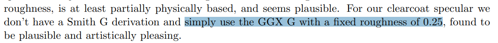

<div align="center"></div>

@[TOC](目录)

# 前言
基于物理的渲染！迪士尼原则的 BRDF 实现：

<div align="center"></div>


<hr>


在 [上一篇博客](https://blog.csdn.net/weixin_44176696/article/details/119044396) 中，我们利用 OpenGL 在 GPU 上实现了光线追踪，尽管获得了令人惊艳（并不）的效果，与此同时遗憾的是我们的代码仅支持漫反射这种材质，为了模拟更多的材质，我们不得不继续学习

尽管我们能够使用一些土方法，比如将随机向量和镜面反射向量，根据粗糙度做一个插值，就能简单模拟模糊镜面反射，运算速度快，并且（看起来）还有不错的效果。不过这毕竟是非常主观的 hack...  

> 注：
> 该方法在 spp 上去之后会有严重的 artifact

我们希望有一种统一的规范（principle）来衡量材质。规范的意义在于，我们用不同的渲染平台，渲染器去渲染同样的物体，就会得到同样的效果，这将材质和渲染人为地分离解耦

什么是 principle？设想你去打吊针，你问医生剂量多少，你希望听到的是 xxx 毫升而不是 x 师傅矿泉水瓶装满九又四分之三 

# 0. 前情回顾
渲染方程：

<div align="center"></div>

还记得上一篇文章中，我们留下的问题吗？在求解渲染方程的 $f_r$  项的时候，我们暴力地假定了：

$$
f_r = \frac{baseColor}{\pi}
$$

事实上，对于漫反射，这么假定能够得到不错的结果，但是如果 $f_r$ 恒定不变，我们也只能得到这样的结果了（：

一个理想的情况是：对于不同的入射角度，出射角度，表面材质，这个 $f_r$ 会有不同的值，我们命中了金属，就返回金属的颜色，命中了塑料，就得到塑料的颜色...

对于动态的入射出射角和材质，我们能够通过 $f_r$ 函数来模拟不同的表面，于是今天我们的任务就是根据科学家的测量和数学家的建模，物理地地确定这个 $f_r$ 的值

# 1. 微平面理论
微平面理论在真实感渲染中有着举足轻重的地位，作为像素的朝圣者，我们不得不对它三叩九拜。在接触微平面理论之前，来先入为主地看这样一张相片（图源百度图片）：

<div align="center"></div>


仔细看反射的树木，模糊的看不到树枝的轮廓了。根据人们的经验，平面越平坦，形成的反射就越接近镜面。为什么几乎水平的地面形成的反射会如此模糊和粗糙？在探究这个问题之前，回想一下模糊形成的模糊的原因。在 **近邻区域重复采样** 这就是形成模糊的原因。：

<div align="center"></div>

那么地面形成了模糊，究其原因是反射光线没有严格按照镜面反射的方向射出，而是 **分布** 在了标准镜面反射方向的附近，相当于采样了周围像素：

<div align="center"></div>

我超，好像出大问题了...  初中物理告诉我们：光沿着直线传播，光在反射的时候严格地沿着法线反射

对于上图右侧的一条法线却出现多方向的出射光，如果 ”光沿直线传播“ 的物理定律没错的话，那么问题就出在 **法线** 上面！

幸运的是我们有显微镜！拿起显微镜看看物体的表面（左图引自百度图片）发现很多凹凸不平的小表面，这样的小表面形成了 **多个不同的法向量** ：

<div align="center"></div>

对于多个不同的法向量，根据反射定律算出来的出射方向就有很多个，多条光线的颜色平均就产生了模糊。这也就解释了为什么看似光滑的地面能够反射出模糊的图像：

<div align="center"></div>

这便是微平面理论的由来。对于粗糙的物体，微平面法线随意分布在宏观表面上反射的方向更加随意。而对于镜面反射的物体，其微平面法线集中在宏观表面法线的附近，其反射光线的方向接近宏观表面的镜面反射方向：

<div align="center"></div>


就好比用 20 x 20 的 kernel 去做 blur，效果比 3 x 3 的好，法线分布越离散，模糊程度就越大。至此，我们对微平面理论有了基本的认知


# 2. BRDF 介绍 
BRDF，Bidirectional Reflectance Distribution Function，双向反射分布函数，通常也是渲染方程中的 $f_r$ 项。BRDF 函数接收三个参数，分别是入射光线 $w_i$，命中点 $p$，和出射方向 $w_o$，并且返回一个能量值：

$$
f_r(p, w_i, w_o)
$$

这个函数描述了入射光沿着 $w_i$ 方向入射，命中 $p$ 点发生反射，能够有多少能量反射到 $w_o$ 方向。举个例子：

<div align="center"></div>

BRDF 有一些性质，这使得它是科学且合理的。首先是能量守恒定律，这意味着所有反射光的能量之和必须等于入射光的能量：

<div align="center"></div>

对于漫反射来说，它的 BRDF 处处相等，于是简单漫反射材质的 BRDF 可以近似认为是一个常数，这也就解释了上一篇博客中，我们使用常数 $\frac{baseColor}{ \pi}$ 做 $f_r$ 项的原因。事实上这是 Lambert diffuse model 的描述，是一种简单好用的近似。而 $1 / \pi$ 是通过对 BRDF 函数立体角在半球面 $\Omega^+$ 上积分积得到的

其次，根据光路可逆，$w_o → w_i$ 和 $w_i → w_o$ 是等效的，他们应当拥有相同的 BRDF 值：

$$
f_r(p, w_i, w_o) = f_r(p, w_o, w_i)
$$

至此建立了对 BRDF 的直观认识。在介绍基于物理的 BRDF 之前，来先入为主的理解一下 BRDF 是如何描述反射的：

* 对于光滑的材质，BRDF 在镜面反射光线上有更大（尖锐）的值
* 对于粗糙的材质，BRDF 在镜面反射光线上有更小（均匀）的值

是的就这么简单，来看图：

<div align="center"></div>

删去贡献为 0 的光线方向之后，BRDF 显得更加直观，通过调整不同方向的取值，来决定表面材质最终的反射是模糊还是光滑：

<div align="center"></div>

至于 BRDF 函数怎么取，自然会有严谨的基于测量和物理的公式来决定，接下来介绍应用最广，最受欢迎的一种 BRDF 实现

# 3. 迪士尼原则的 BRDF
著名的 Disney 是一家动画公司，它出名的原因，除了创造那些家喻户晓的卡通形象和 ~~西半球最强法务部~~  以外，Disney 也推动了渲染业界的一次革命。在 2012 年，Disney 结合物理观测，数学建模，和艺术家的指导，创造了一种 BRDF 规范模型


<div align="center"></div>


Disney 的 BRDF 参数直观，对艺术家友好，且有很强的表现力，于是大家纷纷推崇，这玩意差不多相当于真实感渲染领域的 x 老鼠和 x 老鸭了

在 [这里](https://media.disneyanimation.com/uploads/production/publication_asset/48/asset/s2012_pbs_disney_brdf_notes_v3.pdf) 你可以阅读 Disney 的论文原文，在 [GitHub](https://github.com/wdas/brdf/blob/main/src/brdfs/disney.brdf) 上面也可以找到这段非常经典的代码实现。直接抄代码固然非常快速，但是比起给像素涂上正确的颜色，更重要的是知晓颜色背后的秘密

<hr>

Disney BRDF 听起来挺玄乎的，其实换算成公式非常简单，就是一个漫反射加上一个镜面反射：

<div align="center"></div>

其中 diffuse 是一个未定式，通常使用足够简单的 Lambert 漫反射模型，但是 Disney BRDF 选择了更为复杂的表达式，待会介绍

而对于公式后面的分式表示的是高光（specular），它由三个重要的项 D，F，G 组成，其中 D 是微表面分布项，F 是菲涅尔项，G 是几何遮蔽自阴影项

微表面 D 项描述了表面的粗糙程度和，或者说镜面反射波峰的形状，根据不同的 **粗糙度** 得到不同模糊程度的高光：

<div align="center"></div>

而 F 菲涅尔项表示了菲涅尔效应的强度。菲涅尔效应表面了反射光的比例和观察方向和法线的夹角有关。下面是我之前在 [浅谈《原神》中的图形渲染技术](https://blog.csdn.net/weixin_44176696/article/details/114176844) 这篇博客中提到的一个例子：

<div align="center"></div>

而 G 项是几何阴影，或者说自遮蔽。在视角掠视（grazing）的时候，一些光线更加容易被微表面遮挡，形成遮蔽。G 项描述了这些遮蔽：

<div align="center"></div>

如果没有这些遮蔽，那么掠视的时候就会超亮：

<div align="center"></div>

可以自己去掉 D，F，G 中的任何一项来观察效果，能够更加深刻地理解公式背后的物理意义...

<hr>

BRDF 主要的成分我们清晰了，再来看看 Disney 提供的标准化参数，该部分和 [迪士尼的论文](https://media.disneyanimation.com/uploads/production/publication_asset/48/asset/s2012_pbs_disney_brdf_notes_v3.pdf) 的第 5 节一致

baseColor：表面颜色，这个没啥好说的。。。

subsurface：次表面散射参数，用于将次表面散射和漫反射插值，这玩意不是真的 ss，而是基于经验公式凑出来的，看看就好。。。一般用不到


metallic：金属度，决定了漫反射的比例（金属不发生漫反射）


specular：镜面反射强度控制


specularTint：控制镜面反射的颜色，根据该参数，在 baseColor 和 vec3(1) 之间插值。可以看到 specularTint 越高，反射颜色就越贴近红色，反之为白色


roughness：粗糙度


 anisotropic：各向异性参数，在同一点以法线为轴，旋转 V 字型的入射反射光，得到的 BRDF 不同，就是各项异性。下文会详细展开
 


sheen：模拟织物布料边缘的透光


sheenTint：和 specularTint 类似，控制织物高光颜色在 baseColor 和 vec3(1) 之间插值


 clearcoat：清漆强度，模拟粗糙物体表面的光滑涂层（比如木地板） ，和 specular 一样，不过清漆的值比较弱


clearcoatGloss：清漆的 “粗糙度”，或者说光泽程度。事实上 Disney 的代码把该参数直接作为粗糙度


知晓了公式的由来，组成与参数， 接下来准备着手实现 Disney principle's BRDF

<br>

# 4. 参数约定

在开始之前，先约定一些参数。L 是反弹方向，V 是入射方向的负方向，N 是表面法线，H 是半角向量（或者说是微表面法线，因为 V 沿着 H 反射到 L 方向），如图：

<div align="center"></div>

什么都不做，我们先实现一个接口：

```clike
vec3 BRDF_Evaluate(vec3 V, vec3 N, vec3 L, in Material material) {
    float NdotL = dot(N, L);
    float NdotV = dot(N, V);
    if(NdotL < 0 || NdotV < 0) return vec3(0);

    vec3 H = normalize(L + V);
    float NdotH = dot(N, H);
    float LdotH = dot(L, H);

    ...
    
}
```

首先随机选取半球上的一个方向，然后将光线追踪中的 `f_r = baseColor / PI` 改为：

```clike
vec3 V = -hit.viewDir;
vec3 N = hit.normal;
vec3 L = toNormalHemisphere(SampleHemisphere(), hit.normal);    // 随机出射方向 wi

vec3 f_r = BRDF_Evaluate(V, N, L, hit.material);
```

因为蒙特卡洛积分是无偏估计，不管我们用什么分布进行采样，只要采样够多就能够收敛。这里先使用均匀法向半球分布来采样


# 5. 漫反射 & 次表面散射

漫反射的公式长这样：

<div align="center"></div>

刨开后面的一堆不谈，其实就是 Lambert  加个控制项。对应的代码很简单，这里 Cdlin 是线性空间的颜色，如果对纹理采样，需要进行伽马反矫正，具体可以看 Disney 的代码。而 SchlickFresnel 则是菲涅尔方程的一个近似，就是经典的 pow(5) 了：

```clike
float SchlickFresnel(float u) {
    float m = clamp(1-u, 0, 1);
    float m2 = m*m;
    return m2*m2*m; // pow(m,5)
}

...

vec3 BRDF_Evaluate(vec3 V, vec3 N, vec3 L, in Material material) {
	vec3 Cdlin = material.baseColor;
	
	// 漫反射
	float Fd90 = 0.5 + 2.0 * LdotH * LdotH * material.roughness;
	float FL = SchlickFresnel(NdotL);
	float FV = SchlickFresnel(NdotV);
	float Fd = mix(1.0, Fd90, FL) * mix(1.0, Fd90, FV);
	
	vec3 diffuse = Fd * Cdlin / PI;
	return diffuse  * (1.0 - material.metallic);
}
```


从左到右是粗糙度为 0，0.5，1 的球体，可以观察到粗糙度变换带来球体边缘的明暗变换，注意红球和蓝球的边缘，红球更加暗，蓝球更加亮：


<div align="center"></div>


再来看次表面散射，Disney 的论文里面提到次表面散射是基于 Hanrahan-Krueger 的一个 diffuse model 并未给出具体公式，大概来说就是用经验公式来进行拟合，以达到玉石材质的那种边缘透光的效果，注意到第三行具有最强的边缘光：

<div align="center"></div>


首先算出次表面散射的系数 ss，然后根据 subsurface 参数，在漫反射 Fd 和次表面散射 ss 之间进行插值效果很弱。这里直接照抄代码了：

```clike
// 次表面散射
float Fss90 = LdotH * LdotH * material.roughness;
float Fss = mix(1.0, Fss90, FL) * mix(1.0, Fss90, FV);
float ss = 1.25 * (Fss * (1.0 / (NdotL + NdotV) - 0.5) + 0.5);

...

vec3 diffuse = (1.0/PI) * mix(Fd, ss, material.subsurface) * Cdlin;
return diffuse * (1.0 - material.metallic);
```

以粗糙度为 0，左侧和右侧兔子分别是 0.0 和 1.0 的 subsurface 系数，可以看到右侧的兔子在边缘更加透光：

<div align="center"></div>

注：次表面散射模拟的是玉石表面透光的效果，一般配合镜面反射一起效果更佳。请看下文

# 6. 镜面反射 & 清漆
对于现实中的镜面反射，分为两种情况。光滑表面直接的镜面反射比如瓷砖，此外粗糙表面涂了一层透明涂层（清漆）也能产生的反射：

<div align="center"></div>

> 注：
> 图源百度图片


Disney BRDF 选择了叠加两个不同强度的镜面反射来表达。第一个反射是正常的镜面反射，第二个反射是稍弱的清漆反射。对于清漆镜面反射，固定粗糙度为 0.25，然后通过 clearcoat  参数来控制反射的强度

## 6.1. 镜面颜色计算

镜面反射需要颜色。这个颜色可以从材质中来，也可以是 `vec3(1)`，它两之间通过 specularTint 参数进行插值

首先计算颜色的灰度（亮度，luminance），然后使用亮度对颜色进行归一化以满足能量守恒：

```clike
vec3 Cdlin = material.baseColor;
float Cdlum = 0.3 * Cdlin.r + 0.6 * Cdlin[1].g  + 0.1 * Cdlin.b;
vec3 Ctint = (Cdlum > 0) ? (Cdlin/Cdlum) : (vec3(1));  
```

Ctint 不会发生能量损失，用它来偏转镜面反射的色调。然后通过 specularTint 参数在 Ctint 和 `vec3(1)` 之间进行插值，然使用 specularTint 参数控制偏转的强度：

```clike
vec3 Cspec = material.specular * mix(vec3(1), Ctint, material.specularTint);
```

然后我们要计算 F0，这个数字的意思是当我们以 0 度角 **垂直观察** 材质平面的时候，有多少光能够被反射。对应菲涅尔中的 F0 参数：

<div align="center"></div>


根据测量，大多数非金属的 F0 为 0.08，而对于完美的镜面反射，颜色就是 baseColor，这里根据材质的金属度 metallic 进行镜面反射和漫反射颜色的插值：

```clike
vec3 Cspec0 = mix(0.08*Cspec, Cdlin, material.metallic); // 0° 镜面反射颜色
```


嗯 颜色有了，接下来算颜色的强度 ~ 

## 6.2. 镜面反射实现

首先来看 specular 的公式：

<div align="center"></div>

这意味着我们需要依次算出 D，F，G 三个项，其中 D 项是比较首要的贡献项，或者说决定高光颜色的项

<hr>

首先对于 D 项法线分布项，Disney 选择 GTR 分布，其中 $\alpha$ 是粗糙度：

<div align="center"></div>

其中 $\gamma$ 是控制曲线形状的参数，c 则是一个缩放的常数。通常取 $\gamma=1$ 和 $\gamma=2$ 的情况，并且 Disney 的论文附录也给出了 GTR 的特殊 $\gamma$ 值下的实现：

<div align="center"></div>

其中 $\theta_h$ 是入射光和反射光的半角向量，和法线的夹角，而 $cos(\theta_h)$ 则是 NdotH，代码实现直接 cv 了：

```clike
float GTR1(float NdotH, float a) {
    if (a >= 1) return 1/PI;
    float a2 = a*a;
    float t = 1 + (a2-1)*NdotH*NdotH;
    return (a2-1) / (PI*log(a2)*t);
}

float GTR2(float NdotH, float a) {
    float a2 = a*a;
    float t = 1 + (a2-1)*NdotH*NdotH;
    return a2 / (PI * t*t);
}
```

注意论文里面提到了一个细小的点。在计算 $\alpha$ 的时候要将 $\alpha$ 映射为 $roughness^2$，换句话说，粗糙度要平方：


如果不平方，你想看到镜面反射，就只能粗糙度在 0.2 以下，再高就糊了，大部分的值集中在很小的地方，粗糙度变换不够线性和直观

<hr>

然后是 F 项，这个还是之前的 Schlick 近似，没啥好说的直接 cv 代码：

```clike
float SchlickFresnel(float u) {
    float m = clamp(1-u, 0, 1);
    float m2 = m*m;
    return m2*m2*m; // pow(m,5)
}
```

然后 G 几何遮蔽项使用的是 Smith GGX 模型：

$$
G(\vec v)=\frac{\vec n\cdot \vec v}{(\vec n\cdot \vec v) + \sqrt{\alpha^2+(1-\alpha)^2(\vec n\cdot \vec v)^2}} 
$$

$$
GGX_{smith}(\vec l, \vec v, \vec h)=G(\vec l)G(\vec v)
$$

值得注意的是 Disney 的论文中提到了一种映射粗糙度的方法：


但是后来的修订版本中 Disney 他们 **弃用** 了这个映射，原因未知。这里直接 cv 代码了（开摆

```clike
float smithG_GGX(float NdotV, float alphaG) {
    float a = alphaG*alphaG;
    float b = NdotV*NdotV;
    return 1 / (NdotV + sqrt(a + b - a*b));
}
```

最后将 D，F，G 相乘就可以得到镜面反射项。这里有一个小细节，就是我们 $4\cos(\theta_l)\cos(\theta_v)$ 不见了，这里我也没注意，仔细读了下 Disney 的论文，这玩意应该是一个矫正隐式。为那些不具有微表面描述，但是仍物理正确的模型提供的一个矫正因子：


我们的 specular 本身就是微表面描述的，所以不需要添加矫正因子

> 注：
> 这里以 Disney 的代码为准，他们没加
> 当然你也可以自己试一下加上去会有什么奇怪的效果（我还真试过，物体边缘会有反直觉的高亮

至此我们凑齐了 ~~三相之力~~  ，于是镜面反射项如下：

```clike
vec3 BRDF_Evaluate(vec3 V, vec3 N, vec3 L, in Material material) {

	...
	
	// 镜面反射
	float alpha = material.roughness * material.roughness;
	float Ds = GTR2(NdotH, alpha);
	float FH = SchlickFresnel(LdotH);
	vec3 Fs = mix(Cspec0, vec3(1), FH);
	float Gs = smithG_GGX(NdotL, material.roughness);
	Gs *= smithG_GGX(NdotV, material.roughness);
	
	vec3 specular = Gs * Fs * Ds;
	
	...

}
```

在返回的时候将原来的 diffuse 改为：

```clike
return diffuse * (1.0 - material.metallic) + specular;
```

大功告成，让我们再次进入波与粒的世界！

## 6.3. 小试牛刀

将粗糙度 roughness 调整到 0.1，此时镜面反射 specular 参数为默认值 0.5，而 `0.5 * 0.008 = 0.004` 正好是清漆材质的 F0 值。可以看到鲜明的光滑涂层带来的视觉冲击感：

<div align="center"></div>

调整金属度 metallic，从左到右分别为 0.3，0.6，0.9，而粗糙度仍然是 0.1，可以看到金属拥有更强的镜面反射和更弱的菲涅尔效应：

<div align="center"></div>

调整金属度到 1.0，而粗糙度为 0.1，0.2，0.3，可以观察模糊和标准的镜面反射的区别：

<div align="center"></div>

roughness 为 0.1，specular 为 1.0，再配合之前的 subsurface 参数设为 1.0 即可实现玉石一样的 “通透” 的效果：

<div align="center"></div>

值得注意的一点是如果您亲自调试这些参数，粗糙度调太低，容易造成高光非常 noisy 和难以收敛的情况。这是因为我们选择法向半球的均匀分布采样，而 roughness 为 0.1 的镜面反射，BRDF 的值在完美镜面反射向量的附近才会出现，在其他地方几乎为 0，这导致了我们浪费了很多采样

## 6.4. 清漆

清漆项几乎和镜面反射一致，只是使用固定 0.25 的粗糙度。这是因为清漆模拟的是表面涂层，和实际内层材质的粗糙度无关。一个简单的例子就汽车。是粗糙的金属表面涂上一层光滑的清漆，另一个生动的例子则是木板：

<div align="center"></div>

在法线分布 D 项上，Disney 选择了 $\gamma$ 为 1 的 GTR 分布，将 clearcoatGloss 参数作为 GTR1 的粗糙度。而在几何 G 项上则使用粗糙度固定为 0.25 的：




不多说了，直接上车：

```clike
vec3 BRDF_Evaluate(vec3 V, vec3 N, vec3 L, in Material material) {

	...
	
	// 清漆
	float Dr = GTR1(NdotH, mix(0.1, 0.001, material.clearcoatGloss));
	float Fr = mix(0.04, 1.0, FH);
	float Gr = smithG_GGX(NdotL, 0.25) * smithG_GGX(NdotV, 0.25);
	vec3 clearcoat = vec3(0.25 * Gr * Fr * Dr * material.clearcoat);
	
	...
	
	return diffuse * (1.0 - material.metallic) + specular + clearcoat;
}
```

好吧... 效果不是很明显，其实还是有一点的。因为对于半球均匀采样，法线分布 GTR1 的积分太难收敛的缘故：


<div align="center"></div>


# 7. 织物光泽（sheen）
模拟织物边缘的透光效果。这是一个很微弱的项，和 subsurface 类似，也是通过菲涅尔在掠角处的值来模拟的。sheen 的颜色由 sheenTint 参数在基色和 vec3(1) 之间插值：

```clike
vec3 Csheen = mix(vec3(1), Ctint, material.sheenTint);   // 织物颜色
```

然后是使用一个菲涅尔暴力地 hack 出织物的边缘高光：

```clike
// sheen
vec3 Fsheen = FH * material.sheen * Csheen;
```

然后直接加在 diffuse 上面即可：

```clike
vec3 diffuse += Fsheen;
```

唔... 要把环境光调到常数，制造一个白炉，才容易看清这一项的效果。注意球体边缘的发光：

<div align="center"></div>

顺便提到白炉了，你们猜 BRDF 中的哪些项不能通过白炉测试？（我也不知道） hhh 对于这么复杂的包含大量近似项的 BRDF，能量守恒这种要求就很难达到

# 8. 各向异性（anisotropic）
各向异性就是指当你像转 **圆规** 一样旋转 V-L 向量的时候，对于每个方向，都可以得到一个 `BRDF(V, N, L)`，对于各向同性的材质来说，不管你怎么转，BRDF 的值都不变，而对于各向异性材质来说，不同的角度会造成不同的 BRDF 取值：

<div align="center"></div>

嗯 很难理解。来看一个生活中的例子，就是电梯的抛光金属板。下面是我宿舍楼下的电费计价表和饮料贩卖机在电梯门口的反光：

<div align="center"></div>

可以看到在一个方向上，反射被无限的拖长了，这是因为金属抛光的时候是沿着某一方向进行的，导致 uv 方向上的 **粗糙度** 不同。这就导致一个方向上金属很粗糙，另一个正交的方向上则非常光滑

举个栗子，越粗糙的金属，反射的拖尾就越长。roughness 从左到右分别是 0.05， 0.1 和 0.4，可以看到后者有明显的拖尾：

<div align="center"></div>

对于各向异性的材质，在计算其表面法线分布的时候，要加入一个旋转因子，以控制不同方向上的 BRDF 取值。在切线方向上拥有更大的取值即可：

<div align="center"></div>


在论文中 Disney 指出，将 GTR2 公式中的 $\frac{1}{\alpha}$ 换成 $\frac{\cos^2\phi}{\alpha_x}\frac{\sin^2\phi}{\alpha_y}$ 即可得到各向异性版本的 GTR2 函数：


其中 $\alpha_x, \alpha_y$ 是和 anisotropic 参数相关的缩放因子：

<div align="center"></div>

而考虑到法向半球坐标系各个向量和半角向量 h 的立体角关系：

<div align="center"></div>

> 注：
> x 是切线，y 是副切线，n 是法线，那么有：
> <div align="center"> src="tutorial.assets/383ee3b8bf3b48d2966c2f9ad0598616.png?x-oss-process=image/watermark,type_ZmFuZ3poZW5naGVpdGk,shadow_10,text_Q1NETiBAQWthZ2lTZW5wYWk=,size_20,color_FFFFFF,t_70,g_se,x_16" width="390px"></div>


带入各向异性版本的 GTR2，最终得到：


这里关于我们怎么通过一个点的法线来获取切线...  这里我们使用一个小的 trick，利用一个 helper 向量来帮助建立切线空间：

```clike
void getTangent(vec3 N, inout vec3 tangent, inout vec3 bitangent) {
    vec3 helper = vec3(1, 0, 0);
    if(abs(N.x)>0.999) helper = vec3(0, 0, 1);
    bitangent = normalize(cross(N, helper));
    tangent = normalize(cross(N, bitangent));
}
```

这段代码得到的切线是 “水平” 方向的，即各向异性的方向（tangent）无论如何都是 **横着** 的。~~原理我暂时不明。事实上这段代码我是通过假定 6 个方向的 N，然后炼丹炼出来的经验公式。。。 有空我再详细研究下~~ 

严格意义上讲这段代码是不对的，因为没有考虑物体的 uv，我们暴力指定了一个方向。如果我们旋转物体，高光的方向仍然保持不变

> 注： 
> 要获得切线，严格意义上应该使用一个变换矩阵，或者通过纹理坐标 uv 进行 cross 来重建。
> 可以参考 [learn OpenGL](https://learnopengl-cn.readthedocs.io/zh/latest/05%20Advanced%20Lighting/04%20Normal%20Mapping/) 的 normal mapping 的教程。


emm 不管怎么说，现在我们有了一个能用的切线。好的，又到了暴力 copy 代码的环节。首先是各向异性版的 GTR2 分布，这里用了一个 sqr 来代替稍微昂贵的 pow 函数，其中 X，Y 分别是切线和副切线：

```clike
float sqr(float x) { 
    return x*x; 
}

float GTR2_aniso(float NdotH, float HdotX, float HdotY, float ax, float ay) {
    return 1 / (PI * ax*ay * sqr( sqr(HdotX/ax) + sqr(HdotY/ay) + NdotH*NdotH ));
}
```

然后对于几何遮蔽，这里使用的是 smith GGX 的各向异性版本，也是直接将  $\frac{1}{\alpha}$ 换成 $\frac{\cos^2\phi}{\alpha_x}\frac{\sin^2\phi}{\alpha_y}$ ，然后有：

$$
\frac{1}{(\vec n \cdot \vec v)+\sqrt{(\vec v \cdot \vec x )^2\alpha_x^2+(\vec v \cdot \vec y )^2\alpha_y^2 + (\vec n\cdot \vec v)^2}}
$$

换成代码就是：

```clike
float smithG_GGX_aniso(float NdotV, float VdotX, float VdotY, float ax, float ay) {
    return 1 / (NdotV + sqrt( sqr(VdotX*ax) + sqr(VdotY*ay) + sqr(NdotV) ));
}
```

最后将原来的 specular 改为：

```clike
float aspect = sqrt(1.0 - material.anisotropic * 0.9);
float ax = max(0.001, sqr(material.roughness)/aspect);
float ay = max(0.001, sqr(material.roughness)*aspect);
float Ds = GTR2_aniso(NdotH, dot(H, X), dot(H, Y), ax, ay);
float FH = SchlickFresnel(LdotH);
vec3 Fs = mix(Cspec0, vec3(1), FH);
float Gs;
Gs  = smithG_GGX_aniso(NdotL, dot(L, X), dot(L, Y), ax, ay);
Gs *= smithG_GGX_aniso(NdotV, dot(V, X), dot(V, Y), ax, ay);
```

来试试效果。左侧和右侧的 anisotropic 参数分别为 0 和 1.0，可以看到 anisotropic 为 0 时是标准的镜面反射，为 1 时是带拖尾的各向异性反射：

<div align="center"></div>

再来张 “电梯” 试试：

<div align="center"></div>

噪点太多了。。。 metallic 为 0.95，roughness 为 0.2，均匀采样确实不好拟合，不过结果大体上是对的。。。

# 9. 总结

基于物理的渲染固然复杂且公式繁多，但是效果也十分惊艳，这几个公式基本能涵盖了自然界所有的材质，更重要的是 Disney's PBR 已然是行业标准，是学习真实感渲染路上必不可少的部分

<div align="center"></div>


Disney BRDF 固然真实，但是也有明显的短板：计算负担重，难以收敛。注意到上文很多样例图片都有明显的噪点，这是因为半球均匀采样无法在 BRDF 尖锐处很好的收敛（粗糙度越低越难），在下一部分的博客中，我们将使用 **重要性采样** 策略，着重对于后者进行优化 

# 10. 引用与参考
[1] Brent Burley, Walt Disney Animation Studios 2012. [Physically-Based Shading at Disney](https://media.disneyanimation.com/uploads/production/publication_asset/48/asset/s2012_pbs_disney_brdf_notes_v3.pdf)