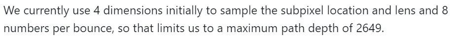
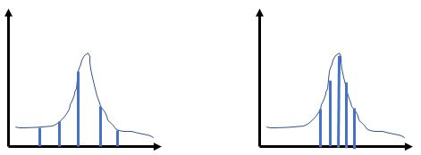
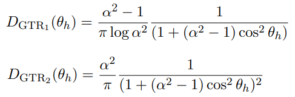
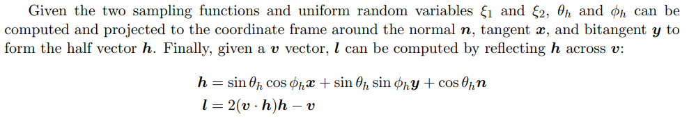
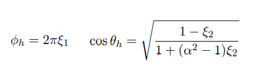
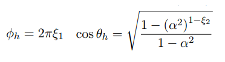
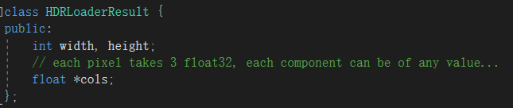
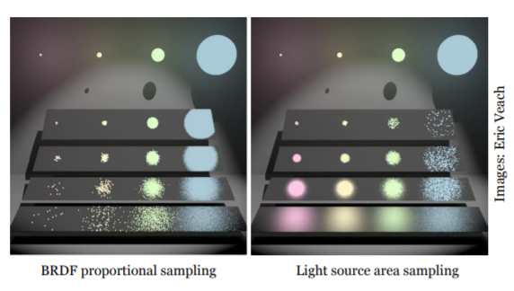
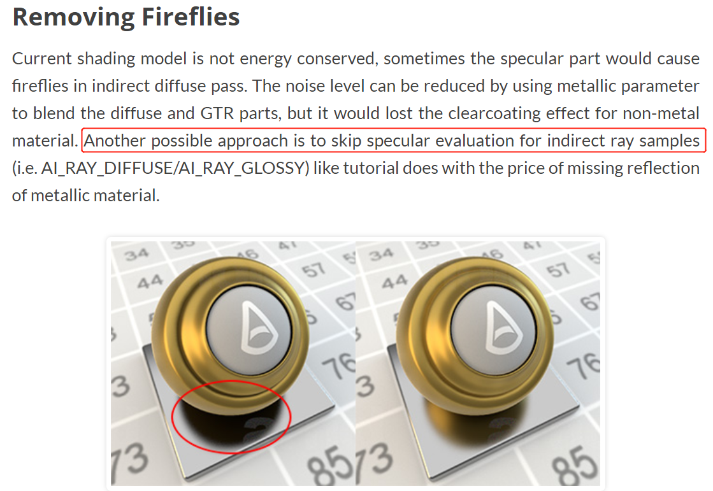
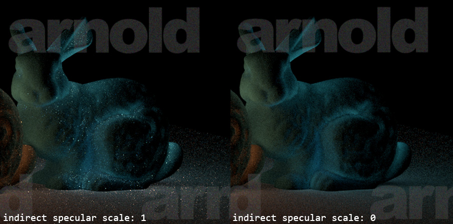

<div align="center"></div>

@[TOC](目录)

# 前言
使用低差异序列与重要性采样来加速光线追踪的收敛！下图是仅 1000 spp 的结果，且找不到任何噪点。而要知道以往博客的示例图样都是 4000 spp 起步的：

<div align="center"></div>

来看看我们究竟干了什么事情：

1. 低差异序列降噪：

<div align="center"></div>

2. 重要性采样（diffuse，specular）降噪：

<div align="center"></div>

3. 对 hdr 贴图重要性采样（从左到右依次是原图，样本，结果）：

<div align="center"></div>

4. 多重（chong）重（zhong）要性采样：

<div align="center"></div>

<hr>

在上一篇博客 [微平面理论与迪士尼 BRDF，严格遵循物理！](https://blog.csdn.net/weixin_44176696/article/details/119791772) 中，我们学习了了微平面理论，并且通过给出的公式实现了完整的迪士尼原则的 BRDF，实现了基于物理的渲染

但是现阶段我们是通过半球均匀采样来计算光线追踪的。尽管对于漫反射来说，均匀采样能够得到很好的结果，但是对于 BRDF，尤其是粗糙度非常低的时候，均匀采样很难达到收敛，因为我们浪费了很多采样：

<div align="center"></div>

如图，对于上图的 10 个采样，真正有用的只有 3 个，效率很低。在这篇博客中我们将通过一些数学方法来强化采样策略：
1. 从样本上：用空间上更加均匀的 **低差异序列** 代替伪随机序列
2. 从分布上：用概率论中的 **重要性采样**  策略来加速渲染方程的收敛过程

不多说了，开始把

# 1. 低差异序列介绍

渲染方程是一个困难积分：

<div align="center"></div>


通常情况下，我们使用蒙特卡洛采样，来对困难积分的值进行估计，而对于一个函数的估计，需要这么几个步骤：

1. 选取积分域内的任意样本 $x$
2. 计算选取该样本的概率 $pdf(x)$
3. 计算样本 $x$ 对应的函数值 $f(x)$
4. 本次采样的贡献为 $\frac{f(x)}{pdf(x)}$

这里有一个结论，就是如果我们使用的样本，在样本空间内的分布越 **均匀** ，那么积分的估计值就会越准确。先入为主的想，原因是因为均匀的样本 **不会放过被积函数的任何一个角落** ，所以估计的值会更加准确

以 $y=x$ 为例，选取 5 个样本，假设 $pdf(x)$ 恒为 $\frac{1}{1.0 - 0.0}$，可以看到均匀的选取 0.2，0.4，0.6，0.8，1.0 得到的估计值，要准于不均匀的选取 0.1，0.7，0.8，0.9，1.0 的采样：


<div align="center"></div>

选取均匀的样本，对于采样的效果至关重要。于是我们引入差异（discrepancy）来衡量一组样本 $X$ 的均匀程度，差异越低的样本越均匀。对于一个拥有 $N$ 个样本和 $V$ 单位体积的样本空间的的点集 $X$，我们任取一体积为 $v$ 的子空间，其中包含 $n$ 个点，那么有：

$$
Disc(X) = \left| \frac{n/N}{v/V} -1.0 \right|
$$

比如一杯水 100 ml，有 3000 个水分子，你一勺子打了 10 ml，那么你理应获得 300 个水分子，这说明水的分布是绝对均匀的，没有差异的

更加直观的，下面是二维平面上，使用较为均匀的低差异序列，和普通的随机数序列生成的点。可以直观的看到，在样本数量同为 256 个的时候，低差异序列对于空间的填充更加均匀：

<div align="center"></div>


可以看到低差异序列均匀的覆盖了样本区域，而对于伪随机数来说，存在很多的孔洞

> 注：
> 蒙特卡洛积分是无偏的，但是积分域的某些角落，在采样次数较少的时候难以达到，采样次数上去了还是可以采到的
> 而对于低差异序列，非常少量的采样就可以均匀照顾到区域，因此低差异序列在采样次数低的时候能够更快收敛

# 2. sobol 序列及其实现

关于 sobol sequence 的原理我看了 3 遍相也没懂，毕竟是数学的东西，都是怪物搞出来的。。。好在最后是勉强搞懂了那些参数和符号的意义，能够拼凑出代码实现了

[这里](https://dl.acm.org/doi/10.1145/641876.641879) 是讲 sobol 原理的论文地址，而 [这里](https://web.maths.unsw.edu.au/~fkuo/sobol/joe-kuo-notes.pdf) 是一篇不错的笔记，对代码实现有帮助。最后 [这里](https://web.maths.unsw.edu.au/~fkuo/sobol/) 则是计算生成矩阵的生成多项式参数


原文比较复杂，下面仅挑一些重要的稍微概括一下，然后是代码实现

## 2.1. 生成矩阵与递推式

sobol 序列是一个递推序列，序列的第 i 个数，取决于序列的第  i-1 个数。此外 sobol 序列需要一个生成矩阵 $v$，它是一个 **二进制** 矩阵，通常以 **一维数组** 的形式出现：


$$
v 
=\begin{bmatrix}
0 & 1 & 0 & 0 \\
0 & 0 & 1 & 1 \\
1 & 0 & 0 & 1 \\
0 & 1 & 1 & 0 \\
\end{bmatrix}
= \begin{bmatrix}
4 \\ 3 \\ 9 \\ 6\\
\end{bmatrix}
= \begin{bmatrix}
\vec v_1 \\ \vec v_2 \\ \vec v_3 \\ \vec v_4 \\
\end{bmatrix}
$$


此外 sobol 的表达式是基于按位异或的操作（bit xor），其中 $x_{i,j}$ 表示第 i 个 sobol 数的第 j 个 bit，而 $i_j$ 表示整数 i 的第 j 个 bit，$v_{i,j}$ 则表示生成矩阵的第 i 行第 j 列。第 i 个 sobol 数的第 j 个 bit 的表达式如下：

$$
x_{i,j}= i_1v_{1,j}  \ \oplus   \ i_2v_{2,j}  \  \oplus  \ i_3v_{3,j}  \  \cdots
$$

对于每个 $x_i$ 的每一 bit 都要和所有的 $v_i$ 按位异或显得有些麻烦，但是存在一种特殊情况：如果 i 和 i-1 的二进制表示 **只有 1 bit 的差异**，比如 $5=(101)_2$ 和 $7=(111)_2$，那么通过 $x_{i-1}$ 异或上那一个差异的 bit 就可以得到 $x_i$，相当于我们得到了递推式：

$$
x_{i,j}=x_{i-1,j}\oplus v_{c_{i-1},j}
$$

其中 $c_{i-1}$ 是 i 和 i-1 的 **发生差异** 的那一 bit。对于一个整数从 0 变成 i，需要改变 k 次，k 为 i 的二进制表示中 1 的个数，下面以 0 变成 11 （二进制 1011）为例：

1. 改变第 1 个bit，由 0000 变为 0001，$c_0=0$
2. 改变第 2 个bit，由 0000 变为 0011，$c_1=1$
3. 改变第 4 个bit，由 0000 变为 1011，$c_2=3$

于是对于递推式有：


$$
x_{i,j} =x_{i-1,j}\oplus v_{c_{i-1},j} 
=(x_{i-2,j}\oplus v_{c_{i-2},j})\oplus v_{c_{i-1},j} = \cdots 
$$

此外规定 $x_{0,j}=0$，而 0 异或任何数字都不影响结果，于是最终变成了：

$$
x_{i,j}= v_{c_{i-1},j}\oplus v_{c_{i-1},j} \oplus \cdots \oplus v_{2,j} \oplus v_{1,j}
$$

这仅是算出 $x_i$ 的第 $j$ 个 bit，而对于整个 $x_i$，因为异或操作满足 **可交换性**，即 `a^b = b^a`，这里假设我们的生成矩阵是通过长度为 32 的，内容为 32 bit 的 uint 数组来表示的 32 x 32 的生成矩阵，即：

```
uint v[32] =  {v1, v2, .... v32}
```

将 vi 看作是行向量，于是我们可以通过一次 **整数的异或操作** 来对 $x_i$ 的 32 bit 都执行一次异或！于是递推式变为：

$$
x_{i}= v_{c_{i-1}}\oplus v_{c_{i-1}} \oplus \cdots \oplus v_{2} \oplus v_{1}
$$

如果序列 $0 \sim i$ 都满足 $i$ 和 $i-1$ 的二进制表示只有 1 bit 的不同，那么我们只需要扫描 $i$ 的每个 bit，在第 $j$ 个位置遇到 1 ，我们就和生成矩阵的第 $j$ 行做异或，于是获得第 $i$ 个 sobol 数的代码为：

```cpp
// 第 i 个 sobol 数
// v 是某一维度的生成矩阵
float sobol(unsigned int v[32], unsigned int i) {
    unsigned int result = 0;

    for(unsigned int j = 0; i; i >>= 1, j++)
        if(i & 1)
            result ^= v[j];

    return result * (1.0f/(float)0xFFFFFFFF);
}
```

遗憾的是从 $0 \sim n$ 的自然数并不都满足 $i$ 和 $i-1$ 的二进制表示只有 1 bit 的不同。于是引入格雷码。格雷码是一种乱序的映射，其中 `gray(i-1)` 和 `gray(i)` 的二进制表达仅相差一个 bit 

<div align="center"></div>


于是我们可以用 gray(i) 代替 $i$ ，进而使用递推版的 sobol 公式生成第 $i$ 个 sobol 数。其中 gray code 的表达式如下：

$$
gray(i)=i \ \oplus \left[  \frac{i}{2} \right]
$$

其中方括号为取整操作。对于编程语言，直接除以二就行

## 2.2. sobol 序列的生成

因为 sobol 是定义在 N 维空间的点的序列，那么 **每个维度都有自己的生成矩阵** ，下面的代码使用预计算的 3 x 32 x 32 的生成矩阵（维度下标从 1 开始），可以生成最多 $2^{32}$ 个三维空间的 sobol 点，上文的二维散点图也是用这个程序生成的：

```cpp
#include <bits/stdc++.h>

using namespace std;

typedef unsigned int uint;

// V[d] 表示第 d 维度的生成矩阵 
uint V[4][32] = { 
	0,0,0,0,0,0,0,0,0,0,0,0,0,0,0,0,0,0,0,0,0,0,0,0,0,0,0,0,0,0,0,0,
	// dimension 1 
	2147483648, 1073741824, 536870912, 268435456, 134217728, 67108864, 33554432, 16777216, 8388608, 4194304, 2097152, 1048576, 524288, 262144, 131072, 65536, 32768, 16384, 8192, 4096, 2048, 1024, 512, 256, 128, 64, 32, 16, 8, 4, 2, 1,
	// dimension 2
	2147483648, 3221225472, 2684354560, 4026531840, 2281701376, 3422552064, 2852126720, 4278190080, 2155872256, 3233808384, 2694840320, 4042260480, 2290614272, 3435921408, 2863267840, 4294901760, 2147516416, 3221274624, 2684395520, 4026593280, 2281736192, 3422604288, 2852170240, 4278255360, 2155905152, 3233857728, 2694881440, 4042322160, 2290649224, 3435973836, 2863311530, 4294967295,
	// dimension 3
	2147483648, 3221225472, 1610612736, 2415919104, 3892314112, 1543503872, 2382364672, 3305111552, 1753219072, 2629828608, 3999268864, 1435500544, 2154299392, 3231449088, 1626210304, 2421489664, 3900735488, 1556135936, 2388680704, 3314585600, 1751705600, 2627492864, 4008611328, 1431684352, 2147543168, 3221249216, 1610649184, 2415969680, 3892340840, 1543543964, 2382425838, 3305133397
};

// 格林码 
uint grayCode(uint i) {
	return i ^ (i>>1);
}

// 生成第 dimension 维度的第 i 个 sobol 数
float sobol(unsigned int vectors[][32], unsigned int dimension, unsigned int i) {
    unsigned int result = 0;

    for(unsigned int j = 0; i; i >>= 1, j++)
        if(i & 1)
            result ^= vectors[dimension][j];

    return result * (1.0f/(float)0xFFFFFFFF);
}

int main() {
	
	// 生成 第 D 维度的 sobol sequence 
	int N = 20;
	for(int i=0; i<N; i++) {
		float x = sobol(V, 1, grayCode(i)); cout<<x<<" ";
		float y = sobol(V, 2, grayCode(i)); cout<<y<<" ";
		float z = sobol(V, 3, grayCode(i)); cout<<z<<" ";	
		cout<<endl;
	}

	return 0;
}

```


代码是参考了开源的渲染器 blender 关于 sobol sequence 的操作。在 [这里](https://wiki.blender.org/wiki/Source/Render/Cycles/Sobol) 可以查看 blender 的该部分的源码。也可以和 [sobol 官网](https://web.maths.unsw.edu.au/~fkuo/sobol/) 的例程的结果对比下。左侧是例程是 linux 下的结果，右侧是我们的程序的输出：

<div align="center"></div>


嗯 结果是正确的！

## 2.3. 生成矩阵的计算

简单说一下就是 emmm ，生成矩阵由数组表示，$v_{k,j}$ 表示第 $k$ 行的第 $j$ 列的元素。的每一个 bit 都有递推式，然后 $a$ 是一个有 $s_i$ 个 bit 的整数，$a_j$ 表示 a 的第 j 个 bit，公式如下：

<div align="center"></div>

但是因为我们 v 矩阵存的都是 32 位 **整数**，所以可以在等式两边同时乘以 $2^{32}$，然后将最终生成的 sobol 数通过除以 $2^{32}$ 映射回 0 ~ 1 的 uniform float 范围。于是最终的 v 矩阵存储的实际上是 $v * 2^{32}$，所以有：

$$
v_{k,j}=m_{k,j} * 2^{32-k}
$$

然后就是暴力的套公式环节了。这里直接放我写好的代码。代码可以根据输入的参数（这些参数可以在 [sobol 官网](https://web.maths.unsw.edu.au/~fkuo/sobol/) 上面下载）生成对应维度的生成矩阵，不过仅支持 32 bit 的，每个维度的二进制生成矩阵都是 32 x 32 的，然后压缩为 32 长度的数组。以第三个维度为例，参数应该这么输入：

<div align="center"></div>

生成第 D 个维度的生成矩阵的例程的代码如下：

```cpp
#include <bits/stdc++.h>

using namespace std;

typedef unsigned int uint;

float sobol(unsigned int vectors[][32], unsigned int dimension, unsigned int i) {
    unsigned int result = 0;

    for(unsigned int j = 0; i; i >>= 1, j++)
        if(i & 1)
            result ^= vectors[dimension][j];

    return result * (1.0f/(float)0xFFFFFFFF);
}

// 格林码 
uint grayCode(uint i) {
	return i ^ (i>>1);
}

// 生成第 k 个方向数 M_k 
void generate_M_k(vector<uint>& M, uint S, uint k, uint a[]) {
	unsigned int M_k = 0;
	for(int i=1; i<=S-1; i++) {
		M_k ^= (1<<i) * a[i] * M[k-i];
	}
	M_k ^= ((1<<S) * M[k-S]) ^ M[k-S];
	M.push_back(M_k);
}

int main() {
	
	// 参数 
	int D = 3;
	int S = 2;
	int A = 1;
	vector<uint> M = {0, 1, 3};	// 下标从 1 开始  
	
	
	// 根据 A 的值生成多项式 
	uint a[S];	// 下标从 1 开始, 共 S-1 个元素 
	uint A_ = A;
	uint i = S-1;
	do {
		a[i--] = A_ & 1;
		A_ = A_>>1;
	} while(A_);
	cout<<"多项式数组 a[1] ~ a[S-1]"<<endl;
	for(int i=1; i<S; i++) {
		cout<<a[i]<<" ";
	}
	cout<<endl<<endl;
	
	
	// 生成方向数 
	for(int k=S+1; k<=32; k++) {
		generate_M_k(M, S, k, a);
	}
	cout<<"方向数数组 m[1] ~ m[32]"<<endl;
	for(int i=1; i<=32; i++) {
		cout<<M[i]<<" ";
	}
	cout<<endl<<endl;
	
	
	// 将 m 换算成 v 同时写第 d 维度的生成矩阵 
	uint V[33][32];
	for(int k=1; k<=32; k++) {
		V[D][k-1] = M[k] * (1<<(32-k));
	}
	cout<<"生成矩阵 v[1] ~ v[32]"<<endl;
	for(int k=1; k<=32; k++) {
		cout<<V[D][k-1]<<", ";
	}
	cout<<endl<<endl;
	
	
	// 生成 第 D 维度的 sobol sequence 
	cout<<"维度为 "<<D<<" 的 sobol 序列"<<endl;
	int N = 30;
	for(int i=0; i<N; i++) {
		float x_i = sobol(V, D, grayCode(i));
		cout<<x_i<<endl;
	}
	

	return 0;
}

```

其中可以和标准的 sobol 例程对比结果。以第三个维度为例，可以看到结果正确：

<div align="center"></div>

> 注：
> 我的代码没有给出第一个维度的生成矩阵怎么求，事实上有：
> vi = 2^i
> 即：
> `V[1][] = {2147483648, 1073741824, 536870912 ... 4, 2, 1}`
> 使用这个矩阵（其实就是单位矩阵）得到的序列（也要用 gray code 做 i）就是一维的 sobol number

# 3. 在着色器中使用 sobol 序列

至此我们掌握了生成 N 维度的 sobol sequence 的方法。对于每个维度的 0 ~ n 个数都是一个单独的随机数序列，但是因为 sobol 具有均匀填充空间的特性，只需要用很少的几个维度填充积分域即可

还有一些问题：对于 N 个 D 维的 sobol 向量总共有 N 个数，对于每一帧，每个像素，光线的每次反弹，该如何选取这些数字作为随机数呢？

* 对于第 i 帧，我们选取第 i 个 sobol 向量
* 假设一次反弹需要 2 个随机数，对于第 i 帧的第 1 次反弹，选取第 i 个 sobol 向量的第 1，2 维度的数字作为随机数。第 2 次反弹则选择 3，4 维度，以此类推...

> 注：
> 上文给出的网站最多可以生成 21201 维度的 sobol 向量，如果你能理解上面我在说什么，就能够理解为啥每次反弹需要 8 个随机数的 blender 的光线最大深度是 21201 ÷ 8 了（下图来自 blender 文档）：
> 


在着色器中使用 sobol sequence 也很简单，因为我们的半球面积分需要两个随机变量，分别是 $\phi$ 和 $\theta$，我们只需要两个维度的 sobol 序列即可。假设我们最大支持 4 次反弹，我们就需要最高为 8 维的 sobol 生成矩阵。在着色器中加入：

```clike
// 1 ~ 8 维的 sobol 生成矩阵
const uint V[8*32] = {
    2147483648, 1073741824, 536870912, 268435456, 134217728, 67108864, 33554432, 16777216, 8388608, 4194304, 2097152, 1048576, 524288, 262144, 131072, 65536, 32768, 16384, 8192, 4096, 2048, 1024, 512, 256, 128, 64, 32, 16, 8, 4, 2, 1,
    2147483648, 3221225472, 2684354560, 4026531840, 2281701376, 3422552064, 2852126720, 4278190080, 2155872256, 3233808384, 2694840320, 4042260480, 2290614272, 3435921408, 2863267840, 4294901760, 2147516416, 3221274624, 2684395520, 4026593280, 2281736192, 3422604288, 2852170240, 4278255360, 2155905152, 3233857728, 2694881440, 4042322160, 2290649224, 3435973836, 2863311530, 4294967295,
    2147483648, 3221225472, 1610612736, 2415919104, 3892314112, 1543503872, 2382364672, 3305111552, 1753219072, 2629828608, 3999268864, 1435500544, 2154299392, 3231449088, 1626210304, 2421489664, 3900735488, 1556135936, 2388680704, 3314585600, 1751705600, 2627492864, 4008611328, 1431684352, 2147543168, 3221249216, 1610649184, 2415969680, 3892340840, 1543543964, 2382425838, 3305133397,
    2147483648, 3221225472, 536870912, 1342177280, 4160749568, 1946157056, 2717908992, 2466250752, 3632267264, 624951296, 1507852288, 3872391168, 2013790208, 3020685312, 2181169152, 3271884800, 546275328, 1363623936, 4226424832, 1977167872, 2693105664, 2437829632, 3689389568, 635137280, 1484783744, 3846176960, 2044723232, 3067084880, 2148008184, 3222012020, 537002146, 1342505107,
    2147483648, 1073741824, 536870912, 2952790016, 4160749568, 3690987520, 2046820352, 2634022912, 1518338048, 801112064, 2707423232, 4038066176, 3666345984, 1875116032, 2170683392, 1085997056, 579305472, 3016343552, 4217741312, 3719483392, 2013407232, 2617981952, 1510979072, 755882752, 2726789248, 4090085440, 3680870432, 1840435376, 2147625208, 1074478300, 537900666, 2953698205,
    2147483648, 1073741824, 1610612736, 805306368, 2818572288, 335544320, 2113929216, 3472883712, 2290089984, 3829399552, 3059744768, 1127219200, 3089629184, 4199809024, 3567124480, 1891565568, 394297344, 3988799488, 920674304, 4193267712, 2950604800, 3977188352, 3250028032, 129093376, 2231568512, 2963678272, 4281226848, 432124720, 803643432, 1633613396, 2672665246, 3170194367,
    2147483648, 3221225472, 2684354560, 3489660928, 1476395008, 2483027968, 1040187392, 3808428032, 3196059648, 599785472, 505413632, 4077912064, 1182269440, 1736704000, 2017853440, 2221342720, 3329785856, 2810494976, 3628507136, 1416089600, 2658719744, 864310272, 3863387648, 3076993792, 553150080, 272922560, 4167467040, 1148698640, 1719673080, 2009075780, 2149644390, 3222291575,
    2147483648, 1073741824, 2684354560, 1342177280, 2281701376, 1946157056, 436207616, 2566914048, 2625634304, 3208642560, 2720006144, 2098200576, 111673344, 2354315264, 3464626176, 4027383808, 2886631424, 3770826752, 1691164672, 3357462528, 1993345024, 3752330240, 873073152, 2870150400, 1700563072, 87021376, 1097028000, 1222351248, 1560027592, 2977959924, 23268898, 437609937
};

// 格林码 
uint grayCode(uint i) {
	return i ^ (i>>1);
}

// 生成第 d 维度的第 i 个 sobol 数
float sobol(uint d, uint i) {
    uint result = 0;
    uint offset = d * 32;
    for(uint j = 0; i; i >>= 1, j++) 
        if(i & 1)
            result ^= V[j+offset];

    return float(result) * (1.0f/float(0xFFFFFFFFU));
}

// 生成第 i 帧的第 b 次反弹需要的二维随机向量
vec2 sobolVec2(uint i, uint b) {
    float u = sobol(b*2, grayCode(i));
    float v = sobol(b*2+1, grayCode(i));
    return vec2(u, v);
}
```

对于第 i 帧，我们取第 i 个 sobol 向量，对于第 b 次反弹，我们取 $[b*2, b*2+1]$  维度的数即可，将帧计数器 frameCounter 变量传入，然后生成二维平面上的点看看效果，可以看到 sobol 的点正在均匀地填满整个空间：


当然你也可以尝试不同的维度，你会发现他们的填充图样各不相同... 

将二维 sobol 向量作为随机变量 $\xi_1$ 和 $\xi_2$，修改 pathTracing 中生成半球向量的代码如下，其中 bounce 是光线反弹次数，从 0 开始：


```clike
vec3 SampleHemisphere(float xi_1, float xi_2) {
    float z = xi_1;
    float r = max(0, sqrt(1.0 - z*z));
    float phi = 2.0 * PI * xi_2;
    return vec3(r * cos(phi), r * sin(phi), z);
}

...

vec3 pathTracing(HitResult hit, int maxBounce) {
	for(int bounce=0; bounce<maxBounce; bounce++) {
		...	
		
		vec2 uv = sobolVec2(frameCounter+1, bounce);
		vec3 L = SampleHemisphere(uv.x, uv.y);
		L = toNormalHemisphere(L, hit.normal);	
		
		...
	}
}
```

别忘了将 L 投影回法向半球：

```clike
// 将向量 v 投影到 N 的法向半球
vec3 toNormalHemisphere(vec3 v, vec3 N) {
    vec3 helper = vec3(1, 0, 0);
    if(abs(N.x)>0.999) helper = vec3(0, 0, 1);
    vec3 tangent = normalize(cross(N, helper));
    vec3 bitangent = normalize(cross(N, tangent));
    return v.x * tangent + v.y * bitangent + v.z * N;
}
```

然后我们看看效果左图是前 200 次迭代，效果很差，像溜冰之后看到的幻觉一样。而右边 4000 次迭代的结果已经非常棒了，看不到任何噪点，展示了低差异序列强大的威力：

<div align="center"></div>


在没有拟合的时候为啥会出现这些类似 “反射” 的图形呢？这是因为 **所有像素都使用同一序列** 进行光线弹射，就像光洁的镜面一样，这当然是不好的。一种解决方案是以像素坐标作为种子生成二维随机向量，然后对该帧的序列都加上这个向量，如果超出了 $[0,1]$ 的值就 **取模** 回去，这个策略叫做 Cranley Patterson Rotation，实现简单效果好：

 

```clike
uint wang_hash(inout uint seed) {
    seed = uint(seed ^ uint(61)) ^ uint(seed >> uint(16));
    seed *= uint(9);
    seed = seed ^ (seed >> 4);
    seed *= uint(0x27d4eb2d);
    seed = seed ^ (seed >> 15);
    return seed;
}

...

vec2 CranleyPattersonRotation(vec2 p) {
    uint pseed = uint(
        uint((pix.x * 0.5 + 0.5) * width)  * uint(1973) + 
        uint((pix.y * 0.5 + 0.5) * height) * uint(9277) + 
        uint(114514/1919) * uint(26699)) | uint(1);
    
    float u = float(wang_hash(pseed)) / 4294967296.0;
    float v = float(wang_hash(pseed)) / 4294967296.0;

    p.x += u;
    if(p.x>1) p.x -= 1;
    if(p.x<0) p.x += 1;

    p.y += v;
    if(p.y>1) p.y -= 1;
    if(p.y<0) p.y += 1;

    return p;
}
```

其中 pix 是 NDC 坐标系下的范围 ±1 的平面像素坐标，weight 和 height 则是屏幕分辨率，我们用 **像素坐标** 做随机种子。再来看看效果，可以看到在 50 spp 的情况下，左侧是使用伪随机数的结果，右侧是使用 sobol + Cranley Patterson Rotation 的结果：

<div align="center"></div>


可以看到 sobol 序列的结果明显更加平滑，注意右图的地面

> 注：
> 对于同一帧的多次弹射，必须使用不同维度的 sobol 数，否则多次弹射使用同一方向，会出现奇怪的 bug，下图是我意外产生的一个视觉效果非常... 意识流的 bug，像是来自异世界的茶壶闪烁着不属于这个次元的光芒
>
> <div align="center"></div>


# 4. 重要性采样简介
在上文中我们仅优化了产生随机数的方式，但是本质上我们还是在使用 **均匀分布** 的样本进行采样。而概率统计告诉我们，相比于各个位置均匀采样，如果 **在函数值大的地方多采样几次** 就能够更好的拟合，这个策略叫做重要性采样：

<div align="center"></div>

事实上 “在函数值大的地方多采样几次” 仅仅是一个直觉上的描述。数学的表述是：如果随机变量的概率密度函数 $pdf(x)$ 能够正比于被估计函数的函数值 $f(x)$，那么估计的结果最好

举个例子，$f(1)=1, f(2)=7, f(3)=2$，那么 x 取 1，2，3 的概率应该分别为：0.1，0.7，0.2

对于光线追踪的重要性采样，因为 BRDF 函数的不同，而分为如下几个部分：
1. 对漫反射的重要性采样（diffuse importance sampling）
2. 对镜面反射的重要性采样（specularimportance sampling）
3. 对清漆的重要性采样（clearcoat importance sampling）
4. 对 HDR 环境贴图的重要性采样（HDR importance sampling）

而对于支持重要性采样的路径追踪，则需要实现这几个步骤：

1. 根据表面材质，随机采样一个方向 L
2. 获取 L 方向上的 BRDF 值
3. 获取 L 方向上采样的概率密度
4. 计算该条路径的贡献

# 5. 漫反射重要性采样
对于 Disney BRDF 的漫反射，我们粗糙的认为 $F_d = \frac{baseColor}{\pi} * \cos(w_i)$，也就是 Lambert diffuse 中的 N dot L ，然后计算半球积得到算归一化因子 $c=\frac{1}{\pi}$，最终得到：

$$
pdf(x) \sim \frac{\cos(w_i)}{\pi}
$$

推导过程见：[PBRT 13.6 2D Sampling with Multidimensional Transformations](https://www.pbr-book.org/3ed-2018/Monte_Carlo_Integration/2D_Sampling_with_Multidimensional_Transformations#Cosine-WeightedHemisphereSampling) ，对于这种样本的生成，PBRT 给了我们使用一种简单的巧取法：
1. 生成两个随机数 xi_1，xi_2
2. 根据随机数得到均匀圆盘上的二维点 xy
3. 将二维点投影到 z 轴半球，得到三维点 xyz


这种方法叫做 Malley’s Method，具体原理不明。**比起探究规律本身，我们对规律的应用更感兴趣** ---- 这句话出自 A 岛的原创科幻短篇小说《灯神精灵》，相较于不切实际的灯神观测者和它的三个愿望，我们还是来看余弦加权的重要性采样的代码吧，同样要注意将随机向量投影到法向半球：

```clike
// 余弦加权的法向半球采样
vec3 SampleCosineHemisphere(float xi_1, float xi_2, vec3 N) {
    // 均匀采样 xy 圆盘然后投影到 z 半球
    float r = sqrt(xi_1);
    float theta = xi_2 * 2.0 * PI;
    float x = r * cos(theta);
    float y = r * sin(theta);
    float z = sqrt(1.0 - x*x - y*y);

    // 从 z 半球投影到法向半球
    vec3 L = toNormalHemisphere(vec3(x, y, z), N);
    return L;
}
```

其中 xi_1，xi_2 是两个随机变量，这意味这重要性采样也支持我们使用来自 sobol sequence 的样本。首先采样一个方向，然后获取对应的 BRDF 值：

```clike
xi_1, xi_2 is 2 random number

vec3 L = SampleCosineHemisphere(xi_1, xi_2, N)
vec3 f_r = ...
float pdf = NdotH / PI;
```

来看看 5 spp 下的效果：


<div align="center"></div>

其中左侧为均匀采样，右侧为余弦半球采样的结果，可以看到重要性采样的噪点更少更加平滑

> 注：
> 该测试图片使用伪随机数而非 sobol 数，因为后者本身就有降噪效果
> 故 **控制变量** 仅使用伪随机数

# 6. BRDF 重要性采样

这一项主要是针对 **镜面反射** 的重要性采样，镜面反射使用 GTR 函数进行近似，而这个函数粗糙度越低尖峰越大，BRDF 较大的值都出现在镜面反射光线附近，这就导致很难通过一般的 **均匀采样** 去拟合。尽管我们使用了 sobol sequence，但是还是不可避免地出现噪点：

<div align="center"></div>

如果你还记得 Disney BRDF 中 GTR2 的复杂表达式，那么你一定不会想自己手动推导一个符合它的分布：

<div align="center"></div>

好在 Disney 在论文中帮我们推导过了：要想生成符合 GTR 函数的一个分布，我们取半角向量 h 的概率密度为 $pdf(\theta_h)=D(\theta_h)\cos_h$，因为双向反射分布函数已经是归一化的。此外对于重要性采样，我们的 pdf 是针对 $\theta_l$ 也就是出射光线的，所以还有一步额外的转换：


至此我们可以确定生成重要性采样方向的流程了：
1. 首先 roll 两个均匀分布的随机向量 $\xi_1, \ \xi_2$
2. 根据 $\xi_1, \ \xi_2$ 计算半球坐标的 $\theta_h, \ \phi_h$ 从而确定半角向量 H
3. 将半角向量 H 投影到反射点的法向半球
4. 将半角向量 H 作为反射镜面的法线，反射入射光线 V，得到出射光线 L

即：




其中最难的步骤就是 2，因为我们要根据随机变量生成符合：

$$
pdf(\theta_h)\sim D(\theta_h)\cos_h
$$

这一分布的立体角  $\theta_h$，而对于旋转角 $\phi_h$ 因为是 **各向同性** 的重要性采样，它和 $\theta_h$ 不相关，我们取均匀分布即可。于是立即推：直接摆烂抄论文里的公式就完事了，对于 GTR2 的 $\theta_h$ 我们有：

<div align="center"></div>

注意我们的计算仍然是 z 向上的几何坐标系下计算的，而不是 y 向上的标准 OpenGL 坐标：

<div align="center"></div>


按照上述公式生成向量，可以看到粗糙度越低，向量的分布越靠近镜面反射的方向，左侧和右侧分别是 0.3 和 0.1 的粗糙度，写个 python 脚本试一下效果：

<div align="center"></div>


在理解了原理之后，在着色器下对应的代码实现如下，我们首先计算 H 然后以 H 做法向反射光线得到 L 即可：

```clike
// GTR2 重要性采样
vec3 SampleGTR2(float xi_1, float xi_2, vec3 V, vec3 N, float alpha) {
    
    float phi_h = 2.0 * PI * xi_1;
    float sin_phi_h = sin(phi_h);
    float cos_phi_h = cos(phi_h);

    float cos_theta_h = sqrt((1.0-xi_2)/(1.0+(alpha*alpha-1.0)*xi_2));
    float sin_theta_h = sqrt(max(0.0, 1.0 - cos_theta_h * cos_theta_h));

    // 采样 "微平面" 的法向量 作为镜面反射的半角向量 h 
    vec3 H = vec3(sin_theta_h*cos_phi_h, sin_theta_h*sin_phi_h, cos_theta_h);
    H = toNormalHemisphere(H, N);   // 投影到真正的法向半球

    // 根据 "微法线" 计算反射光方向
    vec3 L = reflect(-V, H);

    return L;
}
```

注意此处是 **各向同性** 的 GTR2 的重要性采样。此外 alpha 是粗糙度的平方，在光线追踪主循环采样的时候，我们传入的时候要做一次映射，别忘了 clamp 一个 0.001 防止粗糙度过小：

```clike
float alpha = max(0.001, sqr(hit.material.roughness));
```

假设全部的采样都来自镜面反射，我们直接将上文的余弦半球采样替换为 BRDF 采样，然后看看效果：


<div align="center"></div>

金属度为 1.0，粗糙度为 0.2，50 spp 的情况下，因为粗糙度太低难以采样到尖峰，左侧几乎不能形成反射，而右侧能够形成完美的反射


> 注：
> 这里因为 pdf 涉及除法，就不得不考虑除数等于 0 的情况
> 稍有不慎就会抛出 divided by zero 的 exception 从而 down 掉你的 fragment shader 同时屏幕出现黑点，这些黑点永远不会消除，直到你关闭程序

# 7. 清漆重要性采样

Disney BRDF 使用 GTR1 进行清漆的镜面波瓣拟合，而 Disney 的论文中也给出了  **各向同性** 的GTR1 的重要性采样的  $\theta_h$ 和 $\phi_h$ 的取值：

<div align="center"></div>

于是如法炮制即可，和 GTR2 相同，只是 cos_theta 改一下即可：

```clike
// GTR1 重要性采样
vec3 SampleGTR1(float xi_1, float xi_2, vec3 V, vec3 N, float alpha) {
    ...
    
    float cos_theta_h = sqrt((1.0-pow(alpha*alpha, 1.0-xi_2))/(1.0-alpha*alpha));
    ...
}
```

在取 BRDF 的时候注意清漆的粗糙度的 alpha 是这么算的，和 clearcoatGloss 参数有关而和表面粗糙度无关：

```clike
float alpha = mix(0.1, 0.001, hit.material.clearcoatGloss);
```

在仅有清漆项的情况下看一看效果：

<div align="center"></div>

太棒了，完全没有任何噪点


# 8. 按照辐射度混合采样

前面我们分别实现了使用单独的分布来单独采样 BRDF 的三个分部，现在我们要将三种采样的结果叠加起来得到最终的结果。那么问题就来了，在一次采样中，我们不可能同时采样三个 BRDF 项，这样做每次弹射要发射 3 条光线 **时间开销** 太大，并且大多数材质都不同时具有三个项，我们会浪费许多采样

## 8.1. 获取采样方向 L 

一种启发性的方法是根据三种 BRDF 项的 **能量贡献** 来分配采样的次数。比如我有 100 次采样的开销。假设漫反射，镜面反射，清漆分别占最终颜色亮度的 0.6，0.3，0.1，那么我就要分配 60，30，10 次采样到漫反射，镜面反射，清漆上

而根据 Disney BRDF 的表达式：

```clike
diffuse * (1.0 - material.metallic) + specular + clearcoat;
```

我们可以大概推算出每一项的占比，注意这里我们认为镜面反射的亮度永远是 1.0，而清漆亮度受材质的 clearcoat 参数控制：

```clike
// 辐射度统计
float r_diffuse = (1.0 - material.metallic);
float r_specular = 1.0;
float r_clearcoat = 0.25 * material.clearcoat;
float r_sum = r_diffuse + r_specular + r_clearcoat;

// 根据辐射度计算概率
float p_diffuse = r_diffuse / r_sum;
float p_specular = r_specular / r_sum;
float p_clearcoat = r_clearcoat / r_sum;
```

如果单看 diffuse 和 specular 这两项你会发现我们有这样的一个函数：

$$
p_{diffuse} = \frac{1.0 - metallic}{2.0 - metallic} , \ p_{specular} = \frac{1.0}{2.0 - metallic}
$$

以 metallic 为 x，画出漫反射占比 diffuse ratio 关于 x 的图像，你会发现这其实和我们常用的经验公式不谋而合：

```clike
float diffuseRatio = 0.5 * (1.0 - Metallic);
```

互联网上很少有对这个 diffuseRatio  的公式做详细解释的，都是直接由经验公式得。我想，通过【按照辐射度采样】这一思路能够对它做出解释：

<div align="center"></div>


我们 roll 一个随机数 $\xi_3$，根据三种 BRDF 的辐射度贡献来做概率来采样。假设漫反射，镜面反射，清漆的贡献分别为 0.6，0.3，0.1，那么我们的随机数落在 $[0,0.6]$ 就是漫反射，落在 $[0.6,0.9]$ 就是镜面反射，落在 $[0.9,1.0]$ 就是清漆反射：

```clike
// 按照辐射度分布分别采样三种 BRDF
vec3 SampleBRDF(float xi_1, float xi_2, float xi_3, vec3 V, vec3 N, in Material material) {
    float alpha_GTR1 = mix(0.1, 0.001, material.clearcoatGloss);
    float alpha_GTR2 = max(0.001, sqr(material.roughness));
    
    // 辐射度统计
    float r_diffuse = (1.0 - material.metallic);
    float r_specular = 1.0;
    float r_clearcoat = 0.25 * material.clearcoat;
    float r_sum = r_diffuse + r_specular + r_clearcoat;

    // 根据辐射度计算概率
    float p_diffuse = r_diffuse / r_sum;
    float p_specular = r_specular / r_sum;
    float p_clearcoat = r_clearcoat / r_sum;

    // 按照概率采样
    float rd = xi_3;

    // 漫反射
    if(rd <= p_diffuse) {
        return SampleCosineHemisphere(xi_1, xi_2, N);
    } 
    // 镜面反射
    else if(p_diffuse < rd && rd <= p_diffuse + p_specular) {    
        return SampleGTR2(xi_1, xi_2, V, N, alpha_GTR2);
    } 
    // 清漆
    else if(p_diffuse + p_specular < rd) {
        return SampleGTR1(xi_1, xi_2, V, N, alpha_GTR1);
    }
    return vec3(0, 1, 0);
}
```

## 8.2. 获取方向 L 上的概率密度

采样 diffuse 路径我们应该用 diffuse 的 pdf 去计算该条路径的贡献，比起分开采样三种 pdf，一种更好的策略是 **按照采样的概率** 直接叠加三种 pdf 即可。和采样的时候类似，先计算辐射度，然后归一化得到各个部分的概率，最后按照概率叠加三种不同的 pdf 并返回：

```clike
// 获取 BRDF 在 L 方向上的概率密度
float BRDF_Pdf(vec3 V, vec3 N, vec3 L, in Material material) {
    float NdotL = dot(N, L);
    float NdotV = dot(N, V);
    if(NdotL < 0 || NdotV < 0) return 0;

    vec3 H = normalize(L + V);
    float NdotH = dot(N, H);
    float LdotH = dot(L, H);
     
    // 镜面反射 -- 各向同性
    float alpha = max(0.001, sqr(material.roughness));
    float Ds = GTR2(NdotH, alpha); 
    float Dr = GTR1(NdotH, mix(0.1, 0.001, material.clearcoatGloss));   // 清漆

    // 分别计算三种 BRDF 的概率密度
    float pdf_diffuse = NdotL / PI;
    float pdf_specular = Ds * NdotH / (4.0 * dot(L, H));
    float pdf_clearcoat = Dr * NdotH / (4.0 * dot(L, H));

    // 辐射度统计
    float r_diffuse = (1.0 - material.metallic);
    float r_specular = 1.0;
    float r_clearcoat = 0.25 * material.clearcoat;
    float r_sum = r_diffuse + r_specular + r_clearcoat;

    // 根据辐射度计算选择某种采样方式的概率
    float p_diffuse = r_diffuse / r_sum;
    float p_specular = r_specular / r_sum;
    float p_clearcoat = r_clearcoat / r_sum;

    // 根据概率混合 pdf
    float pdf = p_diffuse   * pdf_diffuse 
              + p_specular  * pdf_specular
              + p_clearcoat * pdf_clearcoat;

    pdf = max(1e-10, pdf);
    return pdf;
}
```

然后魔改一下路径追踪的主代码。首先获取一个方向 L，然后计算该方向上的 BRDF 和 pdf 的值，最后叠加这条路径的贡献。其中 hdrColor 是获取方向 L 上 hdr 贴图的颜色：

```clike
// 路径追踪 -- 重要性采样版本
vec3 pathTracingImportanceSampling(HitResult hit, int maxBounce) {

    vec3 Lo = vec3(0);      // 最终的颜色
    vec3 history = vec3(1); // 递归积累的颜色

    for(int bounce=0; bounce<maxBounce; bounce++) {
        vec3 V = -hit.viewDir;
        vec3 N = hit.normal;       
     
        // 获取 3 个随机数        
        float xi_1, xi_2, xi_3 = ...

        // 采样 BRDF 得到一个方向 L
        vec3 L = SampleBRDF(xi_1, xi_2, xi_3, V, N, hit.material); 
        float NdotL = dot(N, L);
        if(NdotL <= 0.0) break;

        // 发射光线
        Ray randomRay;
        randomRay.startPoint = hit.hitPoint;
        randomRay.direction = L;
        HitResult newHit = hitBVH(randomRay);

        // 获取 L 方向上的 BRDF 值和概率密度
        vec3 f_r = BRDF_Evaluate(V, N, L, hit.material);
        float pdf_brdf = BRDF_Pdf(V, N, L, hit.material);
        if(pdf_brdf <= 0.0) break;

        // 未命中        
        if(!newHit.isHit) {
            vec3 color = hdrColor(L);
            Lo += history * color * f_r * NdotL / pdf_brdf;
            break;
        }
        
        // 命中光源积累颜色
        vec3 Le = newHit.material.emissive;
        Lo += history * Le * f_r * NdotL / pdf_brdf;             

        // 递归(步进)
        hit = newHit;
        history *= f_r * NdotL / pdf_brdf;   // 累积颜色
    }
    
    return Lo;
}
```

来看看效果。粗糙度为 0.1，金属度为 0，这样既有漫反射，也有镜面反射。在同样的采样数下，漫反射采样的效果差不多。而重要性采样的镜面反射在噪点这一块则获得了压制性的胜利：

<div align="center"></div>

太棒了，再来一张迭代久一点的：


<div align="center"></div>

这张图片几乎能够以假乱真，也是我最喜欢的一张图


# 9. HRD 环境贴图重要性采样
目前为止我们都使用这一张环境贴图：

<div align="center"></div>

并非其他的贴图不好看，而是其他的贴图他们存在许多 **高频光源**，如图，每个小路灯都是亮度高达几百的像素：

<div align="center"></div>


对 HDR 贴图的均匀采样使得光线追踪在 **漫反射** 的时候能够偶发性的积累一次很大的亮度，导致噪点：

<div align="center"></div>

不难想到用 hdr 贴图的亮度作为概率密度函数。于是我们需要生成 **符合 HDR 贴图的亮度分布的样本** 来采样 HDR 贴图，这样才能避免噪点！


> 注：
> 看懂下面的内容需要一定的概率论基础，至少要知道概率密度，分布是什么...
> 不过相信我，真的不难，真的

## 9.1. 以亮度做 pdf 生成样本

回顾概率论，对于生成符合某一概率密度函数 $pdf(x)$ 的样本，在连续的情况下，我们可以求出概率分布函数 $cdf(x)$ 的 **解析解**，然后取其反函数 $cdf^{-1}(x)$，根据概率分布的定义：

$$
cdf(x) = P\{ X \le x\}=\xi
$$

两边取反函数得到：

$$
cdf^{-1}(cdf(x)) =cdf^{-1}(\xi)= x
$$

我们随机 roll 一个随机数 $\xi$，然后带入 $cdf^{-1}(\xi)$ 即可得到一个服从 $pdf(x)$ 分布的样本 $x$ 的值。对于 Disney BRDF 的重要性采样的 $\theta_h$ 的分布函数就是这么推导出来的


这么说有些抽象，我们再来看离散的情况：假设随机变量 x 有三个取值 5，6，7，而取他们的概率分别是 0.2，0.3，0.5，即 

$$
pdf(5)=0.2, \ pdf(6)=0.3, \ pdf(7)=0.5
$$


我们通过数组的前缀和操作，求随机变量 x 的概率分布函数：

|    x=5     |    x=6     |    x=7     |
| :--------: | :--------: | :--------: |
| cdf(5)=0.2 | cdf(6)=0.5 | cdf(7)=1.0 |

那么我们 roll 一个 0 到 1 的随机数 $\xi$，有三种情况：
* 如果 $\xi \in [0, 0.2]$，那么 x 取 5
* 如果 $\xi \in [0.2, 0.5]$，那么 x 取 6
* 如果 $\xi \in [0.5, 1.0]$，那么 x 取 7

假设我们的 $\xi$ 取 0.34，我们在离散的 cdf 表格里面进行一次 lower bound 操作，即找到 **第一个大于等于自己的 cdf 取值**，这里也可以使用二分搜索，因为 cdf 是递增的

这里我们找到 $cdf(6)=0.5 > 0.34$，于是立即推 $\xi \in [0.2, 0.5]$  ，所以 x 取 6

大功告成！至此我们掌握了生成符合任意分布的 **一维** 离散随机变量

<hr>

对于 HRD 贴图，它的概率密度函数就是它的亮度，拥有 **两个维度** 的随机变量，这就要用到二维联合分布和边缘分布了。首先对每一列做前缀和，得到 X 的 **一维的** 边缘概率密度函数：

<div align="center"></div>

 用上文的一维离散情况下的  lower bound  方法，生成符合 $X$ 概率密度的样本 $x$，然后选定第 $x$ 列。这里假设我们采样选定了 $x=2$ 这一列，我们就得到了 **在 x=2 条件下的联合概率密度** 即 $f_{XY}(x, y)$ 如图：

<div align="center"></div>

而对于二维分布，我们假定 $X，Y$ 独立，那么有：

$$
f_{XY}(x, y) = f_{Y | X}(y) * f_X(x)
$$

而我们刚刚是以 $0.35$ 的概率选中 $x=2$ 这一样本的，那么有 $f_X(x)=0.35$，于是立即将联合分布 $f_{XY}(x, y)$ 除以 X 的边缘分布  $f_X(x)=0.35$ 得到 $Y$ 在 $X=x$ 条件下的 **条件概率密度** 即 $f_{Y | X}(y)$ 如图 ：

<div align="center"></div>


然后在用上文的一维离散情况下的 lower bound 方法，生成符合 $f_{Y | X}(y)$ 分布的样本点 $y$，而且前面我们也取了 $x=2$，所以最终得到一个二维样本 (x,y)，并且这个样本是符合二维联合概率密度函数的分布的！

<hr>

ok 说了这么多，总的来说分为这么几个步骤：
1. 将 HDR 贴图归一化为 概率密度
2. 对每一列做累加，得到 X 的 **边缘** 概率密度 $f_X(x)$，同时前缀和计算 $F_X(x)$
3. 对每一列所有元素，除以那一列的 $f_X(x)$ 得到 **条件** 概率密度 $f_{Y | X}(y)$
4. 对每个 $f_{Y | X}(y)$ 做前缀和得到 **分布** 函数 $F_{Y | X}(y)$

然后生成随机变量 x，y 的时候有：

1. 选取 2 个随机数 $\xi_1, \xi_2$
2. 用 $\xi_1$ 在 $F_X(x)$ 中 lower bound 得到 x
3. 选取第 x 列，用 $\xi_2$ 在第 x 列的条件分布 $F_{Y | X}(y)$  中 lower bound 得到 y

不过每次 lower bound 似乎有些浪费时间，我们可以 **预设** 一些 $\xi_1, \xi_2$ 的值，通常让他们取遍整个 $[0,1]^2$ 的二维平面然后 **预计算** 每个 $\xi_1, \xi_2$ 对应的 (x, y) 的值，存储到一张 hdrCache 纹理

height 行 width 列的 cache 纹理是这么定义的：$cache[i][j]$ 表示 $\xi_1=\frac{i}{height}, \xi_2=\frac{j}{width}$ 的时候，对应的样本着  (x, y)  的值。色器每次生成随机的  $\mu_1, \mu_2$  做纹理坐标然后直接 O(1) 时间查 cache 获得样本 (x, y) 即可

取原图像分辨率作为 cache 分辨率，用 python 简单模拟一下，代码放到 [这里](https://pastebin.ubuntu.com/p/ws3BSr35rW/) 了，结果如下：

<div align="center"></div>

看上去完全没有问题，接着我们在 c++ 和着色器中实现它！

## 9.2. 在 c++ 中预计算 hdr cache

我们使用的是 [HDR Image Loader](https://www.flipcode.com/archives/HDR_Image_Reader.shtml)，这是一个轻量级的库，能够以 float 数组的形式返回 HDR 图片的浮点数值，它的返回结构是这么定义的：

<div align="center"></div>

它的浮点数组是按行存储的，于是我们可以通过：

```cpp
for (int i = 0; i < height; i++) {
    for (int j = 0; j < width; j++) {
        float R = cols[3 * (i * width + j)];
        float G = cols[3 * (i * width + j) + 1];
        float B = cols[3 * (i * width + j) + 2];
    }
}
```

来访问像素 i，j 的 RGB 分量。其中 i 是行 j 是列。我们需要传送 3 个数字到着色器，分别是 cache 的 xy 样本坐标，和该位置对应的概率密度 pdf 的值，于是一块 RGB32F 的纹理完全够用！

下面是根据原始的 HDR 像素值生成 HRD cache 纹理的函数，pdf 和 cdf 的计算和上文一致，最后返回的 float 数组可以直接传入 OpenGL 中做纹理，cache 纹理的 RG 通道是 xy 的值，用随机数 $\xi_1, \xi_2$ 做纹理坐标得到 xy，然后 B 通道是该像素对应的概率密度 pdf ：

```cpp
// 计算 HDR 贴图相关缓存信息
float* calculateHdrCache(float* HDR, int width, int height) {

    float lumSum = 0.0;

    // 初始化 h 行 w 列的概率密度 pdf 并 统计总亮度
    std::vector<std::vector<float>> pdf(height);
    for (auto& line : pdf) line.resize(width);
    for (int i = 0; i < height; i++) {
        for (int j = 0; j < width; j++) {
            float R = HDR[3 * (i * width + j)];
            float G = HDR[3 * (i * width + j) + 1];
            float B = HDR[3 * (i * width + j) + 2];
            float lum = 0.2 * R + 0.7 * G + 0.1 * B;
            pdf[i][j] = lum;
            lumSum += lum;
        }
    }

    // 概率密度归一化
    for (int i = 0; i < height; i++)
        for (int j = 0; j < width; j++)
            pdf[i][j] /= lumSum;
    
    // 累加每一列得到 x 的边缘概率密度
    std::vector<float> pdf_x_margin;
    pdf_x_margin.resize(width);
    for (int j = 0; j < width; j++) 
        for (int i = 0; i < height; i++) 
            pdf_x_margin[j] += pdf[i][j];

    // 计算 x 的边缘分布函数
    std::vector<float> cdf_x_margin = pdf_x_margin;
    for (int i = 1; i < width; i++)
        cdf_x_margin[i] += cdf_x_margin[i - 1];

    // 计算 y 在 X=x 下的条件概率密度函数
    std::vector<std::vector<float>> pdf_y_condiciton = pdf;
    for (int j = 0; j < width; j++) 
        for (int i = 0; i < height; i++) 
            pdf_y_condiciton[i][j] /= pdf_x_margin[j];

    // 计算 y 在 X=x 下的条件概率分布函数
    std::vector<std::vector<float>> cdf_y_condiciton = pdf_y_condiciton;
    for (int j = 0; j < width; j++)
        for (int i = 1; i < height; i++)
            cdf_y_condiciton[i][j] += cdf_y_condiciton[i - 1][j];

    // cdf_y_condiciton 转置为按列存储
    // cdf_y_condiciton[i] 表示 y 在 X=i 下的条件概率分布函数
    std::vector<std::vector<float>> temp = cdf_y_condiciton;
    cdf_y_condiciton = std::vector<std::vector<float>>(width);
    for (auto& line : cdf_y_condiciton) line.resize(height);
    for (int j = 0; j < width; j++)
        for (int i = 0; i < height; i++)
            cdf_y_condiciton[j][i] = temp[i][j];
    
    // 穷举 xi_1, xi_2 预计算样本 xy
    // sample_x[i][j] 表示 xi_1=i/height, xi_2=j/width 时 (x,y) 中的 x
    // sample_y[i][j] 表示 xi_1=i/height, xi_2=j/width 时 (x,y) 中的 y
    // sample_p[i][j] 表示取 (i, j) 点时的概率密度
    std::vector<std::vector<float>> sample_x(height);
    for (auto& line : sample_x) line.resize(width);
    std::vector<std::vector<float>> sample_y(height);
    for (auto& line : sample_y) line.resize(width);
    std::vector<std::vector<float>> sample_p(height);
    for (auto& line : sample_p) line.resize(width);
    for (int j = 0; j < width; j++) {
        for (int i = 0; i < height; i++) {
            float xi_1 = float(i) / height;
            float xi_2 = float(j) / width;
            
            // 用 xi_1 在 cdf_x_margin 中 lower bound 得到样本 x
            int x = std::lower_bound(cdf_x_margin.begin(), cdf_x_margin.end(), xi_1) - cdf_x_margin.begin();
            // 用 xi_2 在 X=x 的情况下得到样本 y
            int y = std::lower_bound(cdf_y_condiciton[x].begin(), cdf_y_condiciton[x].end(), xi_2) - cdf_y_condiciton[x].begin();

            // 存储纹理坐标 xy 和 xy 位置对应的概率密度
            sample_x[i][j] = float(x) / width;
            sample_y[i][j] = float(y) / height;
            sample_p[i][j] = pdf[i][j];
        }
    }
        
    // 整合结果到纹理
    // R,G 通道存储样本 (x,y) 而 B 通道存储 pdf(i, j)
    float* cache = new float[width * height * 3];
    //for (int i = 0; i < width * height * 3; i++) cache[i] = 0.0;

    for (int i = 0; i < height; i++) {
        for (int j = 0; j < width; j++) {
            cache[3 * (i * width + j)] = sample_x[i][j];        // R
            cache[3 * (i * width + j) + 1] = sample_y[i][j];    // G
            cache[3 * (i * width + j) + 2] = sample_p[i][j];    // B
        }
    }   

    return cache;
}
```

诚然上面的代码是无聊且死板的，但不得不承认 python 的 numpy 对多维数组的处理比 c++ 要来的优雅的多，在这一块 py 上分了

然后将生成 HDR 的代码改为：

```cpp
// 生成纹理...
GLuint hdrMap = ...
GLuint hdrCache = ...

// hdr 全景图
HDRLoaderResult hdrRes;
bool r = HDRLoader::load("./HDR/circus_arena_4k.hdr", hdrRes);
glTexImage2D(GL_TEXTURE_2D, 0, GL_RGB32F, hdrRes.width, hdrRes.height, 0, GL_RGB, GL_FLOAT, hdrRes.cols);

// hdr 重要性采样 cache
float* cache = calculateHdrCache(hdrRes.cols, hdrRes.width, hdrRes.height);
glTexImage2D(GL_TEXTURE_2D, 0, GL_RGB32F, hdrRes.width, hdrRes.height, 0, GL_RGB, GL_FLOAT, cache);
```


然后在着色器中我们取 1,2 维度的 100 个 sobol 数做随机数 $\xi_1, \xi_2$ （当然也可以取真正的随机数）得到对应的 (x,y) 描一下点看看效果：

<div align="center"></div>

左侧是原始 HDR 图像，中间是它的概率密度（乘以 1w 倍以明显），右边是我们生成的采样点。可以看到采样点都击中了光源很亮的区域，比如灯和中间的舞台，效果太棒了！

## 9.3. 在着色器中采样 hdr 贴图

对于 hdr 贴图的重要性采样往往用来计算 **直接光照**。我们先根据重要性采样得到 2D 的样本点 (x, y)，然后通过 **球坐标** 将 xy 转三维向量 L 并发射一条射线，判断是否命中，如果射线 miss 则应该获取 L 方向上的 hdr 贴图值并计算该条路径的贡献

球坐标和 hdr 贴图的坐标定义如下，$\varphi$ 的范围是 ± PI 而 $\theta$ 的范围是 ± 0.5 PI，注意这和常规的定义略有不同：

<div align="center"></div>

于是摇两个随机数，然后采样 hdr cache 获得二维点的坐标 xy 并转 3D 坐标的代码如下：

```clike
// 采样预计算的 HDR cache
vec3 SampleHdr(float xi_1, float xi_2) {
    vec2 xy = texture2D(hdrCache, vec2(xi_1, xi_2)).rg; // x, y
    xy.y = 1.0 - xy.y; // flip y

    // 获取角度
    float phi = 2.0 * PI * (xy.x - 0.5);    // [-pi ~ pi]
    float theta = PI * (xy.y - 0.5);        // [-pi/2 ~ pi/2]   

    // 球坐标计算方向
    vec3 L = vec3(cos(theta)*cos(phi), sin(theta), cos(theta)*sin(phi));

    return L;
}
```

有了出射方向，还需要知道 hdr 在该方向上的 pdf 是多少。hdr cache 的 b 通道就存储了这个值。对于一个三维的坐标 $L \in [-1, 1]^3$ 我们能够将其转换为二维纹理坐标 $uv \in [0, 1]^2$，然后采样 cache.b 获得 pdf，注意纹理的 flip y 即可

值得注意的是我们直接采样像素得到的 pdf 的积分域是在整个 2D 图片上面，而最终我们的半球采样的积分域是法向半球，于是需要进行积分域的转换。对于 2D 纹理我们是直接 **覆盖** 到半球面的：

<div align="center"></div>


首先要根据球面和 2D 图像的 **面积** 进行一次积分的归一化，然后对于图像上的每个面积微元，包围到球面上的时候还要乘以 $\sin(\theta)$ 做投影，这也很好理解，因为越靠近球的两极，图像就会被 squeeze，如图：

<div align="center"></div>

于是有最终的转换因子为：

$$
\frac{wh}{2 \pi ^2 \sin(\theta)}
$$

于是通过方向向量得到该位置的 hdr 贴图的 pdf 的代码如下，toSphericalCoord 返回采样纹理的时候已经 flip y 了所以计算 theta 的时候要在 flip 回去，此外 hdrResolution 需要 c++ 通过 uniform 变量传入：

```clike
// 将三维向量 v 转为 HDR map 的纹理坐标 uv
vec2 toSphericalCoord(vec3 v) {
    vec2 uv = vec2(atan(v.z, v.x), asin(v.y));
    uv /= vec2(2.0 * PI, PI);
    uv += 0.5;
    uv.y = 1.0 - uv.y;
    return uv;
}

// 输入光线方向 L 获取 HDR 在该位置的概率密度
// hdr 分辨率为 4096 x 2048 --> hdrResolution = 4096
float hdrPdf(vec3 L, int hdrResolution) {
    vec2 uv = toSphericalCoord(normalize(L));   // 方向向量转 uv 纹理坐标

    float pdf = texture2D(hdrCache, uv).b;      // 采样概率密度
    float theta = PI * (0.5 - uv.y);            // theta 范围 [-pi/2 ~ pi/2]
    float sin_theta = max(sin(theta), 1e-10);

    // 球坐标和图片积分域的转换系数
    float p_convert = float(hdrResolution * hdrResolution / 2) / (2.0 * PI * PI * sin_theta);  
    
    return pdf * p_convert;
}
```

于是在主循环一开始加入直接采样 hdr 重要性采样的代码。首先采样 hdr cache 得到一个出射方向 L，然后做一次 **可见性判断** 如果 L 没有命中任何物体，那么计算这条光路的贡献，注意这里使用的是 **hdr 贴图的 pdf** 而不是 brdf 的 pdf，因为我们是按照 hdr 亮度的分布来采样的：

```clike
// HDR 环境贴图重要性采样    
Ray hdrTestRay;
hdrTestRay.startPoint = hit.hitPoint;
hdrTestRay.direction = SampleHdr(rand(), rand());

// 进行一次求交测试 判断是否有遮挡
if(dot(N, hdrTestRay.direction) > 0.0) { // 如果采样方向背向点 p 则放弃测试, 因为 N dot L < 0            
    HitResult hdrHit = hitBVH(hdrTestRay);
    
    // 天空光仅在没有遮挡的情况下积累亮度
    if(!hdrHit.isHit) {
        vec3 L = hdrTestRay.direction;
        vec3 color = hdrColor(L);
        float pdf_light = hdrPdf(L, hdrResolution);
        vec3 f_r = BRDF_Evaluate(V, N, L, hit.material);
        
        Lo += history * color * f_r * dot(N, L) / pdf_light;	// 累计亮度
    }
}
```

对比一下看看效果，1 次弹射仅有直接光照，可以看到因为光源过小，左侧的均匀采样无法有效命中所以很嘈杂，而右侧的 hdr 重要性采样能够有效的命中光源，并且投下真实的阴影：

<div align="center"></div>

# 10. 多重重要性采样
直接对 hdr 光源采样解决了均匀采样时小光源难以命中的问题。但仍然存在缺陷。如果 hdr 贴图中有较大的光源，而反弹表面的粗糙度很低，这意味着 BRDF 是个 delta function，几乎只在完美镜面反射方向有值，其他地方都是 0，这就导致了采样大面积光源的时候，射线方向 L 很难取到有 BRDF 值的方向

如图，红色射线是标准镜面反射，只有红色方向有 BRDF，而蓝色射线则是对大面积光源采样的射线，于是很难得到正确的估计：

<div align="center"></div>

这就导致了光滑平面无法有效采样大面积光源的镜面反射，产生噪点。下图是仅对光源直接采样的结果：

<div align="center"></div>

这里引用一下这张经典的图片，平板的粗糙度从上往下递增。直接采样 BRDF 在低粗糙度时表现良好，粗糙度一高光线就散开，就不容易命中小光源。而直接采样光源在高粗糙度，光源面积较大的时候表现良好，但粗糙度变低，BRDF 函数的尖峰更加锐利，就不容易命取到 BRDF 有值的方向：

<div align="center"></div>

对 BRDF 采样和对光源采样的效果是 **互补** 的，于是需要按照某种策略将他们的结果混合。一种启发性的方法是根据两种采样的概率密度的比率来进行混合。因为重要性采样是根据亮度贡献来采样，于是认为 **在该点的 pdf 越大则，这条路径的贡献越大，越可信** ，根据概率密度计算最终的权重，一种启发性的公式是根据 pdf 的平方来计算：

$$
w_{light} = \frac{pdf_{light}^2}{pdf_{light}^2+pdf_{brdf}^2} \\
$$

$$
w_{brdf} = \frac{pdf_{brdf}^2}{pdf_{light}^2+pdf_{brdf}^2}
$$

说通俗点就是 diffuse 主要靠光源直接采样，specular 则主要靠 BRDF 采样。或者说粗糙表面主要靠光源重要性采样，光滑表面主要靠 BRDF 采样。用一个简单的函数就能根据两种概率密度得到混合权重，注意第一个参数是分子：

```clike
float misMixWeight(float a, float b) {
    float t = a * a;
    return t / (b*b + t);
}
```

在 **直接对光源采样** 的时候，同时需要计算采样方向 L 上的 BRDF 的 pdf，然后和 hdr 贴图的 pdf 进行混合，最后得到 mis_weight 并修正这条路径的贡献：

```clike
// 获取采样方向 L 上的: 1.光照贡献, 2.环境贴图在该位置的 pdf, 3.BRDF 函数值, 4.BRDF 在该方向的 pdf
vec3 color = hdrColor(L);
float pdf_light = hdrPdf(L, hdrResolution);
vec3 f_r = BRDF_Evaluate(V, N, L, hit.material);
float pdf_brdf = BRDF_Pdf(V, N, L, hit.material);

// 多重重要性采样
float mis_weight = misMixWeight(pdf_light, pdf_brdf);
Lo += mis_weight * history * color * f_r * dot(N, L) / pdf_light;
```

而在 **间接光照** 中，如果射线 miss 了，也要从积累 hdr 贴图积累亮度，这里也要进行多重重要性采样，和上面类似，只是注意这里计算 mis_weight 时，分子应该是 pdf_brdf 才对，因为间接光照是根据 BRDF 的分布发射的光线：

```clike
// 未命中        
if(!newHit.isHit) {
    vec3 color = hdrColor(L);
    float pdf_light = hdrPdf(L, hdrResolution);            
    
    // 多重重要性采样
    float mis_weight = misMixWeight(pdf_brdf, pdf_light);  
    Lo += mis_weight * history * color * f_r * NdotL / pdf_brdf;

    break;
}
```

来看看 50 spp 的效果，右侧是多重重要性采样的结果，不多说了爆杀了好吧：

<div align="center"></div>


此外，其实还有一个问题，那就是在 hdr 背景极端高频的情况下，第一次 diffuse 第二次 specular 的间接光照路径会产生一些噪点，因为光滑 specular 的 BRDF 太大了，一旦取到光源，那么就会带来即使是 multi importance sampling 也难以消除的 firefly，如图：

<div align="center"></div>

我被这个问题困扰了很久，终于在网上搜到了 [这篇博客](http://shihchinw.github.io/2015/07/implementing-disney-principled-brdf-in-arnold.html) ，作者说在间接光照中忽略 specular 的贡献即可，但是会导致金属物体的反射失常（因为金属只有 specular）博客的原话是这样的：

<div align="center"></div>

而作者自己的解决方案则是手动设置一个 indirect specular factor 以控制 specular 在间接光中的亮度：

<div align="center"></div>

出于正确性我并没有加入这段代码，这里仅记录一种解决的思路：

<div align="center"></div>


# 11. 总结与后记
光线追踪的优化就是不断在和噪点斗争的过程。我们使用 sobol sequence 生成更加均匀的样本，使用 importance sampling 来优化抽样的策略，最后启发性地使用多重重要性采样进行微调。正是这些数学，概率论，统计学知识结合起来，才能呈现一个色彩缤纷的茶壶：

<div align="center"></div>


这也是 graphic & rendering 被人们称之为 hard core 的地方，但是探索学习的过程确非常的 attractive，我查阅了众多 blog 和 code，天天蕃襁去外国学校的网站偷 ptt 来看，上 GitHub 偷代码...  经常性的十点半回宿舍洗澡原批吃东西看 b 站到 12 点，然后查资料，看博客，写代码，debug 到 2 点，第二天早上又八点半润去图书馆和看张宇大叔，这样断断续续地完成了这篇博客的写作

诚然在这种 high push 的环境下写出的代码好似 BS，并且有一些 fatal 的 bug，比如一开头的 Stanford Dragon，那个模型的法向插值就有问题，我不得不使用三角形的法线代替插值的法线，好在模型的面数高达 202520 以至于看不出区别：


不出意外后面还有一篇降噪和实时的文章，可能要等 12 月底之后在说了，就这样吧先（摆

<br>

# 12. 引用与参考

[1] Brent Burley, Walt Disney Animation Studios 2012, ["Physically-Based Shading at Disney"](https://media.disneyanimation.com/uploads/production/publication_asset/48/asset/s2012_pbs_disney_brdf_notes_v3.pdf)

[2] Stephen Joe and Frances Kuo, ["Sobol sequence generator"](https://web.maths.unsw.edu.au/~fkuo/sobol/)

[3] Stephen Joe and Frances Y. Kuo, ["Notes on generating Sobol
sequences"](https://web.maths.unsw.edu.au/~fkuo/sobol/joe-kuo-notes.pdf)

[4] cs184.eecs.berkeley.edu, ["Project 3-2, Part 3: Environment Map Lights"](https://cs184.eecs.berkeley.edu/sp18/article/25)

[5] blender (document), "[Cycles Sampling Patterns, Sobol](https://wiki.blender.org/wiki/Source/Render/Cycles/SamplingPatterns)"

[6] Shih-Chin, ["Implementing Disney Principled BRDF in Arnold"](http://shihchinw.github.io/2015/07/implementing-disney-principled-brdf-in-arnold.html)

[7] Matt Pharr, Wenzel Jakob, and Greg Humphreys, ["Physically Based Rendering: From Theory To Implementation"](https://www.pbr-book.org/3ed-2018/contents)

[8] knightcrawler25 (GitHub), ["GLSL-PathTracer"](https://github.com/knightcrawler25/GLSL-PathTracer)

[9] 文刀秋二 (知乎), ["低差异序列（一）- 常见序列的定义及性质"](https://zhuanlan.zhihu.com/p/20197323?columnSlug=graphics)

[10] ksg fk (知乎), ["【Nori】任务5：路径追踪，微表面模型和多重重要性采样"](https://zhuanlan.zhihu.com/p/397068211)

[11] Image Synthesis (CS474 F16), ["Assignment 4 -- Image-based Lighting"](https://sites.google.com/site/cmpsci474/assignment-4)

[12] Dezeming (CSDN), ["多重重要性采样（MIS）与光线追踪技术"](https://blog.csdn.net/tiao_god/article/details/109675133)